# ClickClick

ClickClick generates PNG and JPEG social images by rendering HTML in headless Chromium with
Playwright. It can be used as a library or as the `clickclick` CLI.

## Scope

The v1 surface is intentionally small:

- render user-authored HTML/CSS to PNG or JPEG;
- screenshot arbitrary URLs to PNG or JPEG;
- render built-in social image presets;
- discover and render local schema-backed presets from project config files;
- opt in to text fitting for elements that should shrink to fit;
- opt in to a local render cache for deterministic HTML, template, config, and preset renders;
- report structured warnings and stable error codes.

It does not manage hosted preset registries or publish anything externally.

## Setup

Use Node 20 or newer.

```bash
npm install @maurogoncalo/clickclick
npx playwright install chromium
```

If Chromium cannot start, install the system dependencies requested by Playwright for your platform.

First-run CLI check:

```bash
npx clickclick preset list
npx clickclick preset solid --title "Hello from ClickClick" --out og.png
```

## Library

```ts
import { renderImage, presets, screenshotUrl } from "@maurogoncalo/clickclick";

await renderImage({
  document: {
    html: "<main><h1 data-clickclick-fit>Hello</h1></main>",
    css: "body{margin:0;background:#111;color:white}main{width:1200px;height:630px}",
  },
  output: { path: "og.png" },
});

await renderImage({
  ...presets.solid({
    title: "Launch notes",
    subtitle: "A concise social card",
    backgroundColor: "#111827",
    textColor: "#fff",
  }),
  output: { path: "solid.png" },
});

await screenshotUrl({
  url: "https://www.anthropic.com/",
  viewport: { width: 1200, height: 630 },
  render: { fullPage: true, waitUntil: "networkidle" },
  output: { path: "anthropic-home.png", format: "png" },
  locale: "en-US",
});
```

Use `createRenderer()` when rendering many images in one process. It reuses the browser while still
creating a fresh browser context for every render. You may also pass an externally managed Playwright
`Browser`; ClickClick will not close it.

### Renderer Lifecycle APIs

Batch renders through one browser:

```ts
import { createRenderer, presets } from "@maurogoncalo/clickclick";

const renderer = await createRenderer();
try {
  for (const name of ["launch", "docs", "release"]) {
    await renderer.render({
      ...presets.solid({ title: name, subtitle: "Batch render" }),
      output: { path: `dist/${name}.png` },
    });
  }
} finally {
  await renderer.close();
}
```

Use an externally managed Playwright browser when another process owns browser startup and shutdown:

```ts
import { chromium } from "playwright";
import { createRenderer, presets } from "@maurogoncalo/clickclick";

const browser = await chromium.launch();
const renderer = await createRenderer({ browser });
await renderer.render({
  ...presets.gradient({ title: "Managed browser" }),
  output: { path: "managed-browser.png" },
});
await renderer.close();
await browser.close();
```

Mutate or wait on the page immediately before capture:

```ts
await renderer.render({
  document: { html: "<main><h1>Ready</h1></main>", css: "main{width:1200px;height:630px}" },
  render: {
    beforeScreenshot: async (page) => {
      await page.locator("h1").evaluate((node) => { node.textContent = "Captured"; });
    },
  },
});
```

Read the returned buffer when you do not pass `output.path`:

```ts
const result = await renderer.render({
  ...presets.quote({ quote: "Return a buffer, not a file." }),
  output: { format: "png" },
});

console.log(result.buffer.length, result.format, result.width, result.height, result.path);
for (const warning of result.warnings) console.warn(warning.code, warning.message);
```

### Render Cache

Caching is disabled by default. Enable it when repeatedly rendering the same deterministic input:

```ts
import { clearCache, renderImage, presets } from "@maurogoncalo/clickclick";

const result = await renderImage({
  ...presets.solid({ title: "Launch notes", subtitle: "Cached render" }),
  output: { path: "solid.png" },
}, {
  cache: { dir: ".clickclick-cache" },
});

console.log(result.cache?.hit ? "from cache" : "rendered fresh");

await clearCache({ dir: ".clickclick-cache" });
```

The default cache directory is `.clickclick-cache/` under the current working directory when
`cache: true` is used. Cache hits still write `output.path`, so rerunning a command can recreate a
deleted output file without launching Chromium for the screenshot. Renders with user-provided
`beforeScreenshot` hooks are not cached. URL screenshots and preview renders are also uncached.

The cache key covers the final normalized HTML/CSS render input, viewport, output format options,
render options, fit-text settings, and a ClickClick cache schema version. Raw HTML/CSS that references
external local assets directly, such as `` or `url("./photo.png")`, is keyed by
that literal reference rather than by the external file contents. Pass media through preset/template
options when you need file content changes to affect the cache key.

Handle structured errors and text-fit warnings:

```ts
import { ClickClickError, renderImage } from "@maurogoncalo/clickclick";

try {
  const result = await renderImage({
    document: {
      html: '<main><h1 class="title" data-clickclick-fit>Very long copy...</h1></main>',
      css: "main{width:400px;height:200px}.title{font-size:96px;max-height:90px;overflow:hidden}",
    },
    fitText: [{ selector: ".title", minFontSize: 24, maxFontSize: 96, onOverflow: "warn" }],
  });

  for (const warning of result.warnings) {
    if (warning.code === "TEXT_FIT_OVERFLOW") console.warn(warning.selector);
  }
} catch (error) {
  if (error instanceof ClickClickError && error.code === "INVALID_INPUT") {
    console.error(error.message);
  }
}
```

## CLI

Render an HTML file:

```bash
clickclick render ./examples/card.html --css ./examples/card.css --out og.png
```

Screenshot a URL:

```bash
clickclick screenshot-url https://www.anthropic.com/ --out anthropic-home.png --width 1200 --height 630
```

Generate a built-in preset:

```bash
clickclick preset gradient --title "Hello" --subtitle "From ClickClick" --out og.png
```

Generate several sizes in one command:

```bash
clickclick preset solid --size og --title "Launch" --out og.png
clickclick preset gradient --title "Launch" --sizes og,instagram-square,linkedin --out-dir dist
clickclick render ./examples/card.html --sizes twitter-card,youtube-thumb,1200x630 --out-dir dist
```

Generate a campaign from data rows:

```bash
clickclick generate examples/use-cases/product-card.html \
  --css examples/use-cases/product-card.css \
  --data examples/use-cases/batch-campaign.json \
  --size og \
  --size square \
  --out-dir examples/use-cases/batch-campaign \
  --out-pattern "{{slug}}-{{size}}.png"
```

Library:

```ts
import { generateTemplateBatch } from "@maurogoncalo/clickclick";
import rows from "./examples/use-cases/batch-campaign.json" with { type: "json" };

await generateTemplateBatch({
  template: {
    htmlPath: "examples/use-cases/product-card.html",
    cssPath: "examples/use-cases/product-card.css",
  },
  rows,
  sizes: [
    { label: "og", width: 1200, height: 630 },
    { label: "square", width: 1080, height: 1080 },
  ],
  outputDir: "examples/use-cases/batch-campaign",
  outputPattern: "{{slug}}-{{size}}.png",
});
```

Result:

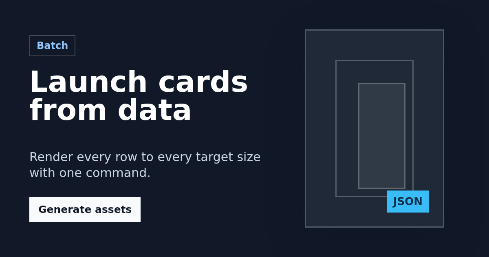

Create a contact sheet from rendered images:

```bash
clickclick contact-sheet \
  examples/presets/solid.png \
  examples/presets/gradient.png \
  examples/presets/quote.png \
  --out examples/use-cases/contact-sheet-cli.png \
  --columns 3 \
  --spacing 12 \
  --padding 16 \
  --label Solid \
  --label Gradient \
  --label Quote
```

Library:

```ts
import { createContactSheet } from "@maurogoncalo/clickclick";

await createContactSheet({
  images: [
    { path: "examples/presets/solid.png", label: "Solid" },
    { path: "examples/presets/gradient.png", label: "Gradient" },
    { path: "examples/presets/quote.png", label: "Quote" },
  ],
  output: { path: "examples/use-cases/contact-sheet-cli.png" },
  columns: 3,
  spacing: 12,
  padding: 16,
});
```

Result:

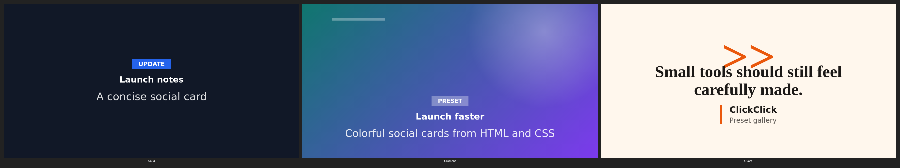

Generate composition utilities for campaign review and lightweight data visuals:

```bash
clickclick composition contact-sheet \
  --image examples/use-cases/orbit-social-coral.png --caption "Coral" \
  --image examples/use-cases/orbit-social-indigo.png --caption "Indigo" \
  --image examples/use-cases/orbit-social-lime.png --caption "Lime" \
  --columns 3 \
  --width 900 \
  --background "#eef2f3" \
  --out examples/use-cases/composition-contact-sheet.png

clickclick composition qr https://github.com/mintyPT/clickclick \
  --caption "ClickClick docs" \
  --width 360 \
  --out examples/use-cases/composition-qr.png

clickclick composition bar-chart \
  --data '[{"label":"Launch","value":42},{"label":"Gallery","value":68},{"label":"Docs","value":55}]' \
  --title "Campaign views" \
  --width 720 \
  --height 420 \
  --background "#fbfaf7" \
  --bar-color "#0f766e" \
  --out examples/use-cases/composition-chart.png
```

Library:

```ts
import { barChart, imageGrid, qrCode, renderImage } from "@maurogoncalo/clickclick";

await renderImage({
  ...imageGrid({
    images: [
      { src: "examples/use-cases/orbit-social-coral.png", caption: "Coral" },
      { src: "examples/use-cases/orbit-social-indigo.png", caption: "Indigo" },
      { src: "examples/use-cases/orbit-social-lime.png", caption: "Lime" },
    ],
    columns: 3,
    width: 900,
    background: "#eef2f3",
  }),
  output: { path: "examples/use-cases/composition-contact-sheet.png" },
});

await renderImage({
  ...qrCode({
    text: "https://github.com/mintyPT/clickclick",
    caption: "ClickClick docs",
    width: 360,
  }),
  output: { path: "examples/use-cases/composition-qr.png" },
});

await renderImage({
  ...barChart({
    title: "Campaign views",
    data: [
      { label: "Launch", value: 42 },
      { label: "Gallery", value: 68 },
      { label: "Docs", value: 55 },
    ],
    width: 720,
    height: 420,
    background: "#fbfaf7",
    barColor: "#0f766e",
  }),
  output: { path: "examples/use-cases/composition-chart.png" },
});
```

Results:

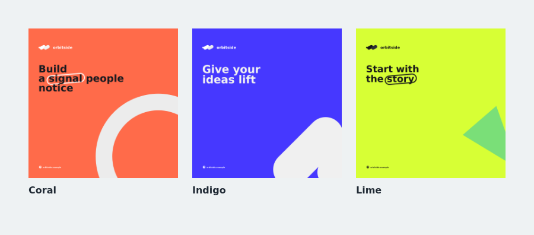


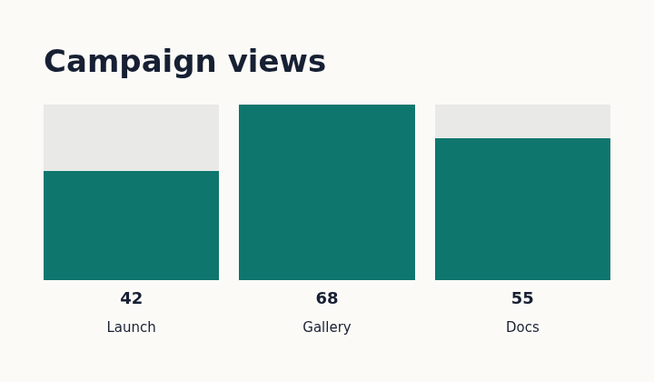

Run a batch preset workflow with a reusable renderer and per-item summary:

```bash
clickclick batch preset solid \
  --data examples/use-cases/batch-campaign.json \
  --out-dir examples/use-cases/batch-command \
  --out-pattern "{{slug}}-preset.png" \
  --width 320 \
  --height 180 \
  --json
```

Batch templates can map data fields to layer names:

```bash
clickclick batch template examples/use-cases/product-card.html \
  --css examples/use-cases/product-card.css \
  --data posts.csv \
  --map title=headline \
  --map subtitle=excerpt \
  --sizes og,instagram-square \
  --out-dir dist/social \
  --out-pattern "{{slug}}-{{size}}.png"
```

The batch preset and batch template commands use the same data formats and output pattern tokens,
reuse one browser across rows, and can print a JSON summary with `--json`.

Result:


Run CI-friendly quality gates:

```bash
clickclick quality image dist/card.png \
  --baseline baselines/card.png \
  --max-diff-ratio 0.001 \
  --strict

clickclick quality render ./examples/card.html \
  --css ./examples/card.css \
  --text-selector "[data-clickclick-fit]" \
  --safe-area 48,24,48,24 \
  --min-contrast-ratio 4.5 \
  --deterministic \
  --strict
```

Library:

```ts
import { checkImageQuality, checkRenderQuality } from "@maurogoncalo/clickclick";

const imageResult = await checkImageQuality({
  actualPath: "dist/card.png",
  baselinePath: "baselines/card.png",
  maxDiffRatio: 0.001,
});

const renderResult = await checkRenderQuality({
  document: {
    html: "<main><h1>Launch</h1></main>",
    css: "main{width:1200px;height:630px;background:#fff}h1{color:#111}",
  },
  viewport: { width: 1200, height: 630 },
  output: { format: "png" },
  textSelector: "h1",
  safeArea: { top: 48, right: 24, bottom: 48, left: 24 },
  minContrastRatio: 4.5,
  deterministic: true,
});

console.log(imageResult.passed, renderResult.diagnostics);
```

Resulting diagnostic output:

```json
{
  "passed": false,
  "diagnostics": [
    {
      "code": "VISUAL_DIFF",
      "severity": "error",
      "message": "Visual diff exceeded threshold: 2.500% changed, allowed 0.100%."
    }
  ]
}
```

List presets:

```bash
clickclick preset list
clickclick preset list --local --preset-config examples/presets/local-presets.json
```

Common render flags include `--width`, `--height`, `--format`, `--quality`, `--selector`,
`--wait-until`, `--delay`, `--omit-background`, `--size`, `--sizes`, `--out-dir`, and `--strict`.
Multi-size renders support named platform sizes plus explicit `WIDTHxHEIGHT` values. When `--size`
or `--sizes` is used, pass `--out-dir`; ClickClick writes deterministic names such as
`dist/gradient-og.png`, `dist/gradient-instagram-square.png`, and `dist/card-youtube-thumb.png` and
prints every generated path. URL screenshots also support `--full-page`, `--omit-background`, and
`--locale`. `--out` and `--output` are aliases.
The `generate` command accepts JSON, CSV, and simple YAML data files. By default scalar row fields
become same-named template layer text modifications, while a row-level `modifications` array can pass
full layer modification objects. Use `--layer-field` to apply only selected CSV/YAML fields as
layers. Output patterns support `{{field}}`, `{{index}}`, `{{size}}`, `{{width}}`, and `{{height}}`.

Render a project-local preset from schema metadata:

```bash
clickclick preset local campaign-card \
  --preset-config examples/presets/local-presets.json \
  --title "Schema-backed campaign presets" \
  --subtitle "Project presets can be discovered, validated, and rendered from JSON." \
  --label "Local" \
  --out examples/presets/local-campaign-card.png
```

Library:

```ts
import { loadLocalPresetConfig, renderLocalPreset, renderTemplate } from "@maurogoncalo/clickclick";

const config = await loadLocalPresetConfig("examples/presets/local-presets.json");
const schema = config.presets.find((preset) => preset.name === "campaign-card");
if (!schema) throw new Error("Missing preset");

await renderTemplate(renderLocalPreset(schema, {
  title: "Schema-backed campaign presets",
  subtitle: "Project presets can be discovered, validated, and rendered from JSON.",
  label: "Local",
}, {
  path: "examples/presets/local-campaign-card.png",
}));
```

Result:

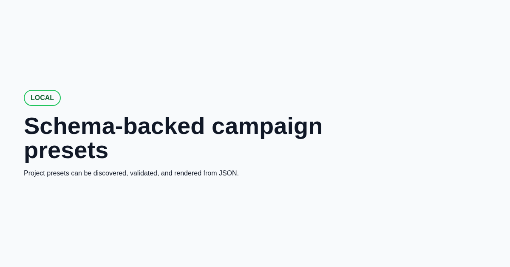

### Named Sizes

The same built-in sizes are available to the CLI and library through the exported `sizes` registry.
The `square` and `story` names remain available as aliases for existing projects.

| Name | Dimensions |
| --- | --- |
| `og` | `1200x630` |
| `twitter-card` | `1200x675` |
| `instagram-square` | `1080x1080` |
| `instagram-story` | `1080x1920` |
| `linkedin` | `1200x627` |
| `youtube-thumb` | `1280x720` |
| `square` | `1080x1080` |
| `story` | `1080x1920` |

CLI:

```bash
clickclick preset solid --size og --title "Launch" --out og.png
clickclick preset solid --title "Launch" --sizes og,instagram-square,linkedin --out-dir dist
```

Library:

```ts
import { renderImage, presets, sizes } from "@maurogoncalo/clickclick";

await renderImage({
  ...presets.solid({ title: "Launch" }),
  viewport: sizes["instagram-square"],
  output: { path: "dist/launch-instagram-square.png" },
});
```

Resulting multi-size output paths:

```text
dist/solid-og.png
dist/solid-instagram-square.png
dist/solid-linkedin.png
```

### Quality Gates

Use quality gates in CI to catch visual regressions, text overflow, low text contrast, unsafe text
placement, and non-deterministic renders. The commands emit structured JSON diagnostics and
`--strict` turns any error diagnostic into a non-zero exit.

CLI:

```bash
clickclick quality image dist/social-card.png \
  --baseline test/baselines/social-card.png \
  --max-diff-ratio 0.001 \
  --strict

clickclick quality render examples/card.html \
  --css examples/card.css \
  --baseline test/baselines/card.png \
  --text-selector "[data-clickclick-fit], h1, p" \
  --safe-area 48,48,72,48 \
  --deterministic \
  --width 1200 \
  --height 630 \
  --strict
```

Library:

```ts
import { readFile } from "node:fs/promises";
import { checkImageQuality, checkRenderQuality } from "@maurogoncalo/clickclick";

const image = await checkImageQuality({
  actualPath: "dist/social-card.png",
  baselinePath: "test/baselines/social-card.png",
  maxDiffRatio: 0.001,
});

const render = await checkRenderQuality({
  document: {
    html: await readFile("examples/card.html", "utf8"),
    css: await readFile("examples/card.css", "utf8"),
  },
  viewport: { width: 1200, height: 630 },
  baselinePath: "test/baselines/card.png",
  textSelector: "[data-clickclick-fit], h1, p",
  safeArea: { top: 48, right: 48, bottom: 72, left: 48 },
  deterministic: true,
});

if (!image.passed || !render.passed) process.exitCode = 1;
```

Example output:

```json
{
  "passed": false,
  "diagnostics": [
    {
      "code": "VISUAL_DIFF",
      "severity": "error",
      "message": "Visual diff exceeded threshold: 0.250% changed, allowed 0.100%."
    }
  ]
}
```

### Brand Kits

Presets, templates, config recipes, and template sets can share reusable design tokens from a brand
kit JSON file. Pass it with `--brand ./brand.json` in the CLI, or pass a `brand` object in library
calls. Brand kits can define `colors`, `fonts`, `logos`, `typography`, `spacing`, visual `defaults`,
and `templateLayers`. Local font, logo, and background image paths are resolved relative to the
brand JSON file and validated before rendering. The package also exports `brandKitJsonSchema` for
tools that want the JSON Schema contract.

Precedence is stable: brand defaults are applied first, recipe/config values are applied next, and
explicit CLI or library options win last.

Example brand kit:

```json
{
  "colors": {
    "primary": "#0f766e",
    "accent": "#f59e0b",
    "background": "#172026",
    "text": "#f8fafc",
    "gradientFrom": "#0f766e",
    "gradientTo": "#334155"
  },
  "typography": {
    "fontFamily": "Inter, ui-sans-serif, system-ui, sans-serif"
  },
  "logos": {
    "primary": {
      "src": "presets/clickclick-logo.svg",
      "placement": "top-right",
      "size": 116
    }
  },
  "defaults": {
    "align": "left",
    "logoPlacement": "top-right"
  }
}
```

CLI:

```bash
clickclick preset solid \
  --title "One brand kit" \
  --subtitle "The same tokens drive multiple presets." \
  --brand examples/brand-kit.json \
  --out examples/presets/brand-kit-solid.png

clickclick preset gradient \
  --title "Reusable design tokens" \
  --subtitle "Colors, logo, typography, and defaults come from one JSON file." \
  --label "Brand kit" \
  --brand examples/brand-kit.json \
  --out examples/presets/brand-kit-gradient.png
```

Library:

```ts
import { loadBrandKit, presets, renderImage } from "@maurogoncalo/clickclick";

const brand = await loadBrandKit("examples/brand-kit.json");

await renderImage({
  ...presets.solid({
    title: "One brand kit",
    subtitle: "The same tokens drive multiple presets.",
    brand,
  }),
  output: { path: "examples/presets/brand-kit-solid.png" },
});

await renderImage({
  ...presets.gradient({
    title: "Reusable design tokens",
    subtitle: "Colors, logo, typography, and defaults come from one JSON file.",
    label: "Brand kit",
    brand,
  }),
  output: { path: "examples/presets/brand-kit-gradient.png" },
});
```

Results:

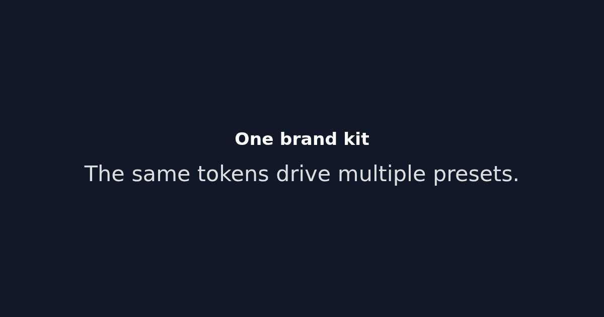

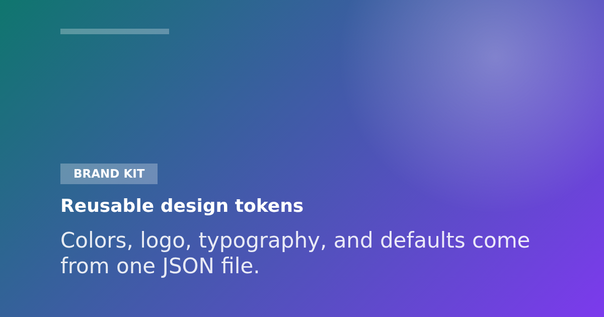

### Render Pawspring Pet Services Social Posts

Use a reusable template for pet services and products social posts with a fictional care studio,
original conversion copy, photo-led service and retail variants, and intentional CSS geometry for
badges, pricing panels, and source-neutral brand marks. Unsplash photos are passed through JSON
image layers instead of being hardcoded into the template.

#### Monthly Care Plan Post

CLI:

```bash
npm run dev -- template examples/use-cases/pet-services-social.html \
  --css examples/use-cases/pet-services-social.css \
  --modify-file examples/use-cases/pet-services-social-care-plan.json \
  --out examples/use-cases/pet-services-social-care-plan.png \
  --width 1080 \
  --height 1080
```

Library:

```ts
await renderTemplate({
  htmlPath: "examples/use-cases/pet-services-social.html",
  cssPath: "examples/use-cases/pet-services-social.css",
  modifications: JSON.parse(await readFile("examples/use-cases/pet-services-social-care-plan.json", "utf8")),
  viewport: { width: 1080, height: 1080 },
  output: { path: "examples/use-cases/pet-services-social-care-plan.png" },
});
```

Result:

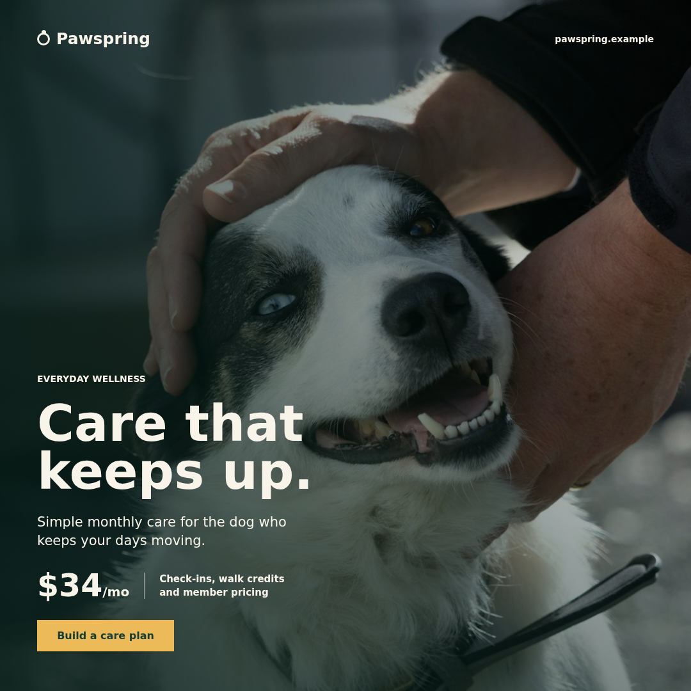

#### Grooming Appointment Promo Post

CLI:

```bash
npm run dev -- template examples/use-cases/pet-services-social.html \
  --css examples/use-cases/pet-services-social.css \
  --modify-file examples/use-cases/pet-services-social-grooming.json \
  --out examples/use-cases/pet-services-social-grooming.png \
  --width 1080 \
  --height 1080
```

Library:

```ts
await renderTemplate({
  htmlPath: "examples/use-cases/pet-services-social.html",
  cssPath: "examples/use-cases/pet-services-social.css",
  modifications: JSON.parse(await readFile("examples/use-cases/pet-services-social-grooming.json", "utf8")),
  viewport: { width: 1080, height: 1080 },
  output: { path: "examples/use-cases/pet-services-social-grooming.png" },
});
```

Result:

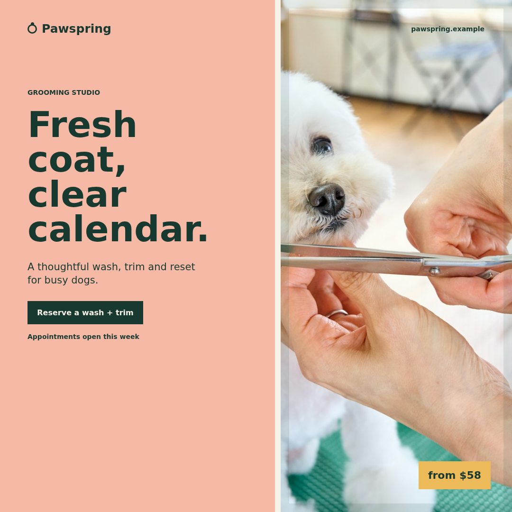

#### Nutrition Bundle Product Post

CLI:

```bash
npm run dev -- template examples/use-cases/pet-services-social.html \
  --css examples/use-cases/pet-services-social.css \
  --modify-file examples/use-cases/pet-services-social-nutrition.json \
  --out examples/use-cases/pet-services-social-nutrition.png \
  --width 1080 \
  --height 1080
```

Library:

```ts
await renderTemplate({
  htmlPath: "examples/use-cases/pet-services-social.html",
  cssPath: "examples/use-cases/pet-services-social.css",
  modifications: JSON.parse(await readFile("examples/use-cases/pet-services-social-nutrition.json", "utf8")),
  viewport: { width: 1080, height: 1080 },
  output: { path: "examples/use-cases/pet-services-social-nutrition.png" },
});
```

Result:

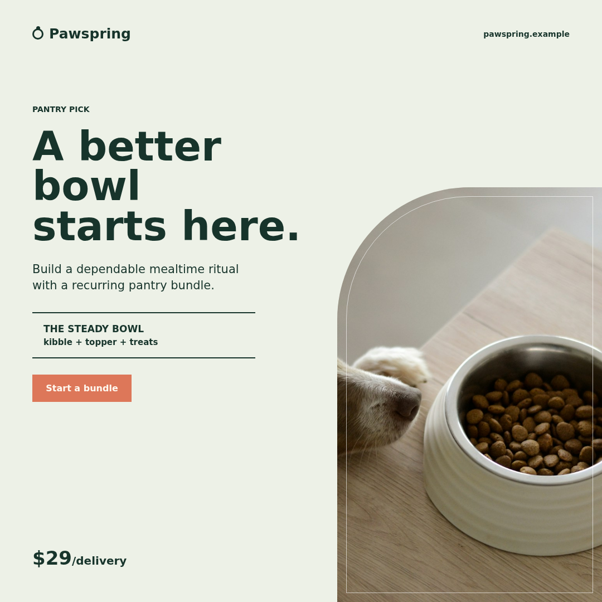

### Render Apex Auto Social Posts

Use a reusable template for automotive sales and detailing social posts with a fictional
dealership/detailing studio, original conversion copy, photo-led service and inventory variants, and
intentional CSS geometry for badges, panels, and trade-in graphics. Source-neutral Unsplash photos
are passed through JSON image layers instead of being hardcoded into the template.

#### Certified Inventory Sales Post

CLI:

```bash
npm run dev -- template examples/use-cases/automotive-social.html \
  --css examples/use-cases/automotive-social.css \
  --modify-file examples/use-cases/automotive-social-inventory.json \
  --out examples/use-cases/automotive-social-inventory.png \
  --width 1080 \
  --height 1080
```

Library:

```ts
await renderTemplate({
  htmlPath: "examples/use-cases/automotive-social.html",
  cssPath: "examples/use-cases/automotive-social.css",
  modifications: JSON.parse(await readFile("examples/use-cases/automotive-social-inventory.json", "utf8")),
  viewport: { width: 1080, height: 1080 },
  output: { path: "examples/use-cases/automotive-social-inventory.png" },
});
```

Result:

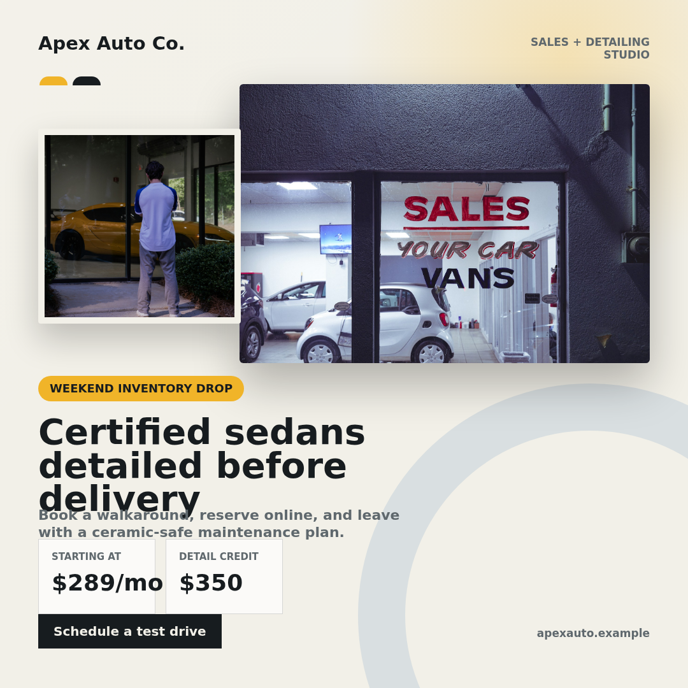

#### Detailing Appointment Promo Post

CLI:

```bash
npm run dev -- template examples/use-cases/automotive-social.html \
  --css examples/use-cases/automotive-social.css \
  --modify-file examples/use-cases/automotive-social-detailing.json \
  --out examples/use-cases/automotive-social-detailing.png \
  --width 1080 \
  --height 1080
```

Library:

```ts
await renderTemplate({
  htmlPath: "examples/use-cases/automotive-social.html",
  cssPath: "examples/use-cases/automotive-social.css",
  modifications: JSON.parse(await readFile("examples/use-cases/automotive-social-detailing.json", "utf8")),
  viewport: { width: 1080, height: 1080 },
  output: { path: "examples/use-cases/automotive-social-detailing.png" },
});
```

Result:

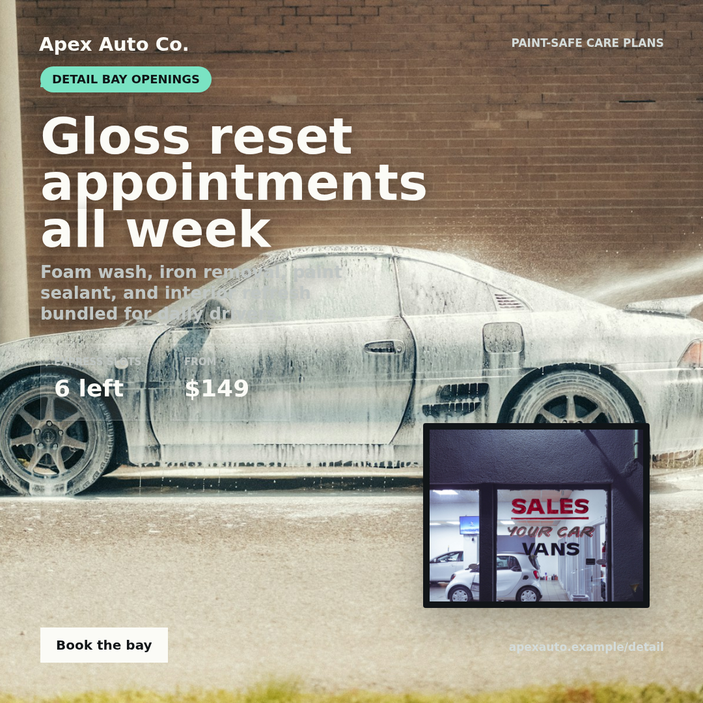

#### Trade-In Event Post

CLI:

```bash
npm run dev -- template examples/use-cases/automotive-social.html \
  --css examples/use-cases/automotive-social.css \
  --modify-file examples/use-cases/automotive-social-trade-in.json \
  --out examples/use-cases/automotive-social-trade-in.png \
  --width 1080 \
  --height 1080
```

Library:

```ts
await renderTemplate({
  htmlPath: "examples/use-cases/automotive-social.html",
  cssPath: "examples/use-cases/automotive-social.css",
  modifications: JSON.parse(await readFile("examples/use-cases/automotive-social-trade-in.json", "utf8")),
  viewport: { width: 1080, height: 1080 },
  output: { path: "examples/use-cases/automotive-social-trade-in.png" },
});
```

Result:

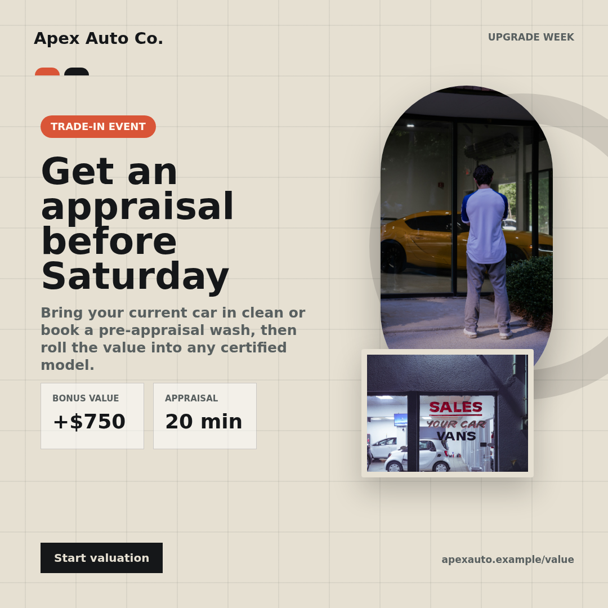

## Advanced Usage

The README keeps quick-start material and the complete built-in preset reference. Longer examples
live in [docs/examples.md](./docs/examples.md):

- advanced PNG, JPEG, selector, transparent, and URL screenshot output modes;
- use-case galleries for template-driven social image sets;
- local templates, image layers, custom fonts, debug bundles, config recipes, and multi-size sets;
- extra preset variations that demonstrate alternate option combinations.

### Render Food Truck Catering Social Posts

Use a reusable mixed photo-and-graphic template for a fictional food truck monetization campaign:
route preorders, office catering inquiries, and private event deposits. Source-neutral Unsplash
photos are passed through JSON image layers, while the route cards, offer badges, borders, and
pattern work are intentional CSS geometry.

#### Route Preorder Post

CLI:

```bash
npm run dev -- template examples/use-cases/food-truck-catering.html \
  --css examples/use-cases/food-truck-catering.css \
  --modify-file examples/use-cases/food-truck-catering-schedule.json \
  --out examples/use-cases/food-truck-catering-schedule.png \
  --width 1080 \
  --height 1080
```

Library:

```ts
await renderTemplate({
  htmlPath: "examples/use-cases/food-truck-catering.html",
  cssPath: "examples/use-cases/food-truck-catering.css",
  modifications: JSON.parse(await readFile("examples/use-cases/food-truck-catering-schedule.json", "utf8")),
  viewport: { width: 1080, height: 1080 },
  output: { path: "examples/use-cases/food-truck-catering-schedule.png" },
});
```

Result:

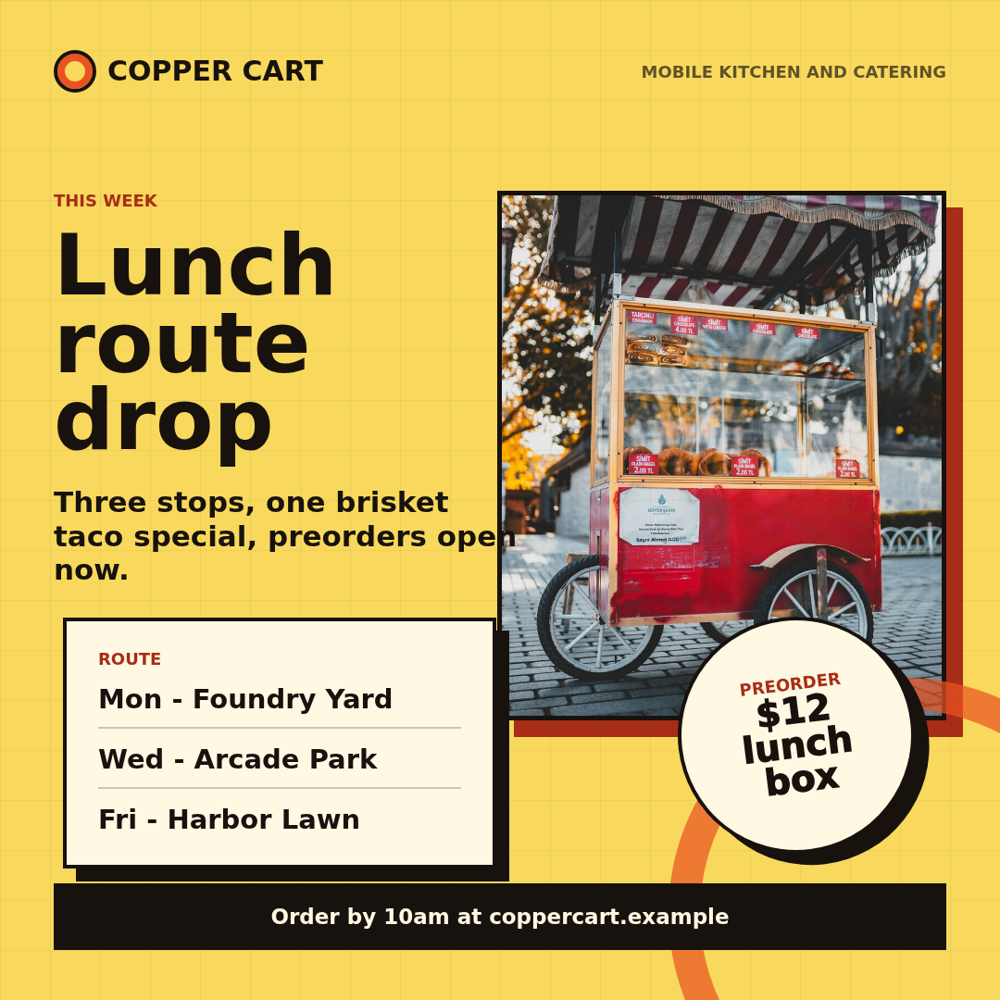

#### Office Catering Inquiry Post

CLI:

```bash
npm run dev -- template examples/use-cases/food-truck-catering.html \
  --css examples/use-cases/food-truck-catering.css \
  --modify-file examples/use-cases/food-truck-catering-catering.json \
  --out examples/use-cases/food-truck-catering-catering.png \
  --width 1080 \
  --height 1080
```

Library:

```ts
await renderTemplate({
  htmlPath: "examples/use-cases/food-truck-catering.html",
  cssPath: "examples/use-cases/food-truck-catering.css",
  modifications: JSON.parse(await readFile("examples/use-cases/food-truck-catering-catering.json", "utf8")),
  viewport: { width: 1080, height: 1080 },
  output: { path: "examples/use-cases/food-truck-catering-catering.png" },
});
```

Result:

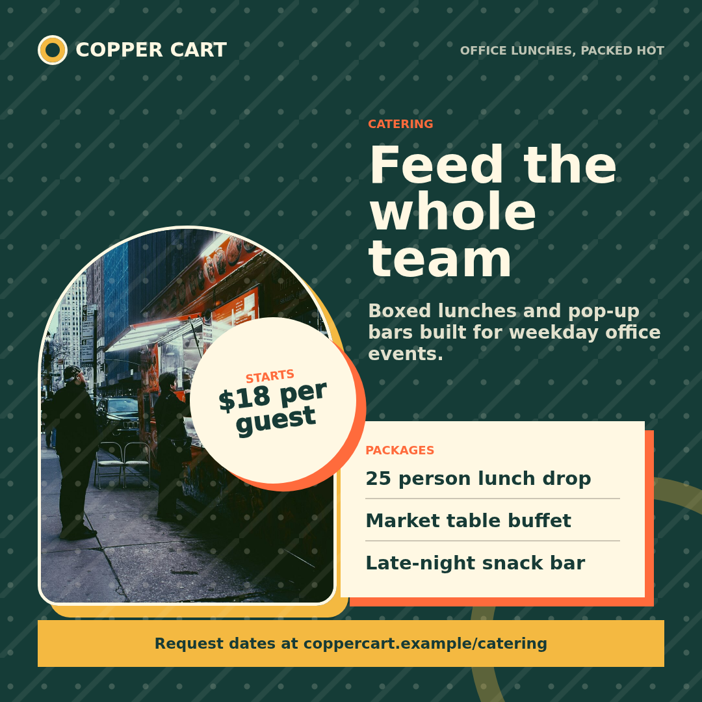

#### Private Event Booking Post

CLI:

```bash
npm run dev -- template examples/use-cases/food-truck-catering.html \
  --css examples/use-cases/food-truck-catering.css \
  --modify-file examples/use-cases/food-truck-catering-booking.json \
  --out examples/use-cases/food-truck-catering-booking.png \
  --width 1080 \
  --height 1080
```

Library:

```ts
await renderTemplate({
  htmlPath: "examples/use-cases/food-truck-catering.html",
  cssPath: "examples/use-cases/food-truck-catering.css",
  modifications: JSON.parse(await readFile("examples/use-cases/food-truck-catering-booking.json", "utf8")),
  viewport: { width: 1080, height: 1080 },
  output: { path: "examples/use-cases/food-truck-catering-booking.png" },
});
```

Result:

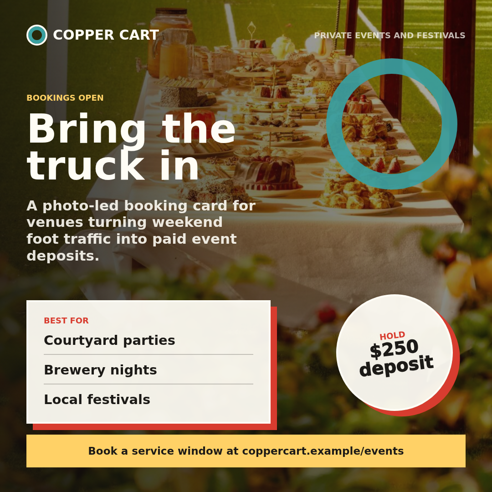

### Render Rootline Health and Wellness Social Post

Use a photo-led membership template for a fictional wellness studio. The real studio image is passed
through the JSON modification file, while the pill label and program card are intentional CSS
geometry.

#### Health and Wellness Membership Post

CLI:

```bash
npm run dev -- template examples/use-cases/health-wellness-social.html \
  --css examples/use-cases/health-wellness-social.css \
  --modify-file examples/use-cases/health-wellness-social.json \
  --out examples/use-cases/health-wellness-social.png \
  --width 1080 \
  --height 1080
```

Library:

```ts
await renderTemplate({
  htmlPath: "examples/use-cases/health-wellness-social.html",
  cssPath: "examples/use-cases/health-wellness-social.css",
  modifications: JSON.parse(await readFile("examples/use-cases/health-wellness-social.json", "utf8")),
  viewport: { width: 1080, height: 1080 },
  output: { path: "examples/use-cases/health-wellness-social.png" },
});
```

Result:

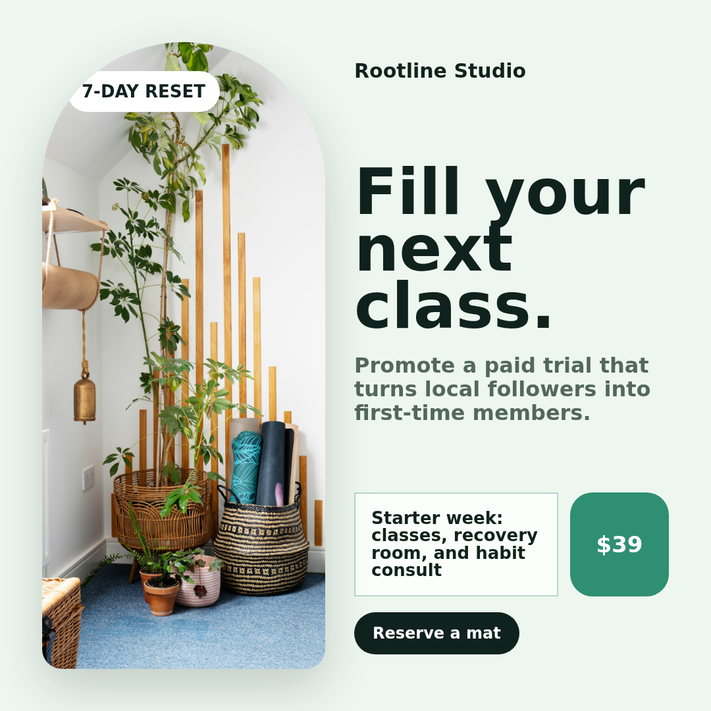

### Render Roomline Interior Design Social Post

Use a magazine-grid template for a fictional interior design studio. The interior photo is passed
through JSON; the editorial blocks and price tile are CSS geometry.

#### Interior Design Consultation Post

CLI:

```bash
npm run dev -- template examples/use-cases/interior-design-social.html \
  --css examples/use-cases/interior-design-social.css \
  --modify-file examples/use-cases/interior-design-social.json \
  --out examples/use-cases/interior-design-social.png \
  --width 1080 \
  --height 1080
```

Library:

```ts
await renderTemplate({
  htmlPath: "examples/use-cases/interior-design-social.html",
  cssPath: "examples/use-cases/interior-design-social.css",
  modifications: JSON.parse(await readFile("examples/use-cases/interior-design-social.json", "utf8")),
  viewport: { width: 1080, height: 1080 },
  output: { path: "examples/use-cases/interior-design-social.png" },
});
```

Result:

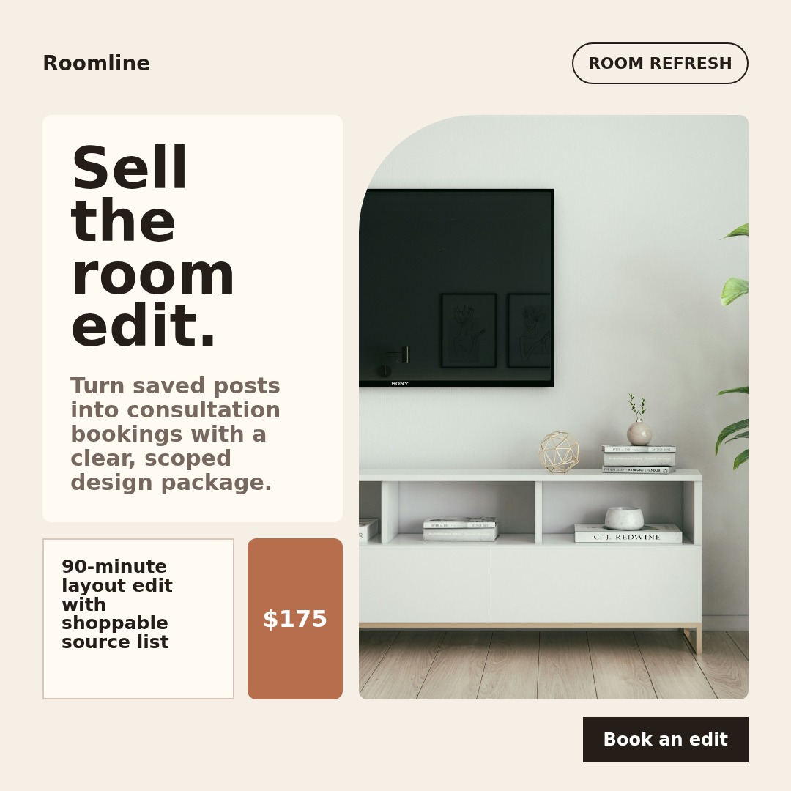

### Render Northgate Real Estate Social Post

Use a listing-card template for a fictional real estate agency. The house photo is passed through
JSON; the appointment card and status pill are CSS geometry.

#### Real Estate Listing Appointment Post

CLI:

```bash
npm run dev -- template examples/use-cases/real-estate-social.html \
  --css examples/use-cases/real-estate-social.css \
  --modify-file examples/use-cases/real-estate-social.json \
  --out examples/use-cases/real-estate-social.png \
  --width 1080 \
  --height 1080
```

Library:

```ts
await renderTemplate({
  htmlPath: "examples/use-cases/real-estate-social.html",
  cssPath: "examples/use-cases/real-estate-social.css",
  modifications: JSON.parse(await readFile("examples/use-cases/real-estate-social.json", "utf8")),
  viewport: { width: 1080, height: 1080 },
  output: { path: "examples/use-cases/real-estate-social.png" },
});
```

Result:


### Render Pulsehall Music and Entertainment Social Post

Use a dark event-ticket template for a fictional live venue. The concert photo is passed through
JSON; the ticket panel and stub are intentional CSS geometry.

#### Music and Entertainment Ticket Post

CLI:

```bash
npm run dev -- template examples/use-cases/music-entertainment-social.html \
  --css examples/use-cases/music-entertainment-social.css \
  --modify-file examples/use-cases/music-entertainment-social.json \
  --out examples/use-cases/music-entertainment-social.png \
  --width 1080 \
  --height 1080
```

Library:

```ts
await renderTemplate({
  htmlPath: "examples/use-cases/music-entertainment-social.html",
  cssPath: "examples/use-cases/music-entertainment-social.css",
  modifications: JSON.parse(await readFile("examples/use-cases/music-entertainment-social.json", "utf8")),
  viewport: { width: 1080, height: 1080 },
  output: { path: "examples/use-cases/music-entertainment-social.png" },
});
```

Result:

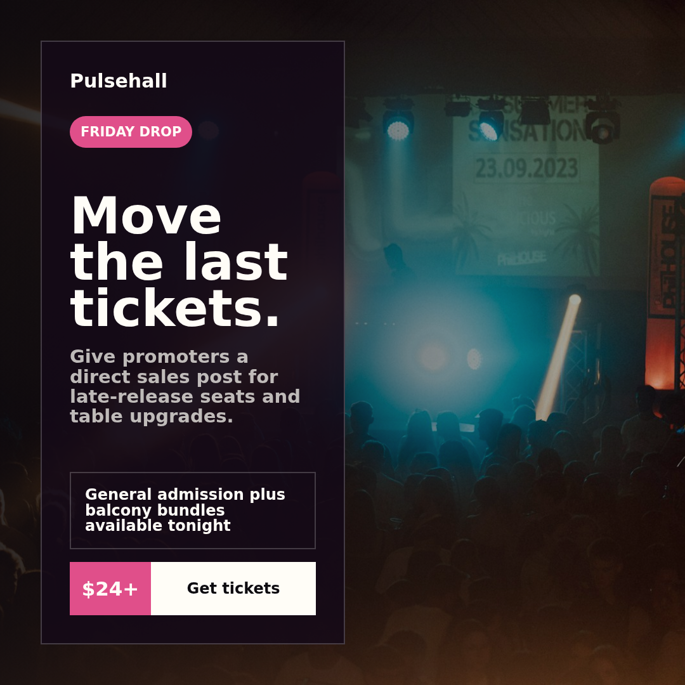

### Render Frameworks Photography and Videography Social Post

Use a studio-brief template for a fictional photography and videography business. The camera photo
is passed through JSON; the label strip and rate block are CSS geometry.

#### Photography and Videography Package Post

CLI:

```bash
npm run dev -- template examples/use-cases/photography-videography-social.html \
  --css examples/use-cases/photography-videography-social.css \
  --modify-file examples/use-cases/photography-videography-social.json \
  --out examples/use-cases/photography-videography-social.png \
  --width 1080 \
  --height 1080
```

Library:

```ts
await renderTemplate({
  htmlPath: "examples/use-cases/photography-videography-social.html",
  cssPath: "examples/use-cases/photography-videography-social.css",
  modifications: JSON.parse(await readFile("examples/use-cases/photography-videography-social.json", "utf8")),
  viewport: { width: 1080, height: 1080 },
  output: { path: "examples/use-cases/photography-videography-social.png" },
});
```

Result:


### Render Vow and Vale Wedding Services Social Post

Use an editorial booking template for a fictional wedding services studio. The reception photo is
passed through JSON; the arched panels and booking strip are CSS geometry.

#### Wedding Services Booking Post

CLI:

```bash
npm run dev -- template examples/use-cases/wedding-services-social.html \
  --css examples/use-cases/wedding-services-social.css \
  --modify-file examples/use-cases/wedding-services-social.json \
  --out examples/use-cases/wedding-services-social.png \
  --width 1080 \
  --height 1080
```

Library:

```ts
await renderTemplate({
  htmlPath: "examples/use-cases/wedding-services-social.html",
  cssPath: "examples/use-cases/wedding-services-social.css",
  modifications: JSON.parse(await readFile("examples/use-cases/wedding-services-social.json", "utf8")),
  viewport: { width: 1080, height: 1080 },
  output: { path: "examples/use-cases/wedding-services-social.png" },
});
```

Result:

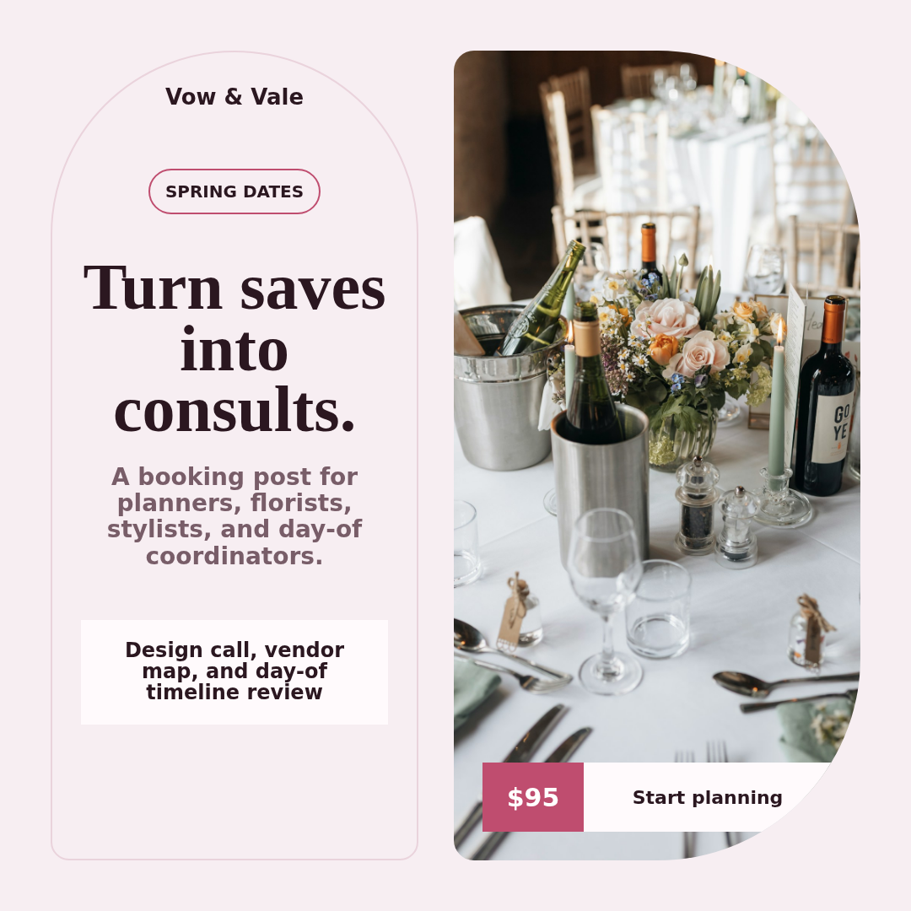

### Render Gathercraft Event Planning Social Post

Use an agenda-card template for a fictional event planning studio. The venue photo is passed through
JSON; the agenda and inquiry blocks are CSS geometry.

#### Event Planning Inquiry Post

CLI:

```bash
npm run dev -- template examples/use-cases/event-planning-social.html \
  --css examples/use-cases/event-planning-social.css \
  --modify-file examples/use-cases/event-planning-social.json \
  --out examples/use-cases/event-planning-social.png \
  --width 1080 \
  --height 1080
```

Library:

```ts
await renderTemplate({
  htmlPath: "examples/use-cases/event-planning-social.html",
  cssPath: "examples/use-cases/event-planning-social.css",
  modifications: JSON.parse(await readFile("examples/use-cases/event-planning-social.json", "utf8")),
  viewport: { width: 1080, height: 1080 },
  output: { path: "examples/use-cases/event-planning-social.png" },
});
```

Result:

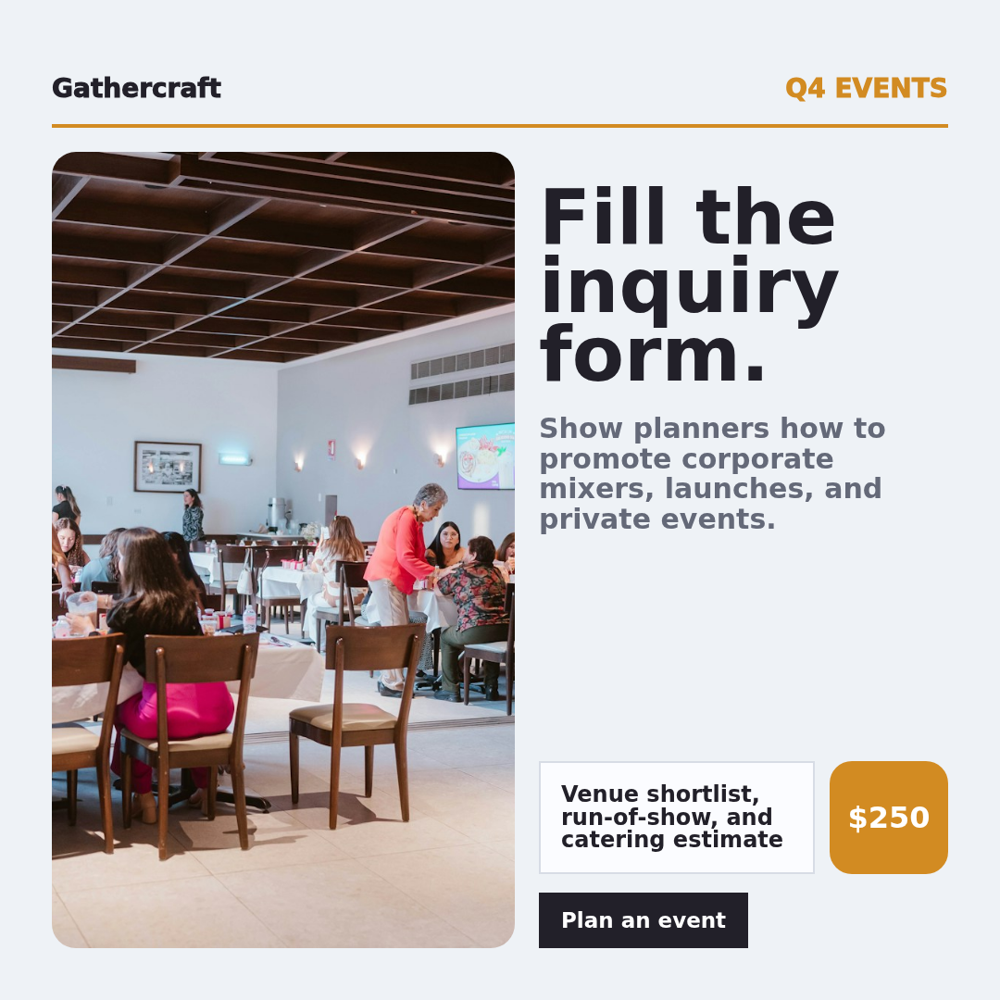

### Render Tidepool Hotels and Resorts Social Post

Use a resort booking-panel template for a fictional hotel. The pool photo is passed through JSON;
the booking panel and rate chip are CSS geometry.

#### Hotels and Resorts Getaway Post

CLI:

```bash
npm run dev -- template examples/use-cases/hotels-resorts-social.html \
  --css examples/use-cases/hotels-resorts-social.css \
  --modify-file examples/use-cases/hotels-resorts-social.json \
  --out examples/use-cases/hotels-resorts-social.png \
  --width 1080 \
  --height 1080
```

Library:

```ts
await renderTemplate({
  htmlPath: "examples/use-cases/hotels-resorts-social.html",
  cssPath: "examples/use-cases/hotels-resorts-social.css",
  modifications: JSON.parse(await readFile("examples/use-cases/hotels-resorts-social.json", "utf8")),
  viewport: { width: 1080, height: 1080 },
  output: { path: "examples/use-cases/hotels-resorts-social.png" },
});
```

Result:

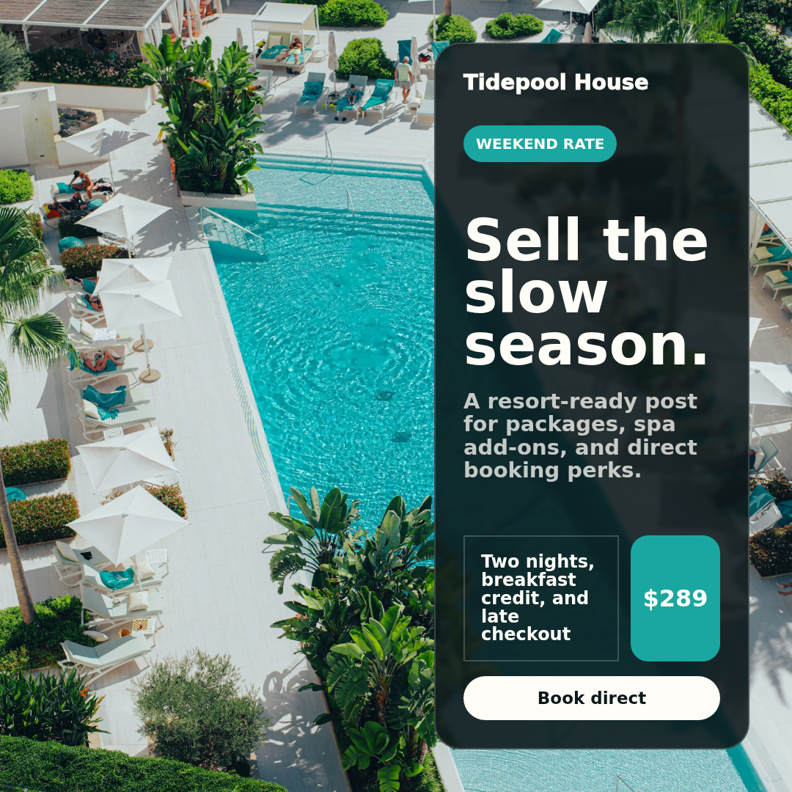

## Package Release

The npm package is prepared as `@maurogoncalo/clickclick` with MIT licensing, public npm access,
provenance-enabled publishing, a `clickclick` binary, ESM library exports, and TypeScript
declarations.

Before publishing, run the local release check:

```bash
npm run release:check
```

This runs type-checking, tests, a production build, and a package dry-run verification that checks
the built CLI, library entry points, declaration files, README, and license. To inspect npm's packed
file list without the full check:

```bash
npm run pack:dry
```

Publishing is intentionally manual. See [`RELEASE.md`](./RELEASE.md) for the confirmation checklist
and the GitHub Actions workflow steps. Do not publish from routine CI.

## Presets

ClickClick currently ships these built-in presets. Keep this list in sync with the exported
`presets` object and the CLI preset commands.

### `adaptive`

A single adaptive template that rearranges typography and visual blocks for the requested output
size.

CLI:

```bash
clickclick preset adaptive \
  --title "One template, many sizes" \
  --subtitle "Typography and visual blocks respond to the requested viewport." \
  --eyebrow "Adaptive" \
  --meta "Same content" \
  --background "#172026" \
  --accent "#f59e0b" \
  --panel-color "rgba(255,255,255,0.14)" \
  --width 1200 \
  --height 630 \
  --out examples/presets/adaptive-wide.png

clickclick preset adaptive \
  --title "One template, many sizes" \
  --subtitle "Typography and visual blocks respond to the requested viewport." \
  --eyebrow "Adaptive" \
  --meta "Same content" \
  --background "#172026" \
  --accent "#f59e0b" \
  --panel-color "rgba(255,255,255,0.14)" \
  --width 1080 \
  --height 1080 \
  --out examples/presets/adaptive-square.png

clickclick preset adaptive \
  --title "One template, many sizes" \
  --subtitle "Typography and visual blocks respond to the requested viewport." \
  --eyebrow "Adaptive" \
  --meta "Same content" \
  --background "#172026" \
  --accent "#f59e0b" \
  --panel-color "rgba(255,255,255,0.14)" \
  --width 720 \
  --height 1280 \
  --out examples/presets/adaptive-tall.png
```

Library:

```ts
import { presets, renderImage } from "@maurogoncalo/clickclick";

const adaptiveOptions = {
  title: "One template, many sizes",
  subtitle: "Typography and visual blocks respond to the requested viewport.",
  eyebrow: "Adaptive",
  meta: "Same content",
  backgroundColor: "#172026",
  accentColor: "#f59e0b",
  panelColor: "rgba(255,255,255,0.14)",
};

for (const item of [
  { width: 1200, height: 630, path: "examples/presets/adaptive-wide.png" },
  { width: 1080, height: 1080, path: "examples/presets/adaptive-square.png" },
  { width: 720, height: 1280, path: "examples/presets/adaptive-tall.png" },
]) {
  await renderImage({
    ...presets.adaptive({ ...adaptiveOptions, width: item.width, height: item.height }),
    output: { path: item.path },
  });
}
```

Results:

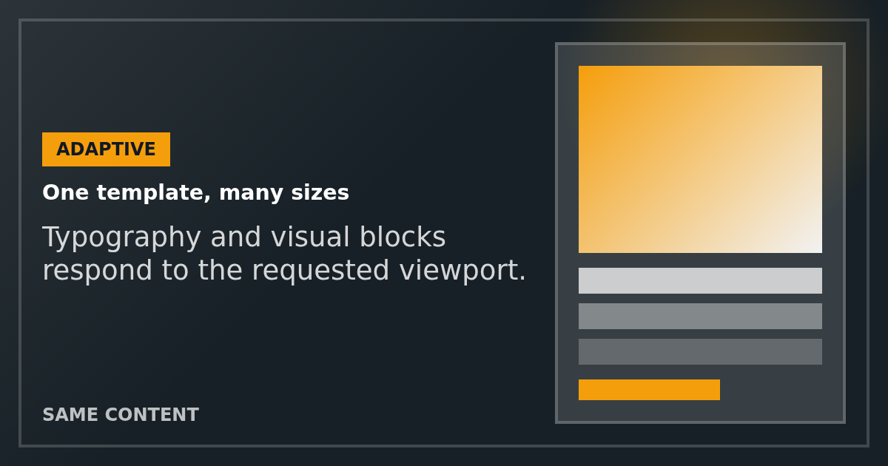

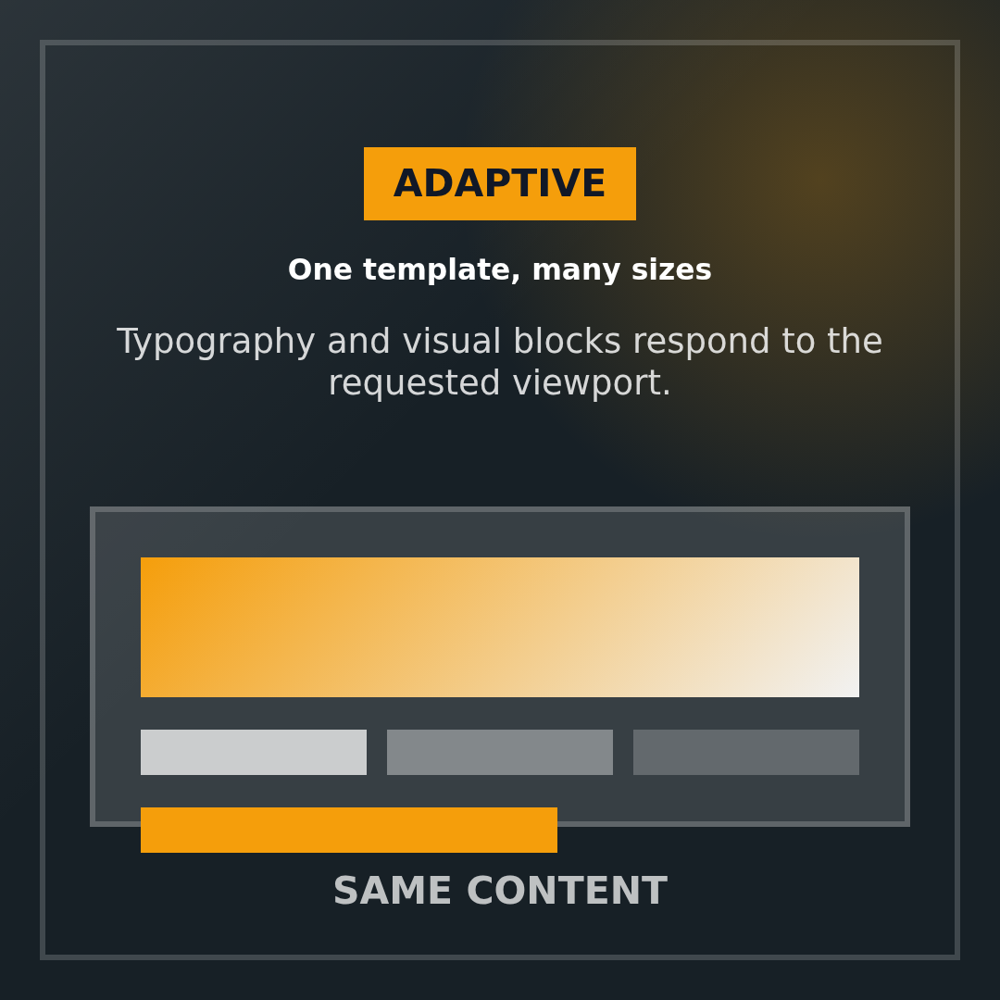

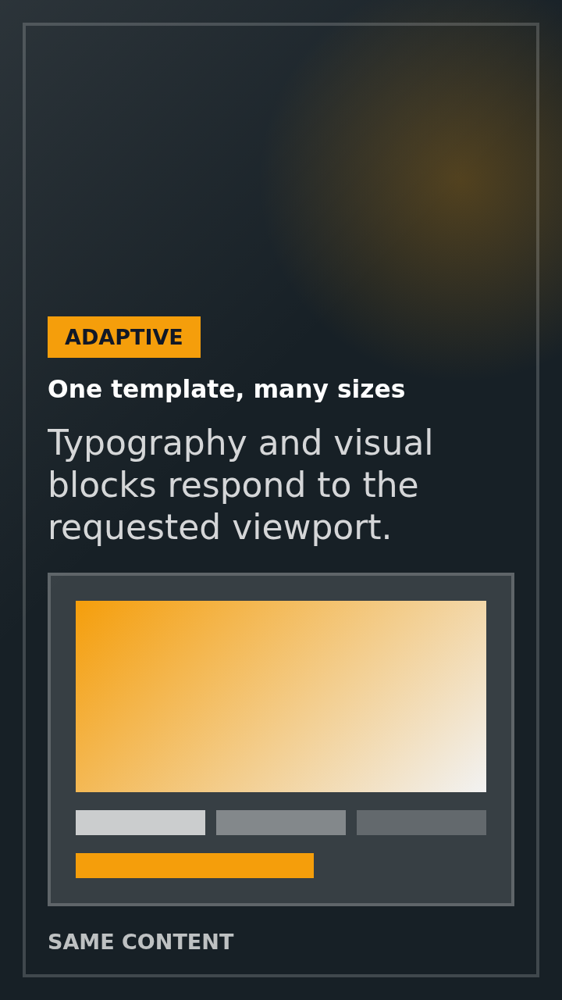

### `brandAnnouncement`

A branded announcement image with title, subtitle, CTA, a corner logo, and a faint logo watermark.

CLI:

```bash
clickclick preset brand-announcement \
  --title "New partner program" \
  --subtitle "Reusable branded cards with logo marks." \
  --cta "Apply today" \
  --logo examples/presets/clickclick-logo.svg \
  --watermark examples/presets/clickclick-logo.svg \
  --out examples/presets/brand-announcement.png
```

Library:

```ts
import { presets, renderImage } from "@maurogoncalo/clickclick";

await renderImage({
  ...presets.brandAnnouncement({
    title: "New partner program",
    subtitle: "Reusable branded cards with logo marks.",
    cta: "Apply today",
    logo: { src: "examples/presets/clickclick-logo.svg", placement: "top-right" },
    watermark: { src: "examples/presets/clickclick-logo.svg", opacity: 0.08, scale: 0.58 },
  }),
  output: { path: "examples/presets/brand-announcement.png" },
});
```

Image options accept `https:`, `data:`, `file:`, absolute paths, and paths relative to the current
working directory. Local paths are inlined as data URLs before Chromium renders the image.

Result:

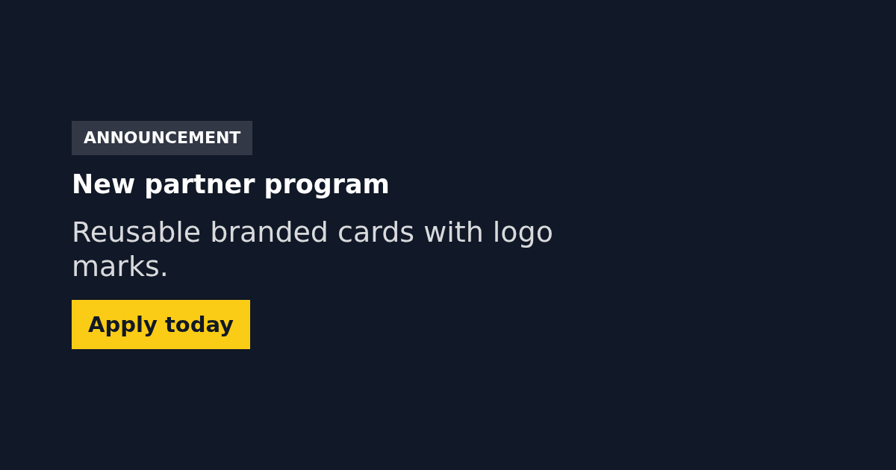

### `logoBackdrop`

A centered headline over a large logo or text watermark backdrop.

CLI:

```bash
clickclick preset logo-backdrop \
  --title "Brand assets in seconds" \
  --meta "Backdrop" \
  --watermark-text "CLICK" \
  --out examples/presets/logo-backdrop.png
```

Library:

```ts
import { presets, renderImage } from "@maurogoncalo/clickclick";

await renderImage({
  ...presets.logoBackdrop({
    title: "Brand assets in seconds",
    meta: "Backdrop",
    watermark: { text: "CLICK" },
  }),
  output: { path: "examples/presets/logo-backdrop.png" },
});
```

Result:

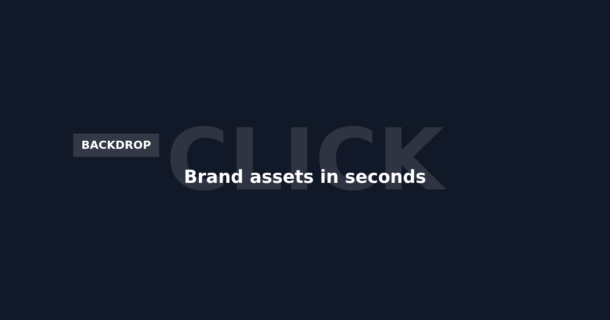

### `partnerCard`

A two-logo card for integrations, partnerships, and co-marketing announcements.

CLI:

```bash
clickclick preset partner-card \
  --title "ClickClick + Acme" \
  --partner-name "Integration" \
  --logo examples/presets/clickclick-logo.svg \
  --partner-logo examples/presets/photo-source.svg \
  --out examples/presets/partner-card.png
```

Library:

```ts
import { presets, renderImage } from "@maurogoncalo/clickclick";

await renderImage({
  ...presets.partnerCard({
    title: "ClickClick + Acme",
    partnerName: "Integration",
    logo: { src: "examples/presets/clickclick-logo.svg" },
    partnerLogo: "examples/presets/photo-source.svg",
  }),
  output: { path: "examples/presets/partner-card.png" },
});
```

Result:

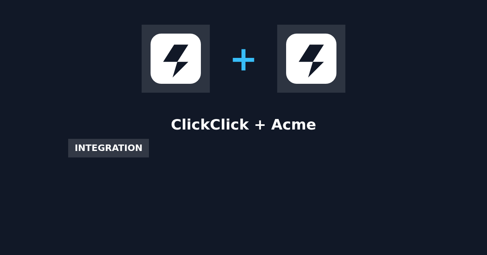

### `watermarkQuote`

A branded quote card with a logo or text watermark behind the quote.

CLI:

```bash
clickclick preset watermark-quote \
  --quote "Every launch asset now follows the brand." \
  --attribution "ClickClick" \
  --watermark-text "QUOTE" \
  --out examples/presets/watermark-quote.png
```

Library:

```ts
import { presets, renderImage } from "@maurogoncalo/clickclick";

await renderImage({
  ...presets.watermarkQuote({
    quote: "Every launch asset now follows the brand.",
    attribution: "ClickClick",
    watermark: { text: "QUOTE" },
  }),
  output: { path: "examples/presets/watermark-quote.png" },
});
```

Result:


### `badgeGrid`

An announcement card with a repeated logo or badge pattern behind foreground copy.

CLI:

```bash
clickclick preset badge-grid \
  --title "Hiring across product" \
  --subtitle "Repeatable badge backgrounds for announcements." \
  --badge "Hiring" \
  --badge-logo examples/presets/clickclick-logo.svg \
  --out examples/presets/badge-grid.png
```

Library:

```ts
import { presets, renderImage } from "@maurogoncalo/clickclick";

await renderImage({
  ...presets.badgeGrid({
    title: "Hiring across product",
    subtitle: "Repeatable badge backgrounds for announcements.",
    badge: "Hiring",
    badgeLogo: "examples/presets/clickclick-logo.svg",
  }),
  output: { path: "examples/presets/badge-grid.png" },
});
```

Result:

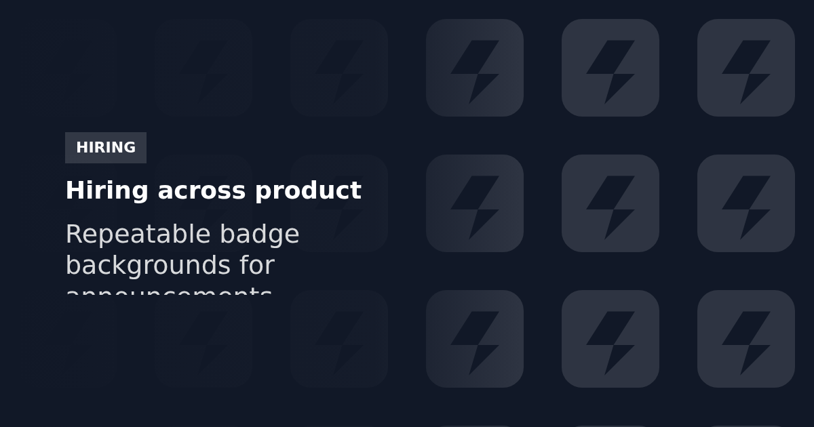

### `gradient`

A colorful gradient social image with title, optional subtitle, optional label, configurable
gradient colors, text color, accent color, alignment, size, and font family. It uses
`data-clickclick-fit` text fitting for title and subtitle.

CLI:

```bash
clickclick preset gradient \
  --title "Launch faster" \
  --subtitle "Colorful social cards from HTML and CSS" \
  --label "Preset" \
  --from "#0f766e" \
  --to "#7c3aed" \
  --accent "rgba(255,255,255,0.32)" \
  --align center \
  --out examples/presets/gradient.png
```

Library:

```ts
import { presets, renderImage } from "@maurogoncalo/clickclick";

await renderImage({
  ...presets.gradient({
    title: "Launch faster",
    subtitle: "Colorful social cards from HTML and CSS",
    label: "Preset",
    fromColor: "#0f766e",
    toColor: "#7c3aed",
    accentColor: "rgba(255,255,255,0.32)",
    align: "center",
  }),
  output: { path: "examples/presets/gradient.png" },
});
```

Result:

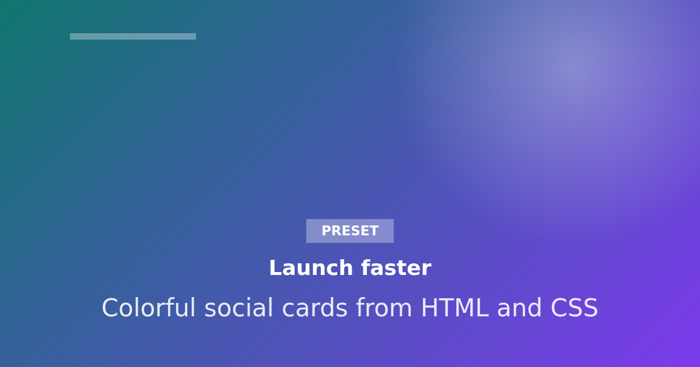

### `photoHero`

A full-bleed photo-backed hero card with a readable overlay, title, subtitle, label, and optional
logo corner.

CLI:

```bash
clickclick preset photo-hero \
  --title "Launch visuals that feel alive" \
  --subtitle "Photo-forward cards with readable overlays and logo corners." \
  --label "Photo" \
  --image examples/presets/photo-source.svg \
  --logo examples/presets/clickclick-logo.svg \
  --out examples/presets/photo-hero.png
```

Library:

```ts
import { presets, renderImage } from "@maurogoncalo/clickclick";

await renderImage({
  ...presets.photoHero({
    title: "Launch visuals that feel alive",
    subtitle: "Photo-forward cards with readable overlays and logo corners.",
    label: "Photo",
    image: "examples/presets/photo-source.svg",
    logo: { src: "examples/presets/clickclick-logo.svg" },
  }),
  output: { path: "examples/presets/photo-hero.png" },
});
```

Result:

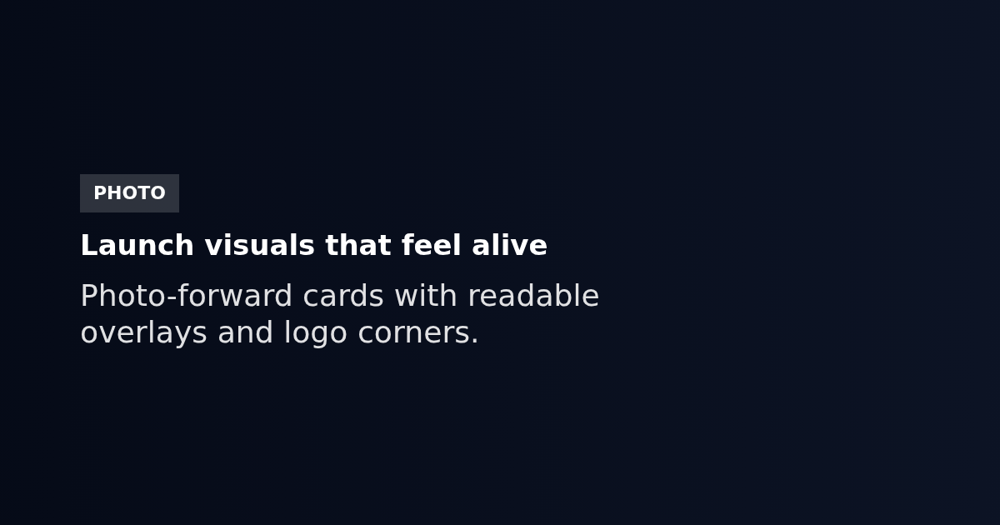

### `editorialFeature`

A magazine-style feature layout with a cropped media panel, headline, kicker, and byline.

CLI:

```bash
clickclick preset editorial-feature \
  --title "Designing with local images" \
  --kicker "Editorial" \
  --byline "ClickClick Magazine" \
  --image examples/presets/photo-source.svg \
  --out examples/presets/editorial-feature.png
```

Library:

```ts
import { presets, renderImage } from "@maurogoncalo/clickclick";

await renderImage({
  ...presets.editorialFeature({
    title: "Designing with local images",
    kicker: "Editorial",
    byline: "ClickClick Magazine",
    image: "examples/presets/photo-source.svg",
  }),
  output: { path: "examples/presets/editorial-feature.png" },
});
```

Result:

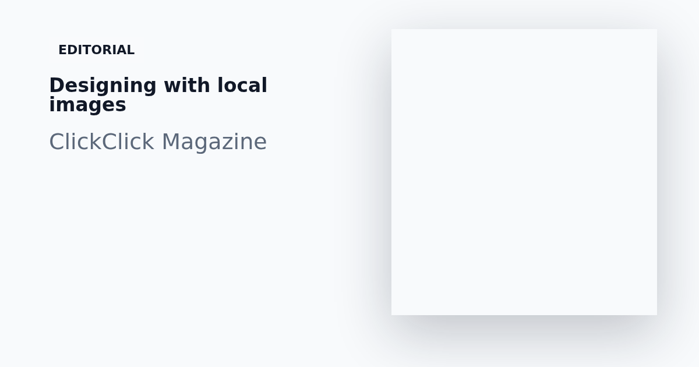

### `eventPoster`

An event or launch poster with image backdrop, date block, metadata, CTA, and optional logo.

CLI:

```bash
clickclick preset event-poster \
  --title "Summer Launch" \
  --date "Jul 16" \
  --meta "Online" \
  --cta "Register now" \
  --image examples/presets/photo-source.svg \
  --logo examples/presets/clickclick-logo.svg \
  --out examples/presets/event-poster.png
```

Library:

```ts
import { presets, renderImage } from "@maurogoncalo/clickclick";

await renderImage({
  ...presets.eventPoster({
    title: "Summer Launch",
    date: "Jul 16",
    meta: "Online",
    cta: "Register now",
    image: "examples/presets/photo-source.svg",
    logo: { src: "examples/presets/clickclick-logo.svg" },
  }),
  output: { path: "examples/presets/event-poster.png" },
});
```

Result:


### `caseStudy`

An image-backed customer story card with customer label, quote, metric, logo, and overlay controls.

CLI:

```bash
clickclick preset case-study \
  --title "Acme ships images faster" \
  --customer "Acme" \
  --quote "We replaced hand-made cards with one script." \
  --metric "42% faster" \
  --image examples/presets/photo-source.svg \
  --logo examples/presets/clickclick-logo.svg \
  --out examples/presets/case-study.png
```

Library:

```ts
import { presets, renderImage } from "@maurogoncalo/clickclick";

await renderImage({
  ...presets.caseStudy({
    title: "Acme ships images faster",
    customer: "Acme",
    quote: "We replaced hand-made cards with one script.",
    metric: "42% faster",
    image: "examples/presets/photo-source.svg",
    logo: { src: "examples/presets/clickclick-logo.svg" },
  }),
  output: { path: "examples/presets/case-study.png" },
});
```

Result:

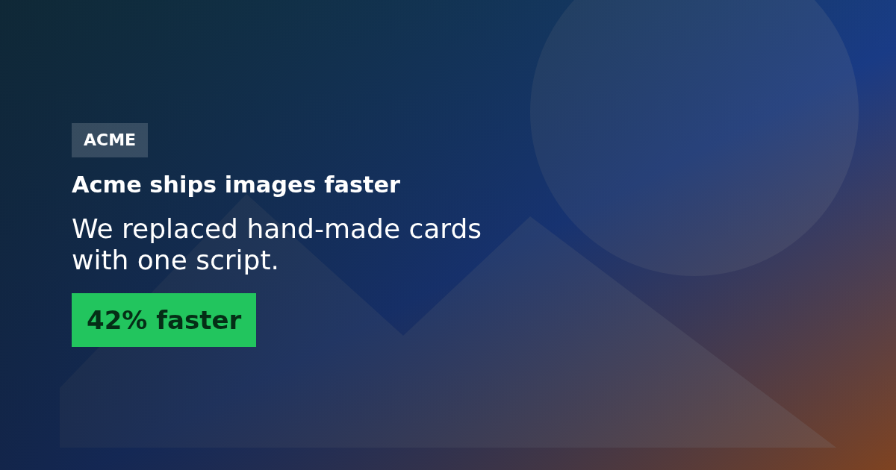

### `announcement`

A launch or event announcement image with title, optional subtitle, badge, meta line, CTA,
configurable colors, size, and font family.

CLI:

```bash
clickclick preset announcement \
  --title "Launch week starts now" \
  --subtitle "Five focused updates for faster social image workflows." \
  --badge "Event" \
  --meta "July 2026" \
  --cta "See the schedule" \
  --out examples/presets/announcement.png
```

Library:

```ts
import { presets, renderImage } from "@maurogoncalo/clickclick";

await renderImage({
  ...presets.announcement({
    title: "Launch week starts now",
    subtitle: "Five focused updates for faster social image workflows.",
    badge: "Event",
    meta: "July 2026",
    cta: "See the schedule",
  }),
  output: { path: "examples/presets/announcement.png" },
});
```

Result:

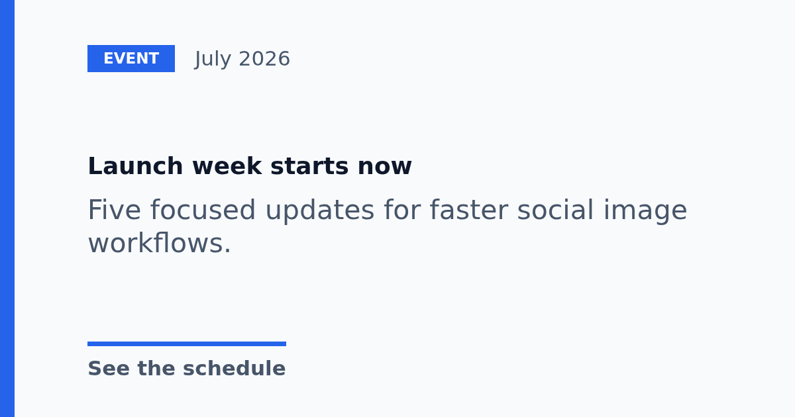

### `checkerboard`

A bold checkerboard-pattern social image with title, optional subtitle, optional label,
configurable pattern color, text color, accent color, size, and font family.

CLI:

```bash
clickclick preset checkerboard \
  --title "Make the update impossible to miss" \
  --subtitle "High-contrast cards for launches and calls for attention." \
  --label "New" \
  --out examples/presets/checkerboard.png
```

Library:

```ts
import { presets, renderImage } from "@maurogoncalo/clickclick";

await renderImage({
  ...presets.checkerboard({
    title: "Make the update impossible to miss",
    subtitle: "High-contrast cards for launches and calls for attention.",
    label: "New",
  }),
  output: { path: "examples/presets/checkerboard.png" },
});
```

Result:


### `compare`

A two-column before-and-after image with optional heading, configurable panel colors, text color,
accent color, size, and font family.

CLI:

```bash
clickclick preset compare \
  --title "Before and after the preset pass" \
  --before-title "Before" \
  --before-text "One solid card" \
  --after-title "After" \
  --after-text "Nine documented presets" \
  --out examples/presets/compare.png
```

Library:

```ts
import { presets, renderImage } from "@maurogoncalo/clickclick";

await renderImage({
  ...presets.compare({
    title: "Before and after the preset pass",
    beforeTitle: "Before",
    beforeText: "One solid card",
    afterTitle: "After",
    afterText: "Nine documented presets",
  }),
  output: { path: "examples/presets/compare.png" },
});
```

Result:

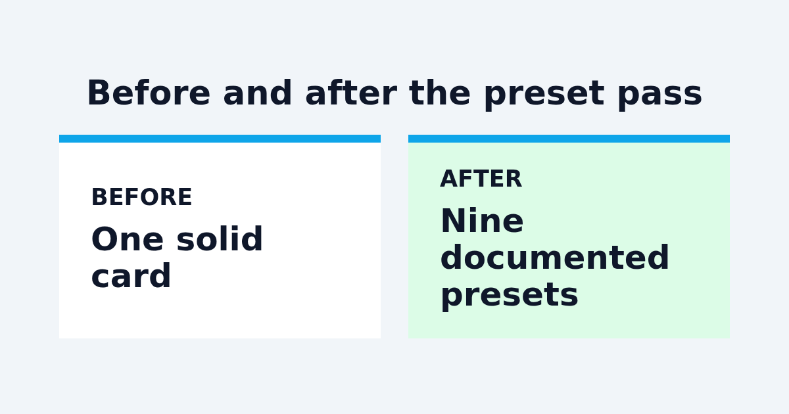

### `minimal`

A minimal editorial image with title, optional subtitle, optional metadata, configurable colors,
alignment, size, and font family.

CLI:

```bash
clickclick preset minimal \
  --title "Readable social cards without decoration" \
  --subtitle "A quiet preset for articles, docs, and product notes." \
  --meta "Design note" \
  --accent "#111827" \
  --out examples/presets/minimal.png
```

Library:

```ts
import { presets, renderImage } from "@maurogoncalo/clickclick";

await renderImage({
  ...presets.minimal({
    title: "Readable social cards without decoration",
    subtitle: "A quiet preset for articles, docs, and product notes.",
    meta: "Design note",
    accentColor: "#111827",
  }),
  output: { path: "examples/presets/minimal.png" },
});
```

Result:

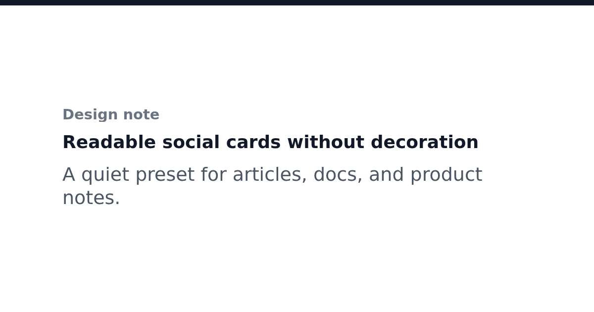

### `quote`

An editorial quote image with large quote text, optional attribution, optional source, configurable
quote mark, alignment, background, text, accent color, size, and font family.

CLI:

```bash
clickclick preset quote \
  --quote "Small tools should still feel carefully made." \
  --attribution "ClickClick" \
  --source "Preset gallery" \
  --mark ">>" \
  --align center \
  --out examples/presets/quote.png
```

Library:

```ts
import { presets, renderImage } from "@maurogoncalo/clickclick";

await renderImage({
  ...presets.quote({
    quote: "Small tools should still feel carefully made.",
    attribution: "ClickClick",
    source: "Preset gallery",
    mark: ">>",
    align: "center",
  }),
  output: { path: "examples/presets/quote.png" },
});
```

Result:

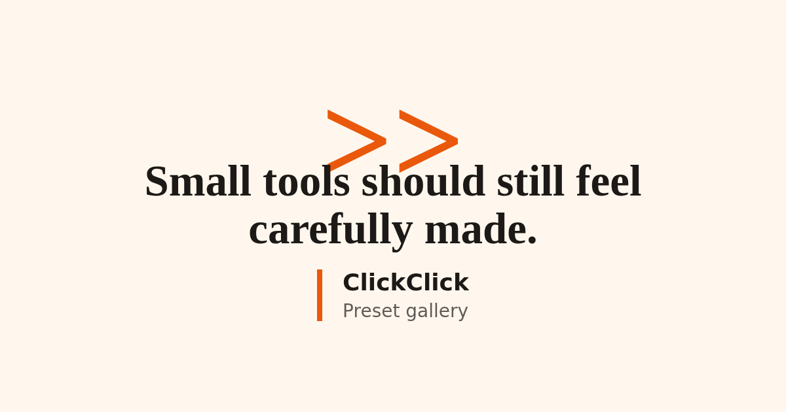

### `solid`

A solid-background social image with title, optional subtitle, optional label, configurable colors,
accent color, size, font family, and left or center alignment. It uses the same
`data-clickclick-fit` text-fitting mechanism available to user-authored HTML.

CLI:

```bash
clickclick preset solid \
  --title "Launch notes" \
  --subtitle "A concise social card" \
  --label "Update" \
  --background "#111827" \
  --text-color "#ffffff" \
  --accent "#2563eb" \
  --out examples/presets/solid.png
```

Library:

```ts
import { presets, renderImage } from "@maurogoncalo/clickclick";

await renderImage({
  ...presets.solid({
    title: "Launch notes",
    subtitle: "A concise social card",
    label: "Update",
    backgroundColor: "#111827",
    textColor: "#ffffff",
    accentColor: "#2563eb",
  }),
  output: { path: "examples/presets/solid.png" },
});
```

Result:

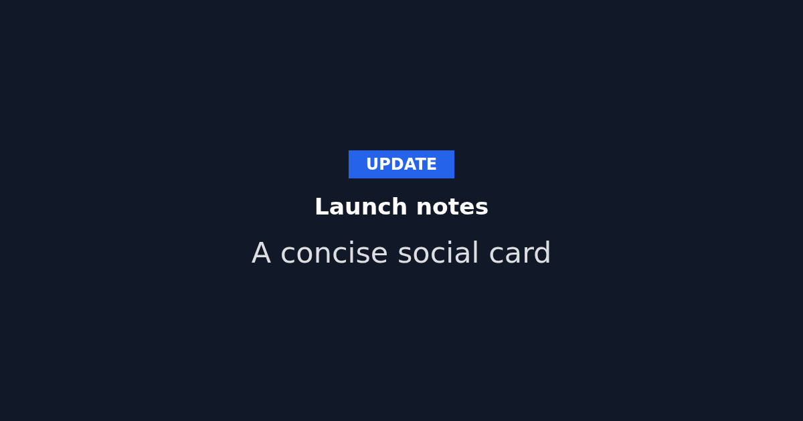

### `split`

A split-layout social image with text on the left and a bold graphic panel on the right. It supports
an optional label, subtitle, panel color, background color, text color, accent color, panel side,
size, and font family.

CLI:

```bash
clickclick preset split \
  --title "Ship a sharper changelog" \
  --subtitle "Readable layouts for posts, releases, and product updates." \
  --label "Release" \
  --panel-side left \
  --out examples/presets/split.png
```

Library:

```ts
import { presets, renderImage } from "@maurogoncalo/clickclick";

await renderImage({
  ...presets.split({
    title: "Ship a sharper changelog",
    subtitle: "Readable layouts for posts, releases, and product updates.",
    label: "Release",
    panelSide: "left",
  }),
  output: { path: "examples/presets/split.png" },
});
```

Result:

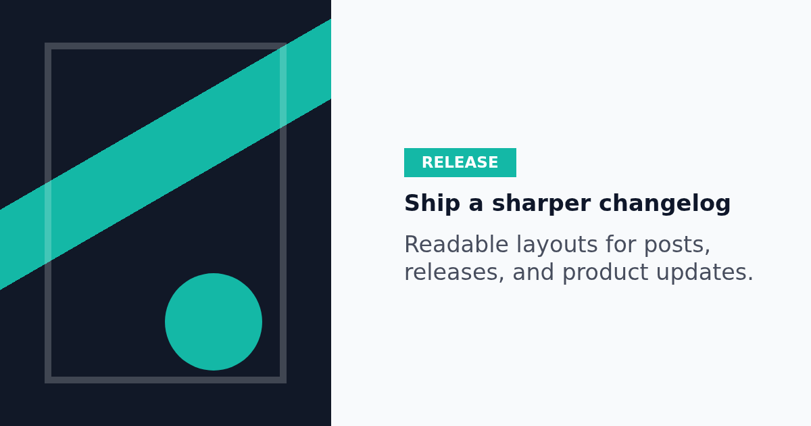

### `terminal`

A developer-focused social image with title, optional subtitle, command, prompt, optional output
line, configurable page, terminal, text, command, accent colors, size, and font families.

CLI:

```bash
clickclick preset terminal \
  --title "Automate image generation" \
  --subtitle "Render social cards from scripts, docs, or CI." \
  --prompt ">" \
  --command "clickclick preset terminal --out og.png" \
  --output-text "created og.png" \
  --out examples/presets/terminal.png
```

Library:

```ts
import { presets, renderImage } from "@maurogoncalo/clickclick";

await renderImage({
  ...presets.terminal({
    title: "Automate image generation",
    subtitle: "Render social cards from scripts, docs, or CI.",
    prompt: ">",
    command: "clickclick preset terminal --out og.png",
    output: "created og.png",
  }),
  output: { path: "examples/presets/terminal.png" },
});
```

Result:

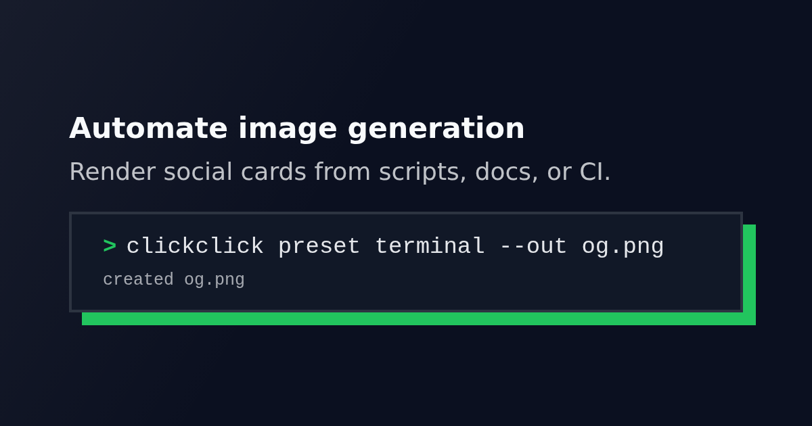
## PNG and JPEG

ClickClick infers the format from `output.path` when possible. `.jpg` and `.jpeg` produce JPEG;
everything else defaults to PNG unless `output.format` is provided. JPEG supports `quality`. PNG
supports `omitBackground` for explicit transparency.

## Text Fitting

Add `data-clickclick-fit` to an element to let ClickClick reduce only its inline `font-size` until
the content fits its existing box:

```html
<h1 data-clickclick-fit data-clickclick-min-font-size="28">Long title</h1>
```

Programmatic targets are also supported through `fitText`. The fitter runs after page readiness,
fonts, delay, and the `beforeScreenshot` hook, but before the screenshot. It does not change text,
box size, line height, letter spacing, or transforms.

Overflow at the minimum size returns a `TEXT_FIT_OVERFLOW` warning by default. Use
`data-clickclick-on-overflow="error"` or a programmatic target with `onOverflow: "error"` to throw a
`ClickClickError`. The CLI prints warnings to stderr and exits zero unless `--strict` is set.

## Errors

Known failures throw `ClickClickError` with stable codes:

- `INVALID_INPUT`
- `MISSING_SELECTOR`
- `TEXT_FIT_OVERFLOW`
- `BROWSER_LAUNCH_FAILED`
- `RENDER_FAILED`

## Development

```bash
npm test
npm run check
npm run build
npm run pack:dry
```

## Release

CI runs on pushes to `main` and on pull requests across Node 20, 22, and 24. Each run installs
dependencies, installs Playwright Chromium, typechecks, builds, runs tests, and verifies the npm
package contents with `npm pack --dry-run`.

Publishing to npm is handled by the `Publish to npm` GitHub Actions workflow. The publish workflow
checks out `main`, bumps `package.json` and `package-lock.json` to the next unused patch version when
the committed version already exists on npm or already has a git tag, verifies the npm package
contents, commits and tags that release version, and publishes it with provenance. It is manually
dispatched and requires the operator to confirm the package name before publishing. The workflow uses
npm trusted publishing with GitHub Actions OIDC, so npm must be configured with a trusted publisher
for:

- Package: `@maurogoncalo/clickclick`
- Repository: `mintyPT/clickclick`
- Workflow filename: `publish.yml`
- Allowed action: `npm publish`

The publish job publishes with provenance:

```bash
npm publish --access public --provenance
```

Before the workflow can publish, the npm package owner must authorize it as a trusted publisher:

```bash
npm install -g npm@latest
npm trust github @maurogoncalo/clickclick \
  --repo mintyPT/clickclick \
  --file publish.yml \
  --allow-publish \
  --yes
```
