# ClickClick

ClickClick generates PNG and JPEG social images by rendering HTML in headless Chromium with
Playwright. It can be used as a library or as the `clickclick` CLI.

## Scope

The v1 surface is intentionally small:

- render user-authored HTML/CSS to PNG or JPEG;
- screenshot arbitrary URLs to PNG or JPEG;
- render built-in social image presets;
- opt in to text fitting for elements that should shrink to fit;
- report structured warnings and stable error codes.

It does not manage user preset registries or publish anything externally.

## Setup

Use Node 20 or newer.

```bash
npm install @maurogoncalo/clickclick
npx playwright install chromium
```

If Chromium cannot start, install the system dependencies requested by Playwright for your platform.

First-run CLI check:

```bash
npx clickclick preset list
npx clickclick preset solid --title "Hello from ClickClick" --out og.png
```

## Library

```ts
import { renderImage, presets, screenshotUrl } from "@maurogoncalo/clickclick";

await renderImage({
  document: {
    html: "<main><h1 data-clickclick-fit>Hello</h1></main>",
    css: "body{margin:0;background:#111;color:white}main{width:1200px;height:630px}",
  },
  output: { path: "og.png" },
});

await renderImage({
  ...presets.solid({
    title: "Launch notes",
    subtitle: "A concise social card",
    backgroundColor: "#111827",
    textColor: "#fff",
  }),
  output: { path: "solid.png" },
});

await screenshotUrl({
  url: "https://www.anthropic.com/",
  viewport: { width: 1200, height: 630 },
  render: { fullPage: true, waitUntil: "networkidle" },
  output: { path: "anthropic-home.png", format: "png" },
  locale: "en-US",
});
```

Use `createRenderer()` when rendering many images in one process. It reuses the browser while still
creating a fresh browser context for every render. You may also pass an externally managed Playwright
`Browser`; ClickClick will not close it.

### Renderer Lifecycle APIs

Batch renders through one browser:

```ts
import { createRenderer, presets } from "@maurogoncalo/clickclick";

const renderer = await createRenderer();
try {
  for (const name of ["launch", "docs", "release"]) {
    await renderer.render({
      ...presets.solid({ title: name, subtitle: "Batch render" }),
      output: { path: `dist/${name}.png` },
    });
  }
} finally {
  await renderer.close();
}
```

Use an externally managed Playwright browser when another process owns browser startup and shutdown:

```ts
import { chromium } from "playwright";
import { createRenderer, presets } from "@maurogoncalo/clickclick";

const browser = await chromium.launch();
const renderer = await createRenderer({ browser });
await renderer.render({
  ...presets.gradient({ title: "Managed browser" }),
  output: { path: "managed-browser.png" },
});
await renderer.close();
await browser.close();
```

Mutate or wait on the page immediately before capture:

```ts
await renderer.render({
  document: { html: "<main><h1>Ready</h1></main>", css: "main{width:1200px;height:630px}" },
  render: {
    beforeScreenshot: async (page) => {
      await page.locator("h1").evaluate((node) => { node.textContent = "Captured"; });
    },
  },
});
```

Read the returned buffer when you do not pass `output.path`:

```ts
const result = await renderer.render({
  ...presets.quote({ quote: "Return a buffer, not a file." }),
  output: { format: "png" },
});

console.log(result.buffer.length, result.format, result.width, result.height, result.path);
for (const warning of result.warnings) console.warn(warning.code, warning.message);
```

Handle structured errors and text-fit warnings:

```ts
import { ClickClickError, renderImage } from "@maurogoncalo/clickclick";

try {
  const result = await renderImage({
    document: {
      html: '<main><h1 class="title" data-clickclick-fit>Very long copy...</h1></main>',
      css: "main{width:400px;height:200px}.title{font-size:96px;max-height:90px;overflow:hidden}",
    },
    fitText: [{ selector: ".title", minFontSize: 24, maxFontSize: 96, onOverflow: "warn" }],
  });

  for (const warning of result.warnings) {
    if (warning.code === "TEXT_FIT_OVERFLOW") console.warn(warning.selector);
  }
} catch (error) {
  if (error instanceof ClickClickError && error.code === "INVALID_INPUT") {
    console.error(error.message);
  }
}
```

## CLI

Render an HTML file:

```bash
clickclick render ./examples/card.html --css ./examples/card.css --out og.png
```

Screenshot a URL:

```bash
clickclick screenshot-url https://www.anthropic.com/ --out anthropic-home.png --width 1200 --height 630
```

Generate a built-in preset:

```bash
clickclick preset gradient --title "Hello" --subtitle "From ClickClick" --out og.png
```

List presets:

```bash
clickclick preset list
```

Common render flags include `--width`, `--height`, `--format`, `--quality`, `--selector`,
`--wait-until`, `--delay`, `--omit-background`, and `--strict`. URL screenshots also support
`--full-page`, `--omit-background`, and `--locale`. `--out` and `--output` are aliases.

## Advanced Output Modes

Use JPEG when you need smaller opaque images:

```bash
clickclick render examples/card.html \
  --css examples/card.css \
  --out examples/use-cases/jpeg-quality.jpg \
  --width 1200 \
  --height 630 \
  --format jpeg \
  --quality 82
```

```ts
import { readFile } from "node:fs/promises";
import { renderImage } from "@maurogoncalo/clickclick";

await renderImage({
  document: {
    html: await readFile("examples/card.html", "utf8"),
    css: await readFile("examples/card.css", "utf8"),
  },
  viewport: { width: 1200, height: 630 },
  output: { path: "examples/use-cases/jpeg-quality.jpg", format: "jpeg", quality: 82 },
});
```

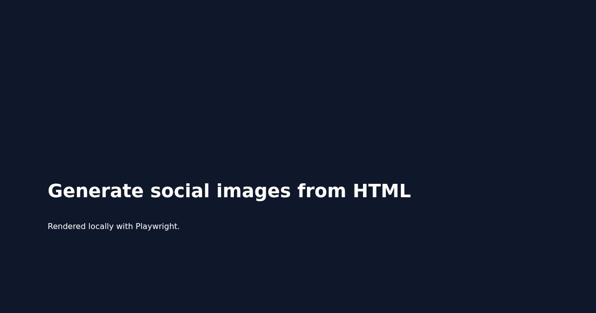

Use selector capture when the page contains a larger layout but the image should include only one
element:

```bash
clickclick render examples/card.html \
  --css examples/card.css \
  --selector main \
  --out examples/use-cases/selector-card.png \
  --width 1200 \
  --height 630
```

```ts
await renderImage({
  document: {
    html: await readFile("examples/card.html", "utf8"),
    css: await readFile("examples/card.css", "utf8"),
  },
  viewport: { width: 1200, height: 630 },
  render: { selector: "main" },
  output: { path: "examples/use-cases/selector-card.png" },
});
```

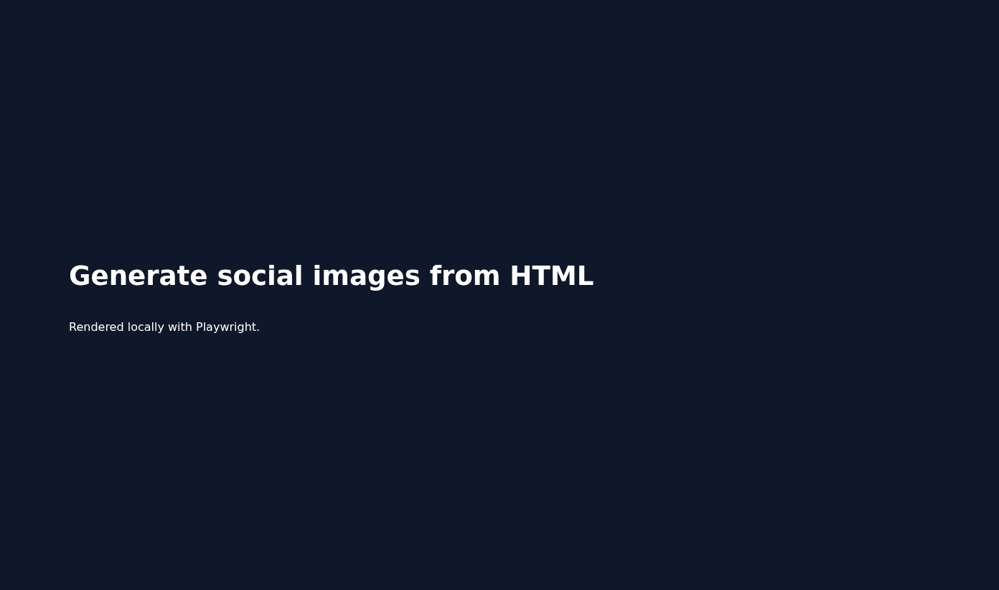

Use transparent PNG output when the document background should stay transparent:

```bash
clickclick render examples/use-cases/transparent-card.html \
  --css examples/use-cases/transparent-card.css \
  --out examples/use-cases/transparent-card.png \
  --width 1200 \
  --height 630 \
  --omit-background
```

```ts
await renderImage({
  document: {
    html: await readFile("examples/use-cases/transparent-card.html", "utf8"),
    css: await readFile("examples/use-cases/transparent-card.css", "utf8"),
  },
  viewport: { width: 1200, height: 630 },
  output: { path: "examples/use-cases/transparent-card.png", omitBackground: true },
});
```

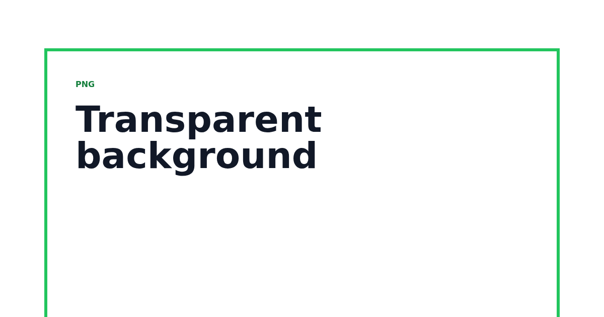

URL screenshots support selector-only capture, full-page capture, wait events, render delays, and
locale:

```bash
clickclick screenshot-url https://www.anthropic.com/ \
  --selector main \
  --out examples/use-cases/anthropic-home.png \
  --width 1200 \
  --height 630 \
  --wait-until networkidle \
  --delay 1000 \
  --locale en-US

clickclick screenshot-url https://www.anthropic.com/ \
  --full-page \
  --out examples/use-cases/anthropic-home.png \
  --width 1200 \
  --height 630
```

```ts
import { screenshotUrl } from "@maurogoncalo/clickclick";

await screenshotUrl({
  url: "https://www.anthropic.com/",
  viewport: { width: 1200, height: 630 },
  render: { selector: "main", waitUntil: "networkidle", delayMs: 1000 },
  output: { path: "examples/use-cases/anthropic-home.png" },
  locale: "en-US",
});

await screenshotUrl({
  url: "https://www.anthropic.com/",
  viewport: { width: 1200, height: 630 },
  render: { fullPage: true },
  output: { path: "examples/use-cases/anthropic-home.png" },
});
```

## Use Case Gallery

These examples cover the workflows ClickClick is meant to make scriptable: live website screenshots,
custom HTML cards, template modifications, and config-driven image sets.

### Capture a Live Website

Use URL screenshots when you need a reproducible image of a product page, docs page, landing page,
or public status page.

CLI:

```bash
clickclick screenshot-url https://www.anthropic.com/ \
  --out examples/use-cases/anthropic-home.png \
  --width 1200 \
  --height 630 \
  --wait-until networkidle \
  --delay 1000
```

Library:

```ts
import { screenshotUrl } from "@maurogoncalo/clickclick";

await screenshotUrl({
  url: "https://www.anthropic.com/",
  viewport: { width: 1200, height: 630 },
  render: { waitUntil: "networkidle", delayMs: 1000 },
  output: { path: "examples/use-cases/anthropic-home.png" },
  locale: "en-US",
});
```

Result:

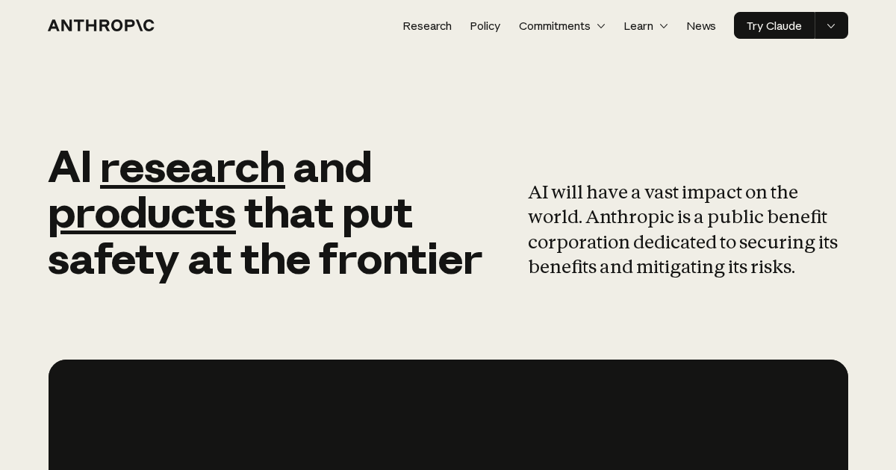

### Render Custom HTML with Fit Text

Use custom HTML/CSS when presets are too constrained, but keep `data-clickclick-fit` on important
copy that needs to survive variable titles.

CLI:

```bash
clickclick render examples/use-cases/fit-text-card.html \
  --css examples/use-cases/fit-text-card.css \
  --out examples/use-cases/fit-text-card.png \
  --width 1200 \
  --height 630
```

Library:

```ts
import { readFile } from "node:fs/promises";
import { renderImage } from "@maurogoncalo/clickclick";

await renderImage({
  document: {
    html: await readFile("examples/use-cases/fit-text-card.html", "utf8"),
    css: await readFile("examples/use-cases/fit-text-card.css", "utf8"),
  },
  viewport: { width: 1200, height: 630 },
  output: { path: "examples/use-cases/fit-text-card.png" },
});
```

Result:

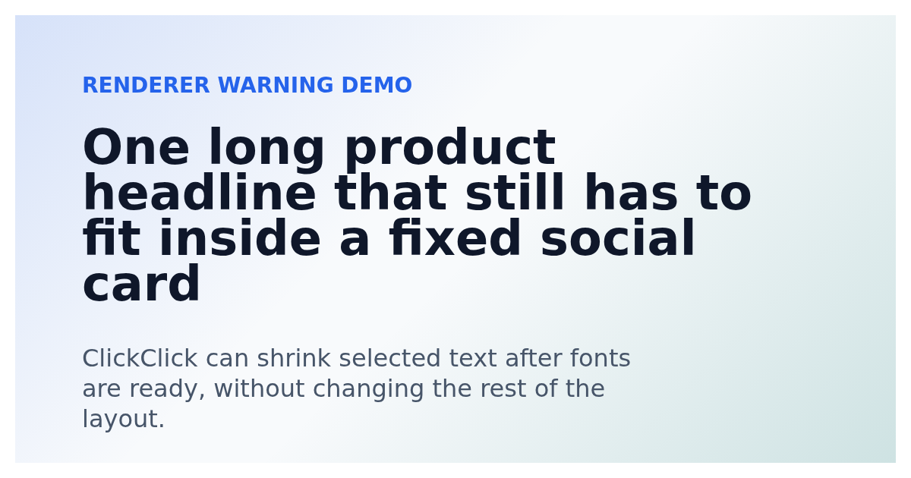

### Fit Text Edge Cases

Attribute-based fitting can set a minimum font size and overflow behavior:

```html
<h1
  data-clickclick-fit
  data-clickclick-min-font-size="28"
  data-clickclick-on-overflow="warn"
>
  A launch title that may be much longer than expected
</h1>
```

Programmatic fitting is useful when you cannot edit the source HTML:

```ts
import { renderImage } from "@maurogoncalo/clickclick";

const result = await renderImage({
  document: {
    html: '<main><h1 class="headline">A launch title that may be much longer than expected</h1></main>',
    css: "main{width:1200px;height:630px}.headline{width:760px;max-height:220px;font-size:96px;overflow:hidden}",
  },
  fitText: [
    {
      selector: ".headline",
      minFontSize: 28,
      maxFontSize: 96,
      onOverflow: "warn",
    },
  ],
});

for (const warning of result.warnings) {
  if (warning.code === "TEXT_FIT_OVERFLOW") {
    console.warn(`${warning.selector} overflowed at ${warning.minFontSize}px`);
  }
}
```

Deliberately long copy can produce a structured warning:

```ts
const result = await renderImage({
  document: {
    html: '<main><h1 class="headline">This headline is intentionally far too long for the available card area and should warn</h1></main>',
    css: "main{width:420px;height:180px}.headline{width:360px;max-height:80px;font-size:72px;overflow:hidden}",
  },
  fitText: [{ selector: ".headline", minFontSize: 32, onOverflow: "warn" }],
});

console.log(result.warnings.map((warning) => warning.code));
```

The CLI `--strict` flag turns renderer warnings into a non-zero exit:

```bash
clickclick render examples/use-cases/fit-text-card.html \
  --css examples/use-cases/fit-text-card.css \
  --out examples/use-cases/fit-text-card.png \
  --strict
```

Text fitting changes only font size. It does not rewrite text, change the box size, adjust
line-height, or remove transforms; size the containing element for the longest copy you intend to
support.

### Modify Template Layers from JSON

Use local templates when you want a reusable art direction with data-driven layer changes. Layers are
selected with `data-layer` attributes in the HTML.

CLI:

```bash
clickclick template examples/use-cases/product-card.html \
  --css examples/use-cases/product-card.css \
  --modify-json '[{"name":"label","text":"Template"},{"name":"title","text":"Modify image layers from JSON"},{"name":"subtitle","text":"Change copy, colors, effects, and visibility while the HTML stays reusable."},{"name":"cta","text":"Ship the asset"},{"name":"panel","background":"#312e81","shadow":"0 28px 80px rgba(15,23,42,.35)"},{"name":"badge","text":"JSON"}]' \
  --out examples/use-cases/template-modifications.png \
  --width 1200 \
  --height 630
```

Library:

```ts
import { renderTemplate } from "@maurogoncalo/clickclick";

await renderTemplate({
  htmlPath: "examples/use-cases/product-card.html",
  cssPath: "examples/use-cases/product-card.css",
  modifications: [
    { name: "label", text: "Template" },
    { name: "title", text: "Modify image layers from JSON" },
    {
      name: "subtitle",
      text: "Change copy, colors, effects, and visibility while the HTML stays reusable.",
    },
    { name: "cta", text: "Ship the asset" },
    { name: "panel", background: "#312e81", shadow: "0 28px 80px rgba(15,23,42,.35)" },
    { name: "badge", text: "JSON" },
  ],
  viewport: { width: 1200, height: 630 },
  output: { path: "examples/use-cases/template-modifications.png" },
});
```

Result:

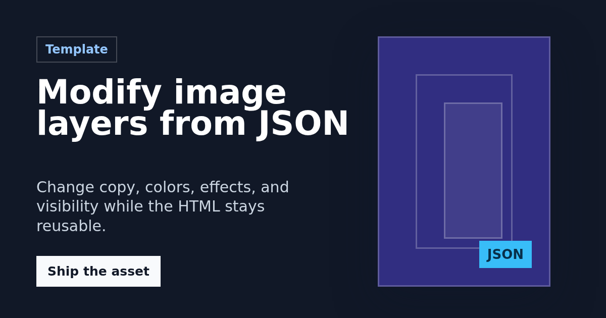

### Render a Config Recipe

Use recipes when the template, output size, and standard modifications should live in a project
config instead of a shell script.

CLI:

```bash
clickclick config recipe examples/use-cases/clickclick.config.json release
```

Library:

```ts
import { renderRecipe } from "@maurogoncalo/clickclick";

await renderRecipe("examples/use-cases/clickclick.config.json", "release");
```

Result:

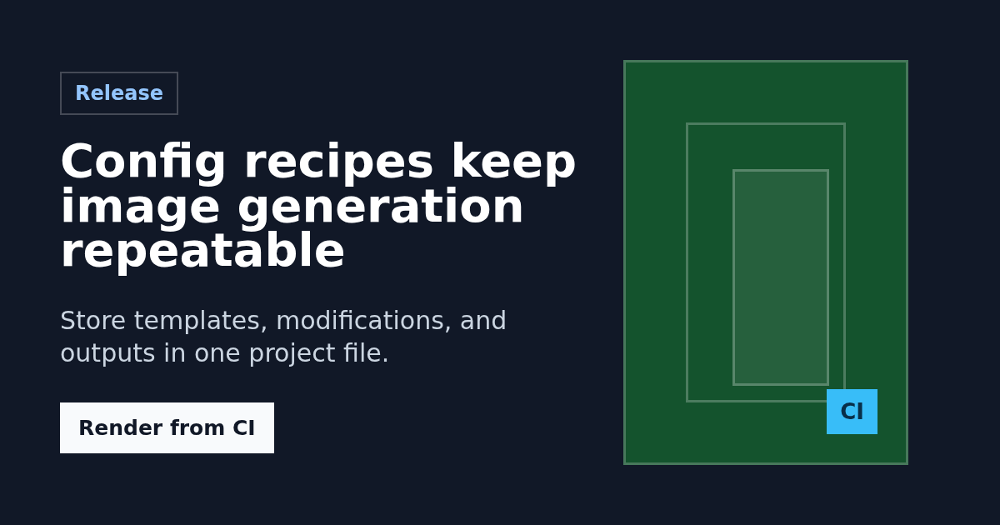

### Render a Multi-Size Social Set

Use template sets when one source template needs to produce several assets for different surfaces.

CLI:

```bash
clickclick config set examples/use-cases/clickclick.config.json social \
  --out-dir examples/use-cases/config-set
```

Library:

```ts
import { renderTemplateSet } from "@maurogoncalo/clickclick";

await renderTemplateSet(
  "examples/use-cases/clickclick.config.json",
  "social",
  "examples/use-cases/config-set",
);
```

Results:

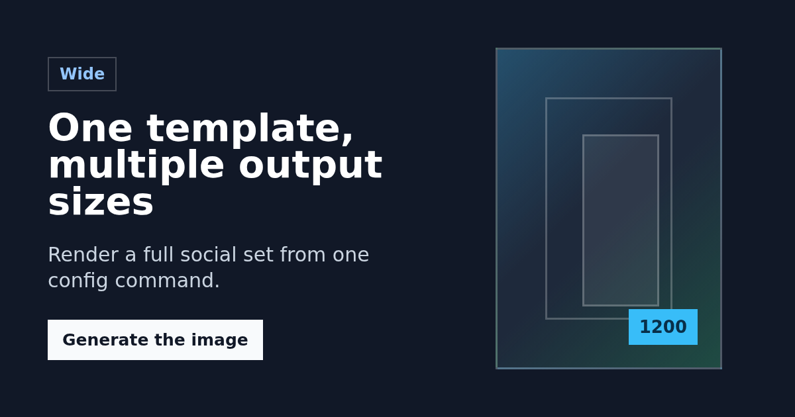

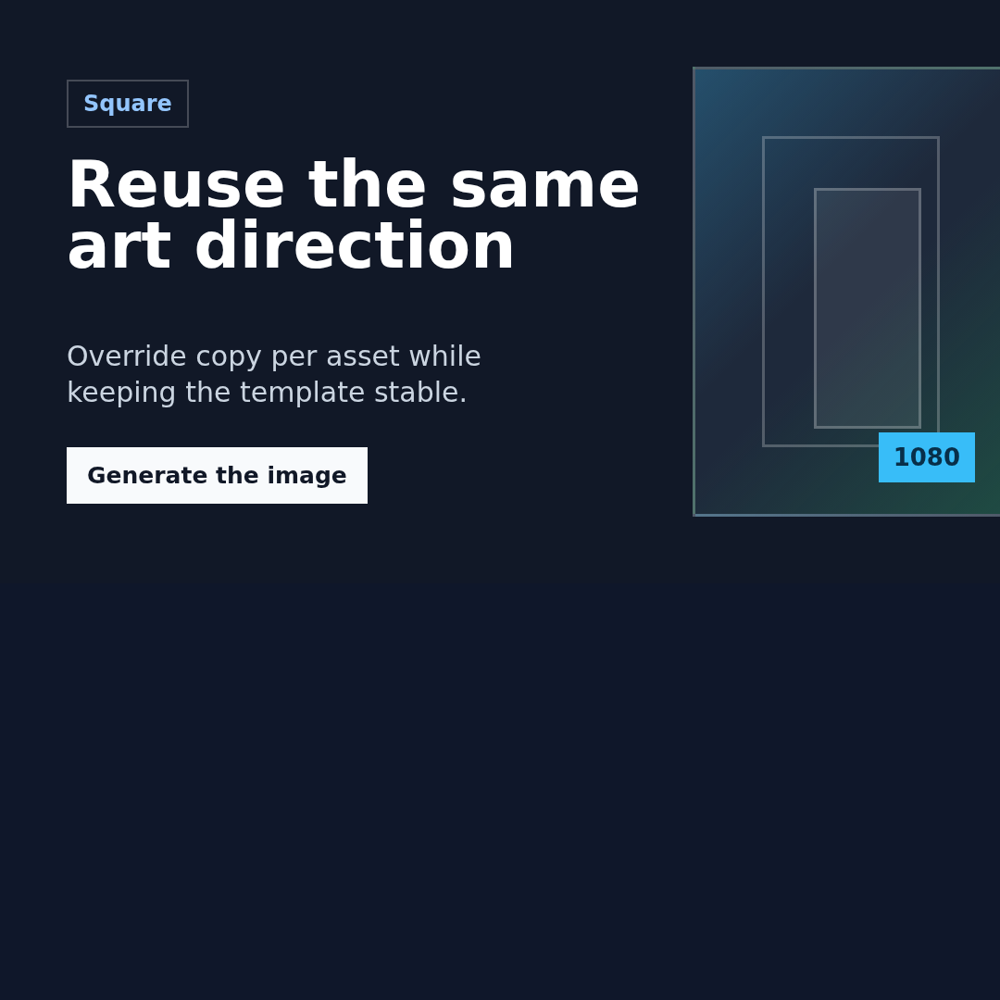

## Local Templates

Templates are normal HTML and CSS. Mark editable elements with `data-layer` names, then render them
directly or apply Bannerbear-style local modifications.

CLI:

```bash
clickclick template ./examples/card.html \
  --css ./examples/card.css \
  --modify-json '[{"name":"title","text":"Local launch"},{"name":"card","background":"#f8fafc"}]' \
  --out examples/templates/local-template.png
```

Library:

```ts
import { renderTemplate } from "@maurogoncalo/clickclick";

await renderTemplate({
  html: '<main data-layer="card"><h1 data-layer="title">Old</h1></main>',
  css: "main{width:1200px;height:630px;background:white}",
  modifications: [
    { name: "title", text: "Local launch", color: "#111827", alignment: "center" },
    { name: "card", background: "#f8fafc", shadow: "0 24px 80px rgba(15,23,42,.18)" },
  ],
  output: { path: "template.png" },
});
```

Result:

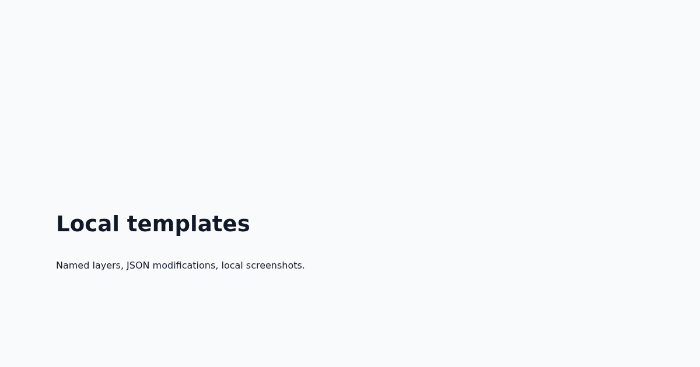

### Advanced Template Features

Use `--modify-file` when layer updates are easier to review as JSON:

```bash
clickclick template examples/use-cases/image-template.html \
  --css examples/use-cases/image-template.css \
  --modify-file examples/use-cases/template-modifications.json \
  --out examples/use-cases/image-template.png \
  --width 1200 \
  --height 630 \
  --strict
```

Library:

```ts
import { readFile } from "node:fs/promises";
import { renderTemplate } from "@maurogoncalo/clickclick";

await renderTemplate({
  htmlPath: "examples/use-cases/image-template.html",
  cssPath: "examples/use-cases/image-template.css",
  modifications: JSON.parse(await readFile("examples/use-cases/template-modifications.json", "utf8")),
  viewport: { width: 1200, height: 630 },
  output: { path: "examples/use-cases/image-template.png" },
});
```

Result:

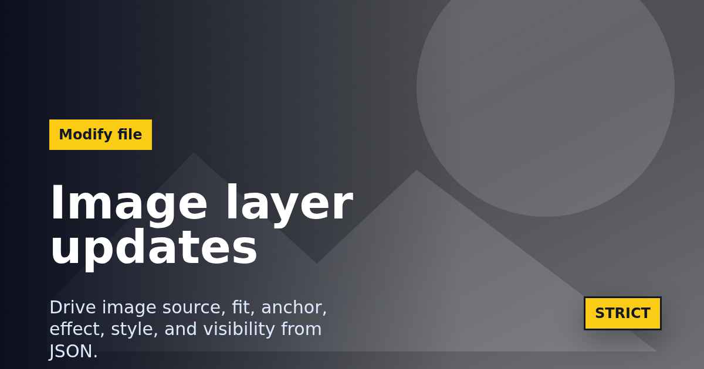

The JSON file updates an image layer with `src`, `fit`, `anchor`, and `effect`; it also demonstrates
text updates, `style`, `attributes`, `x`, `y`, `border`, `shadow`, and visibility-compatible layer
fields:

```json
[
  { "name": "hero", "src": "examples/presets/photo-source.svg", "fit": "cover", "anchor": "center", "effect": "grayscale" },
  { "name": "badge", "text": "STRICT", "x": -24, "y": -18, "border": "3px solid #111827" }
]
```

Register a custom font from the CLI or library/config:

```bash
clickclick template examples/use-cases/image-template.html \
  --css examples/use-cases/image-template.css \
  --font "Inter=./fonts/Inter.woff2" \
  --modify-file examples/use-cases/template-modifications.json \
  --out image-template.png
```

```ts
await renderTemplate({
  htmlPath: "examples/use-cases/image-template.html",
  cssPath: "examples/use-cases/image-template.css",
  fonts: [{ family: "Inter", source: "./fonts/Inter.woff2" }],
});
```

Choose warning behavior explicitly while developing templates:

```bash
clickclick template examples/use-cases/image-template.html \
  --css examples/use-cases/image-template.css \
  --modify-json '[{"name":"missing","text":"No layer"}]' \
  --on-missing-layer warn

clickclick template examples/use-cases/image-template.html \
  --css examples/use-cases/image-template.css \
  --modify-json '[{"name":"missing","text":"No layer"}]' \
  --on-missing-layer error \
  --strict
```

Debug bundles write the rendered HTML, CSS, and manifest:

```bash
clickclick template examples/use-cases/image-template.html \
  --css examples/use-cases/image-template.css \
  --modify-file examples/use-cases/template-modifications.json \
  --debug-dir .clickclick-debug \
  --out image-template.png
```

Supported modification fields include `text`, `html`, `src`, `image_url`, `color`, `background`,
`font_family`, `alignment`, `hide`, `show`, `style`, `className`, `attributes`, `x`, `y`, `border`,
`shadow`, `fit`, `anchor`, and `effect`. Effects are CSS-only: `grayscale`, `sepia`, `blur`,
`grayscale-blur`, `flip-horizontal`, `flip-vertical`, `invert`, and `negate`.

Register fonts with `--font "Family=./font.woff2"` in the CLI or with `fonts` in the library/config
API. ClickClick injects `@font-face` rules before capture and waits for browser font readiness.

## Config, Recipes, and Sets

Use a JSON config file to register reusable templates, named recipes, and multi-output sets:

```json
{
  "templates": {
    "card": { "htmlPath": "./examples/card.html", "cssPath": "./examples/card.css" }
  },
  "recipes": {
    "launch": {
      "template": "card",
      "output": { "path": "launch.png", "width": 1200, "height": 630 },
      "modifications": [{ "name": "title", "text": "Launch" }]
    }
  },
  "templateSets": {
    "social": [
      { "name": "square", "template": "card", "output": { "width": 1080, "height": 1080 } },
      { "name": "wide", "template": "card", "output": { "width": 1200, "height": 630 } }
    ]
  }
}
```

```bash
clickclick config templates ./clickclick.config.json
clickclick config recipe ./clickclick.config.json launch
clickclick config set ./clickclick.config.json social --out-dir ./dist/images
clickclick preview ./examples/card.html --css ./examples/card.css --watch
```

Add `--debug-dir ./debug-render` to template or recipe renders to write the source HTML/CSS and a
manifest with modifications and warnings.

### Preview and Config Authoring

Generate a one-shot preview while editing an HTML/CSS template:

```bash
clickclick preview examples/use-cases/product-card.html \
  --css examples/use-cases/product-card.css \
  --out-dir .clickclick-preview \
  --width 1200 \
  --height 630
```

The preview command writes `.clickclick-preview/preview.png`. Use watch mode for the local authoring
loop:

```bash
clickclick preview examples/use-cases/product-card.html \
  --css examples/use-cases/product-card.css \
  --out-dir .clickclick-preview \
  --watch
```

List templates registered in a config file:

```bash
clickclick config templates examples/use-cases/clickclick.config.json
```

Expected output:

```text
product
```

Render a recipe with CLI overrides:

```bash
clickclick config recipe examples/use-cases/clickclick.config.json release \
  --modify-json '[{"name":"title","text":"Recipe override"},{"name":"badge","text":"CLI"}]' \
  --out examples/use-cases/config-recipe.png \
  --width 1200 \
  --height 630
```

Render a template set into an output directory:

```bash
clickclick config set examples/use-cases/clickclick.config.json social \
  --out-dir examples/use-cases/config-set
```

Results:


Library equivalents:

```ts
import { listConfigTemplates, renderRecipe, renderTemplateSet } from "@maurogoncalo/clickclick";

const templates = await listConfigTemplates("examples/use-cases/clickclick.config.json");

await renderRecipe("examples/use-cases/clickclick.config.json", "release", {
  modifications: [
    { name: "title", text: "Recipe override" },
    { name: "badge", text: "API" },
  ],
  viewport: { width: 1200, height: 630 },
  output: { path: "examples/use-cases/config-recipe.png" },
});

await renderTemplateSet(
  "examples/use-cases/clickclick.config.json",
  "social",
  "examples/use-cases/config-set",
);

console.log(templates);
```

## Package Release

The npm package is prepared as `@maurogoncalo/clickclick` with MIT licensing, public npm access,
provenance-enabled publishing, a `clickclick` binary, ESM library exports, and TypeScript
declarations.

Before publishing, run the local release check:

```bash
npm run release:check
```

This runs type-checking, tests, a production build, and a package dry-run verification that checks
the built CLI, library entry points, declaration files, README, and license. To inspect npm's packed
file list without the full check:

```bash
npm run pack:dry
```

Publishing is intentionally manual. See [`RELEASE.md`](./RELEASE.md) for the confirmation checklist
and the GitHub Actions workflow steps. Do not publish from routine CI.

## Presets

ClickClick currently ships these built-in presets. Keep this list in sync with the exported
`presets` object and the CLI preset commands.

### `brandAnnouncement`

A branded announcement image with title, subtitle, CTA, a corner logo, and a faint logo watermark.

CLI:

```bash
clickclick preset brand-announcement \
  --title "New partner program" \
  --subtitle "Reusable branded cards with logo marks." \
  --cta "Apply today" \
  --logo examples/presets/clickclick-logo.svg \
  --watermark examples/presets/clickclick-logo.svg \
  --out examples/presets/brand-announcement.png
```

Library:

```ts
import { presets, renderImage } from "@maurogoncalo/clickclick";

await renderImage({
  ...presets.brandAnnouncement({
    title: "New partner program",
    subtitle: "Reusable branded cards with logo marks.",
    cta: "Apply today",
    logo: { src: "examples/presets/clickclick-logo.svg", placement: "top-right" },
    watermark: { src: "examples/presets/clickclick-logo.svg", opacity: 0.08, scale: 0.58 },
  }),
  output: { path: "examples/presets/brand-announcement.png" },
});
```

Image options accept `https:`, `data:`, `file:`, absolute paths, and paths relative to the current
working directory. Local paths are inlined as data URLs before Chromium renders the image.

Result:


### `logoBackdrop`

A centered headline over a large logo or text watermark backdrop.

CLI:

```bash
clickclick preset logo-backdrop \
  --title "Brand assets in seconds" \
  --meta "Backdrop" \
  --watermark-text "CLICK" \
  --out examples/presets/logo-backdrop.png
```

Library:

```ts
import { presets, renderImage } from "@maurogoncalo/clickclick";

await renderImage({
  ...presets.logoBackdrop({
    title: "Brand assets in seconds",
    meta: "Backdrop",
    watermark: { text: "CLICK" },
  }),
  output: { path: "examples/presets/logo-backdrop.png" },
});
```

Result:


### `partnerCard`

A two-logo card for integrations, partnerships, and co-marketing announcements.

CLI:

```bash
clickclick preset partner-card \
  --title "ClickClick + Acme" \
  --partner-name "Integration" \
  --logo examples/presets/clickclick-logo.svg \
  --partner-logo examples/presets/photo-source.svg \
  --out examples/presets/partner-card.png
```

Library:

```ts
import { presets, renderImage } from "@maurogoncalo/clickclick";

await renderImage({
  ...presets.partnerCard({
    title: "ClickClick + Acme",
    partnerName: "Integration",
    logo: { src: "examples/presets/clickclick-logo.svg" },
    partnerLogo: "examples/presets/photo-source.svg",
  }),
  output: { path: "examples/presets/partner-card.png" },
});
```

Result:


### `watermarkQuote`

A branded quote card with a logo or text watermark behind the quote.

CLI:

```bash
clickclick preset watermark-quote \
  --quote "Every launch asset now follows the brand." \
  --attribution "ClickClick" \
  --watermark-text "QUOTE" \
  --out examples/presets/watermark-quote.png
```

Library:

```ts
import { presets, renderImage } from "@maurogoncalo/clickclick";

await renderImage({
  ...presets.watermarkQuote({
    quote: "Every launch asset now follows the brand.",
    attribution: "ClickClick",
    watermark: { text: "QUOTE" },
  }),
  output: { path: "examples/presets/watermark-quote.png" },
});
```

Result:


### `badgeGrid`

An announcement card with a repeated logo or badge pattern behind foreground copy.

CLI:

```bash
clickclick preset badge-grid \
  --title "Hiring across product" \
  --subtitle "Repeatable badge backgrounds for announcements." \
  --badge "Hiring" \
  --badge-logo examples/presets/clickclick-logo.svg \
  --out examples/presets/badge-grid.png
```

Library:

```ts
import { presets, renderImage } from "@maurogoncalo/clickclick";

await renderImage({
  ...presets.badgeGrid({
    title: "Hiring across product",
    subtitle: "Repeatable badge backgrounds for announcements.",
    badge: "Hiring",
    badgeLogo: "examples/presets/clickclick-logo.svg",
  }),
  output: { path: "examples/presets/badge-grid.png" },
});
```

Result:


### `gradient`

A colorful gradient social image with title, optional subtitle, optional label, configurable
gradient colors, text color, accent color, alignment, size, and font family. It uses
`data-clickclick-fit` text fitting for title and subtitle.

CLI:

```bash
clickclick preset gradient \
  --title "Launch faster" \
  --subtitle "Colorful social cards from HTML and CSS" \
  --label "Preset" \
  --from "#0f766e" \
  --to "#7c3aed" \
  --accent "rgba(255,255,255,0.32)" \
  --align center \
  --out examples/presets/gradient.png
```

Library:

```ts
import { presets, renderImage } from "@maurogoncalo/clickclick";

await renderImage({
  ...presets.gradient({
    title: "Launch faster",
    subtitle: "Colorful social cards from HTML and CSS",
    label: "Preset",
    fromColor: "#0f766e",
    toColor: "#7c3aed",
    accentColor: "rgba(255,255,255,0.32)",
    align: "center",
  }),
  output: { path: "examples/presets/gradient.png" },
});
```

Result:


### `photoHero`

A full-bleed photo-backed hero card with a readable overlay, title, subtitle, label, and optional
logo corner.

CLI:

```bash
clickclick preset photo-hero \
  --title "Launch visuals that feel alive" \
  --subtitle "Photo-forward cards with readable overlays and logo corners." \
  --label "Photo" \
  --image examples/presets/photo-source.svg \
  --logo examples/presets/clickclick-logo.svg \
  --out examples/presets/photo-hero.png
```

Library:

```ts
import { presets, renderImage } from "@maurogoncalo/clickclick";

await renderImage({
  ...presets.photoHero({
    title: "Launch visuals that feel alive",
    subtitle: "Photo-forward cards with readable overlays and logo corners.",
    label: "Photo",
    image: "examples/presets/photo-source.svg",
    logo: { src: "examples/presets/clickclick-logo.svg" },
  }),
  output: { path: "examples/presets/photo-hero.png" },
});
```

Result:


### `editorialFeature`

A magazine-style feature layout with a cropped media panel, headline, kicker, and byline.

CLI:

```bash
clickclick preset editorial-feature \
  --title "Designing with local images" \
  --kicker "Editorial" \
  --byline "ClickClick Magazine" \
  --image examples/presets/photo-source.svg \
  --out examples/presets/editorial-feature.png
```

Library:

```ts
import { presets, renderImage } from "@maurogoncalo/clickclick";

await renderImage({
  ...presets.editorialFeature({
    title: "Designing with local images",
    kicker: "Editorial",
    byline: "ClickClick Magazine",
    image: "examples/presets/photo-source.svg",
  }),
  output: { path: "examples/presets/editorial-feature.png" },
});
```

Result:


### `eventPoster`

An event or launch poster with image backdrop, date block, metadata, CTA, and optional logo.

CLI:

```bash
clickclick preset event-poster \
  --title "Summer Launch" \
  --date "Jul 16" \
  --meta "Online" \
  --cta "Register now" \
  --image examples/presets/photo-source.svg \
  --logo examples/presets/clickclick-logo.svg \
  --out examples/presets/event-poster.png
```

Library:

```ts
import { presets, renderImage } from "@maurogoncalo/clickclick";

await renderImage({
  ...presets.eventPoster({
    title: "Summer Launch",
    date: "Jul 16",
    meta: "Online",
    cta: "Register now",
    image: "examples/presets/photo-source.svg",
    logo: { src: "examples/presets/clickclick-logo.svg" },
  }),
  output: { path: "examples/presets/event-poster.png" },
});
```

Result:


### `caseStudy`

An image-backed customer story card with customer label, quote, metric, logo, and overlay controls.

CLI:

```bash
clickclick preset case-study \
  --title "Acme ships images faster" \
  --customer "Acme" \
  --quote "We replaced hand-made cards with one script." \
  --metric "42% faster" \
  --image examples/presets/photo-source.svg \
  --logo examples/presets/clickclick-logo.svg \
  --out examples/presets/case-study.png
```

Library:

```ts
import { presets, renderImage } from "@maurogoncalo/clickclick";

await renderImage({
  ...presets.caseStudy({
    title: "Acme ships images faster",
    customer: "Acme",
    quote: "We replaced hand-made cards with one script.",
    metric: "42% faster",
    image: "examples/presets/photo-source.svg",
    logo: { src: "examples/presets/clickclick-logo.svg" },
  }),
  output: { path: "examples/presets/case-study.png" },
});
```

Result:


### `announcement`

A launch or event announcement image with title, optional subtitle, badge, meta line, CTA,
configurable colors, size, and font family.

CLI:

```bash
clickclick preset announcement \
  --title "Launch week starts now" \
  --subtitle "Five focused updates for faster social image workflows." \
  --badge "Event" \
  --meta "July 2026" \
  --cta "See the schedule" \
  --out examples/presets/announcement.png
```

Library:

```ts
import { presets, renderImage } from "@maurogoncalo/clickclick";

await renderImage({
  ...presets.announcement({
    title: "Launch week starts now",
    subtitle: "Five focused updates for faster social image workflows.",
    badge: "Event",
    meta: "July 2026",
    cta: "See the schedule",
  }),
  output: { path: "examples/presets/announcement.png" },
});
```

Result:


### `checkerboard`

A bold checkerboard-pattern social image with title, optional subtitle, optional label,
configurable pattern color, text color, accent color, size, and font family.

CLI:

```bash
clickclick preset checkerboard \
  --title "Make the update impossible to miss" \
  --subtitle "High-contrast cards for launches and calls for attention." \
  --label "New" \
  --out examples/presets/checkerboard.png
```

Library:

```ts
import { presets, renderImage } from "@maurogoncalo/clickclick";

await renderImage({
  ...presets.checkerboard({
    title: "Make the update impossible to miss",
    subtitle: "High-contrast cards for launches and calls for attention.",
    label: "New",
  }),
  output: { path: "examples/presets/checkerboard.png" },
});
```

Result:


### `compare`

A two-column before-and-after image with optional heading, configurable panel colors, text color,
accent color, size, and font family.

CLI:

```bash
clickclick preset compare \
  --title "Before and after the preset pass" \
  --before-title "Before" \
  --before-text "One solid card" \
  --after-title "After" \
  --after-text "Nine documented presets" \
  --out examples/presets/compare.png
```

Library:

```ts
import { presets, renderImage } from "@maurogoncalo/clickclick";

await renderImage({
  ...presets.compare({
    title: "Before and after the preset pass",
    beforeTitle: "Before",
    beforeText: "One solid card",
    afterTitle: "After",
    afterText: "Nine documented presets",
  }),
  output: { path: "examples/presets/compare.png" },
});
```

Result:


### `minimal`

A minimal editorial image with title, optional subtitle, optional metadata, configurable colors,
alignment, size, and font family.

CLI:

```bash
clickclick preset minimal \
  --title "Readable social cards without decoration" \
  --subtitle "A quiet preset for articles, docs, and product notes." \
  --meta "Design note" \
  --accent "#111827" \
  --out examples/presets/minimal.png
```

Library:

```ts
import { presets, renderImage } from "@maurogoncalo/clickclick";

await renderImage({
  ...presets.minimal({
    title: "Readable social cards without decoration",
    subtitle: "A quiet preset for articles, docs, and product notes.",
    meta: "Design note",
    accentColor: "#111827",
  }),
  output: { path: "examples/presets/minimal.png" },
});
```

Result:


### `quote`

An editorial quote image with large quote text, optional attribution, optional source, configurable
quote mark, alignment, background, text, accent color, size, and font family.

CLI:

```bash
clickclick preset quote \
  --quote "Small tools should still feel carefully made." \
  --attribution "ClickClick" \
  --source "Preset gallery" \
  --mark ">>" \
  --align center \
  --out examples/presets/quote.png
```

Library:

```ts
import { presets, renderImage } from "@maurogoncalo/clickclick";

await renderImage({
  ...presets.quote({
    quote: "Small tools should still feel carefully made.",
    attribution: "ClickClick",
    source: "Preset gallery",
    mark: ">>",
    align: "center",
  }),
  output: { path: "examples/presets/quote.png" },
});
```

Result:


### `solid`

A solid-background social image with title, optional subtitle, optional label, configurable colors,
accent color, size, font family, and left or center alignment. It uses the same
`data-clickclick-fit` text-fitting mechanism available to user-authored HTML.

CLI:

```bash
clickclick preset solid \
  --title "Launch notes" \
  --subtitle "A concise social card" \
  --label "Update" \
  --background "#111827" \
  --text-color "#ffffff" \
  --accent "#2563eb" \
  --out examples/presets/solid.png
```

Library:

```ts
import { presets, renderImage } from "@maurogoncalo/clickclick";

await renderImage({
  ...presets.solid({
    title: "Launch notes",
    subtitle: "A concise social card",
    label: "Update",
    backgroundColor: "#111827",
    textColor: "#ffffff",
    accentColor: "#2563eb",
  }),
  output: { path: "examples/presets/solid.png" },
});
```

Result:


### `split`

A split-layout social image with text on the left and a bold graphic panel on the right. It supports
an optional label, subtitle, panel color, background color, text color, accent color, panel side,
size, and font family.

CLI:

```bash
clickclick preset split \
  --title "Ship a sharper changelog" \
  --subtitle "Readable layouts for posts, releases, and product updates." \
  --label "Release" \
  --panel-side left \
  --out examples/presets/split.png
```

Library:

```ts
import { presets, renderImage } from "@maurogoncalo/clickclick";

await renderImage({
  ...presets.split({
    title: "Ship a sharper changelog",
    subtitle: "Readable layouts for posts, releases, and product updates.",
    label: "Release",
    panelSide: "left",
  }),
  output: { path: "examples/presets/split.png" },
});
```

Result:


### `terminal`

A developer-focused social image with title, optional subtitle, command, prompt, optional output
line, configurable page, terminal, text, command, accent colors, size, and font families.

CLI:

```bash
clickclick preset terminal \
  --title "Automate image generation" \
  --subtitle "Render social cards from scripts, docs, or CI." \
  --prompt ">" \
  --command "clickclick preset terminal --out og.png" \
  --output-text "created og.png" \
  --out examples/presets/terminal.png
```

Library:

```ts
import { presets, renderImage } from "@maurogoncalo/clickclick";

await renderImage({
  ...presets.terminal({
    title: "Automate image generation",
    subtitle: "Render social cards from scripts, docs, or CI.",
    prompt: ">",
    command: "clickclick preset terminal --out og.png",
    output: "created og.png",
  }),
  output: { path: "examples/presets/terminal.png" },
});
```

Result:


## Preset Variations

These examples use the same built-in presets with different option combinations. They are useful
starting points when you want a different tone without writing custom HTML/CSS.

### Gradient Launch Alert

CLI:

```bash
clickclick preset gradient \
  --title "API v2 is live" \
  --subtitle "A sharper endpoint design with fewer moving parts." \
  --label "Launch" \
  --from "#be123c" \
  --to "#f97316" \
  --accent "rgba(255,255,255,0.35)" \
  --align left \
  --out examples/presets/gradient-launch.png
```

Library:

```ts
import { presets, renderImage } from "@maurogoncalo/clickclick";

await renderImage({
  ...presets.gradient({
    title: "API v2 is live",
    subtitle: "A sharper endpoint design with fewer moving parts.",
    label: "Launch",
    fromColor: "#be123c",
    toColor: "#f97316",
    accentColor: "rgba(255,255,255,0.35)",
    align: "left",
  }),
  output: { path: "examples/presets/gradient-launch.png" },
});
```

Result:

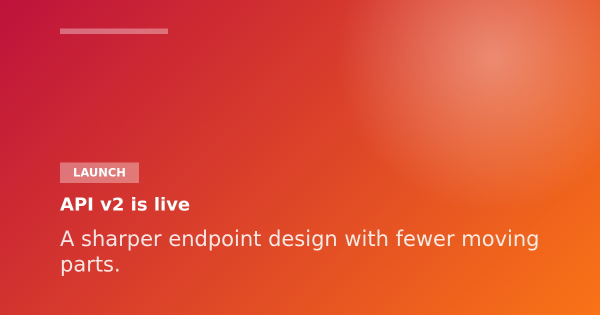

### Minimal Centered Article

CLI:

```bash
clickclick preset minimal \
  --title "What changed in the renderer" \
  --subtitle "A short technical note for people maintaining image pipelines." \
  --meta "Engineering" \
  --align center \
  --background "#f8fafc" \
  --accent "#0f766e" \
  --out examples/presets/minimal-article.png
```

Library:

```ts
import { presets, renderImage } from "@maurogoncalo/clickclick";

await renderImage({
  ...presets.minimal({
    title: "What changed in the renderer",
    subtitle: "A short technical note for people maintaining image pipelines.",
    meta: "Engineering",
    align: "center",
    backgroundColor: "#f8fafc",
    accentColor: "#0f766e",
  }),
  output: { path: "examples/presets/minimal-article.png" },
});
```

Result:

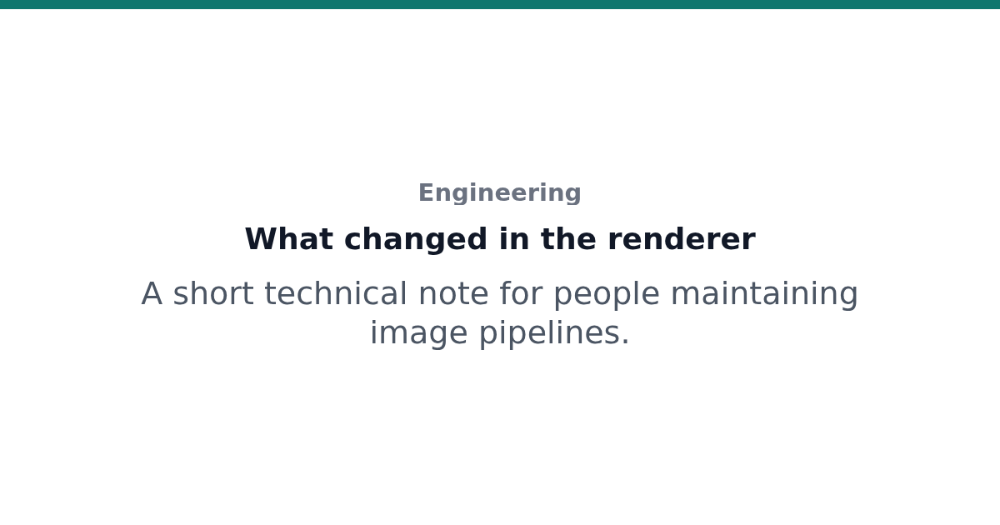

### Split Product Update

CLI:

```bash
clickclick preset split \
  --title "New dashboard filters" \
  --subtitle "Pin saved views, compare segments, and scan fresher data." \
  --label "Product" \
  --panel-side right \
  --background "#ffffff" \
  --panel-color "#0f172a" \
  --accent "#eab308" \
  --out examples/presets/split-product.png
```

Library:

```ts
import { presets, renderImage } from "@maurogoncalo/clickclick";

await renderImage({
  ...presets.split({
    title: "New dashboard filters",
    subtitle: "Pin saved views, compare segments, and scan fresher data.",
    label: "Product",
    panelSide: "right",
    backgroundColor: "#ffffff",
    panelColor: "#0f172a",
    accentColor: "#eab308",
  }),
  output: { path: "examples/presets/split-product.png" },
});
```

Result:

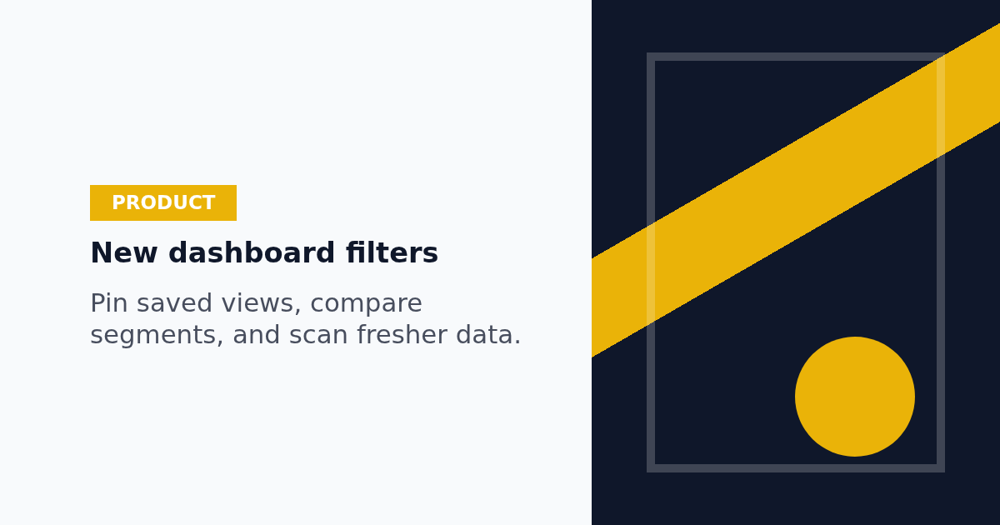

### Terminal Install Card

CLI:

```bash
clickclick preset terminal \
  --title "Install ClickClick" \
  --subtitle "Generate social images from your release scripts." \
  --prompt "$" \
  --command "npm install @maurogoncalo/clickclick" \
  --output-text "added 1 package" \
  --accent "#38bdf8" \
  --command-color "#ffffff" \
  --out examples/presets/terminal-install.png
```

Library:

```ts
import { presets, renderImage } from "@maurogoncalo/clickclick";

await renderImage({
  ...presets.terminal({
    title: "Install ClickClick",
    subtitle: "Generate social images from your release scripts.",
    prompt: "$",
    command: "npm install @maurogoncalo/clickclick",
    output: "added 1 package",
    accentColor: "#38bdf8",
    commandColor: "#ffffff",
  }),
  output: { path: "examples/presets/terminal-install.png" },
});
```

Result:

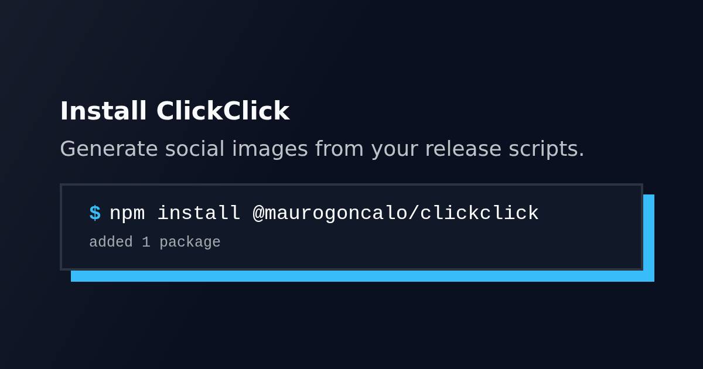

### Compare Migration Card

CLI:

```bash
clickclick preset compare \
  --title "Migration impact" \
  --before-title "Old flow" \
  --before-text "Manual screenshots" \
  --after-title "New flow" \
  --after-text "Scripted preset renders" \
  --before-color "#fee2e2" \
  --after-color "#dbeafe" \
  --accent "#2563eb" \
  --out examples/presets/compare-migration.png
```

Library:

```ts
import { presets, renderImage } from "@maurogoncalo/clickclick";

await renderImage({
  ...presets.compare({
    title: "Migration impact",
    beforeTitle: "Old flow",
    beforeText: "Manual screenshots",
    afterTitle: "New flow",
    afterText: "Scripted preset renders",
    beforeColor: "#fee2e2",
    afterColor: "#dbeafe",
    accentColor: "#2563eb",
  }),
  output: { path: "examples/presets/compare-migration.png" },
});
```

Result:

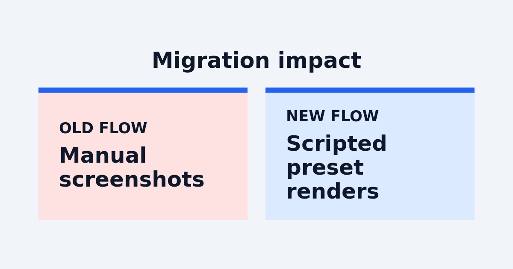

## PNG and JPEG

ClickClick infers the format from `output.path` when possible. `.jpg` and `.jpeg` produce JPEG;
everything else defaults to PNG unless `output.format` is provided. JPEG supports `quality`. PNG
supports `omitBackground` for explicit transparency.

## Text Fitting

Add `data-clickclick-fit` to an element to let ClickClick reduce only its inline `font-size` until
the content fits its existing box:

```html
<h1 data-clickclick-fit data-clickclick-min-font-size="28">Long title</h1>
```

Programmatic targets are also supported through `fitText`. The fitter runs after page readiness,
fonts, delay, and the `beforeScreenshot` hook, but before the screenshot. It does not change text,
box size, line height, letter spacing, or transforms.

Overflow at the minimum size returns a `TEXT_FIT_OVERFLOW` warning by default. Use
`data-clickclick-on-overflow="error"` or a programmatic target with `onOverflow: "error"` to throw a
`ClickClickError`. The CLI prints warnings to stderr and exits zero unless `--strict` is set.

## Errors

Known failures throw `ClickClickError` with stable codes:

- `INVALID_INPUT`
- `MISSING_SELECTOR`
- `TEXT_FIT_OVERFLOW`
- `BROWSER_LAUNCH_FAILED`
- `RENDER_FAILED`

## Development

```bash
npm test
npm run check
npm run build
npm run pack:dry
```

## Release

CI runs on pushes to `main` and on pull requests across Node 20, 22, and 24. Each run installs
dependencies, installs Playwright Chromium, typechecks, builds, runs tests, and verifies the npm
package contents with `npm pack --dry-run`.

Publishing to npm is handled by the `Publish to npm` GitHub Actions workflow. The publish workflow
checks out `main`, bumps `package.json` and `package-lock.json` to the next unused patch version when
the committed version already exists on npm or already has a git tag, verifies the npm package
contents, commits and tags that release version, and publishes it with provenance. It is manually
dispatched and requires the operator to confirm the package name before publishing. The workflow uses
npm trusted publishing with GitHub Actions OIDC, so npm must be configured with a trusted publisher
for:

- Package: `@maurogoncalo/clickclick`
- Repository: `mintyPT/clickclick`
- Workflow filename: `publish.yml`
- Allowed action: `npm publish`

The publish job publishes with provenance:

```bash
npm publish --access public --provenance
```

Before the workflow can publish, the npm package owner must authorize it as a trusted publisher:

```bash
npm install -g npm@latest
npm trust github @maurogoncalo/clickclick \
  --repo mintyPT/clickclick \
  --file publish.yml \
  --allow-publish \
  --yes
```
