# Examples and Advanced Usage

This page contains the longer ClickClick examples that used to live inline in the README. Commands assume they are run from the repository root; image links are relative to this document.

## Advanced Output Modes

Use JPEG when you need smaller opaque images:

```bash
clickclick render examples/card.html \
  --css examples/card.css \
  --out examples/use-cases/jpeg-quality.jpg \
  --width 1200 \
  --height 630 \
  --format jpeg \
  --quality 82
```

```ts
import { readFile } from "node:fs/promises";
import { renderImage } from "@maurogoncalo/clickclick";

await renderImage({
  document: {
    html: await readFile("examples/card.html", "utf8"),
    css: await readFile("examples/card.css", "utf8"),
  },
  viewport: { width: 1200, height: 630 },
  output: { path: "examples/use-cases/jpeg-quality.jpg", format: "jpeg", quality: 82 },
});
```


Use selector capture when the page contains a larger layout but the image should include only one
element:

```bash
clickclick render examples/card.html \
  --css examples/card.css \
  --selector main \
  --out examples/use-cases/selector-card.png \
  --width 1200 \
  --height 630
```

```ts
await renderImage({
  document: {
    html: await readFile("examples/card.html", "utf8"),
    css: await readFile("examples/card.css", "utf8"),
  },
  viewport: { width: 1200, height: 630 },
  render: { selector: "main" },
  output: { path: "examples/use-cases/selector-card.png" },
});
```


## Quality Gate Workflow

Use quality gates after rendering examples or template sets to fail CI on visual regressions,
overflowing text, low text contrast, unsafe social-platform margins, or non-deterministic renders.
Baseline and media paths stay outside preset code and are passed through CLI flags or library
options.

CLI:

```bash
clickclick quality image examples/use-cases/selector-card.png \
  --baseline test/baselines/selector-card.png \
  --max-diff-ratio 0.001 \
  --strict

clickclick quality render examples/card.html \
  --css examples/card.css \
  --baseline test/baselines/card.png \
  --text-selector "[data-clickclick-fit], h1, p" \
  --safe-area 48,48,72,48 \
  --deterministic \
  --width 1200 \
  --height 630 \
  --strict
```

Library:

```ts
import { readFile } from "node:fs/promises";
import { checkImageQuality, checkRenderQuality } from "@maurogoncalo/clickclick";

const image = await checkImageQuality({
  actualPath: "examples/use-cases/selector-card.png",
  baselinePath: "test/baselines/selector-card.png",
  maxDiffRatio: 0.001,
});

const render = await checkRenderQuality({
  document: {
    html: await readFile("examples/card.html", "utf8"),
    css: await readFile("examples/card.css", "utf8"),
  },
  viewport: { width: 1200, height: 630 },
  baselinePath: "test/baselines/card.png",
  textSelector: "[data-clickclick-fit], h1, p",
  safeArea: { top: 48, right: 48, bottom: 72, left: 48 },
  deterministic: true,
});

console.log(JSON.stringify({ image, render }, null, 2));
```

Result:

```json
{
  "image": {
    "passed": true,
    "diagnostics": []
  },
  "render": {
    "passed": true,
    "diagnostics": []
  }
}
```

Use transparent PNG output when the document background should stay transparent:

```bash
clickclick render examples/use-cases/transparent-card.html \
  --css examples/use-cases/transparent-card.css \
  --out examples/use-cases/transparent-card.png \
  --width 1200 \
  --height 630 \
  --omit-background
```

```ts
await renderImage({
  document: {
    html: await readFile("examples/use-cases/transparent-card.html", "utf8"),
    css: await readFile("examples/use-cases/transparent-card.css", "utf8"),
  },
  viewport: { width: 1200, height: 630 },
  output: { path: "examples/use-cases/transparent-card.png", omitBackground: true },
});
```


URL screenshots support selector-only capture, full-page capture, wait events, render delays, and
locale:

```bash
clickclick screenshot-url https://www.anthropic.com/ \
  --selector main \
  --out examples/use-cases/anthropic-home.png \
  --width 1200 \
  --height 630 \
  --wait-until networkidle \
  --delay 1000 \
  --locale en-US

clickclick screenshot-url https://www.anthropic.com/ \
  --full-page \
  --out examples/use-cases/anthropic-home.png \
  --width 1200 \
  --height 630
```

```ts
import { screenshotUrl } from "@maurogoncalo/clickclick";

await screenshotUrl({
  url: "https://www.anthropic.com/",
  viewport: { width: 1200, height: 630 },
  render: { selector: "main", waitUntil: "networkidle", delayMs: 1000 },
  output: { path: "examples/use-cases/anthropic-home.png" },
  locale: "en-US",
});

await screenshotUrl({
  url: "https://www.anthropic.com/",
  viewport: { width: 1200, height: 630 },
  render: { fullPage: true },
  output: { path: "examples/use-cases/anthropic-home.png" },
});
```

## Use Case Gallery

These examples cover the workflows ClickClick is meant to make scriptable: live website screenshots,
custom HTML cards, template modifications, and config-driven image sets.

### Example Set Workflow

Use manifest-driven example sets for multi-post inspiration work. The manifest keeps template paths,
variant JSON, output paths, and README labels in one place, so rendering and documentation stay in
sync.

```bash
npm run examples:scaffold -- campaign-social coral indigo lime
npm run examples:render -- examples/use-cases/orbit-social.manifest.json
npm run examples:readme -- examples/use-cases/orbit-social.manifest.json
npm run examples:contact-sheet -- examples/use-cases/orbit-social.manifest.json examples/use-cases/orbit-social-contact-sheet.png
```

For first-class composition output, render contact sheets, collages, QR codes, and simple charts
through the CLI or library. Media paths stay in flags or options, so preset code remains reusable.

```bash
clickclick composition contact-sheet \
  --image examples/use-cases/orbit-social-coral.png --caption "Coral" \
  --image examples/use-cases/orbit-social-indigo.png --caption "Indigo" \
  --image examples/use-cases/orbit-social-lime.png --caption "Lime" \
  --columns 3 \
  --width 900 \
  --background "#eef2f3" \
  --out examples/use-cases/composition-contact-sheet.png

clickclick composition qr https://github.com/mintyPT/clickclick \
  --caption "ClickClick docs" \
  --width 360 \
  --out examples/use-cases/composition-qr.png

clickclick composition bar-chart \
  --data '[{"label":"Launch","value":42},{"label":"Gallery","value":68},{"label":"Docs","value":55}]' \
  --title "Campaign views" \
  --width 720 \
  --height 420 \
  --background "#fbfaf7" \
  --bar-color "#0f766e" \
  --out examples/use-cases/composition-chart.png
```

```ts
import { barChart, collage, qrCode, renderImage } from "@maurogoncalo/clickclick";

await renderImage({
  ...collage({
    images: [
      { src: "examples/use-cases/orbit-social-coral.png", caption: "Coral" },
      { src: "examples/use-cases/orbit-social-indigo.png", caption: "Indigo" },
      { src: "examples/use-cases/orbit-social-lime.png", caption: "Lime" },
    ],
    columns: 3,
    width: 900,
    background: "#eef2f3",
  }),
  output: { path: "examples/use-cases/composition-contact-sheet.png" },
});

await renderImage({
  ...qrCode({ text: "https://github.com/mintyPT/clickclick", caption: "ClickClick docs", width: 360 }),
  output: { path: "examples/use-cases/composition-qr.png" },
});

await renderImage({
  ...barChart({
    title: "Campaign views",
    data: [
      { label: "Launch", value: 42 },
      { label: "Gallery", value: 68 },
      { label: "Docs", value: 55 },
    ],
    width: 720,
    height: 420,
    background: "#fbfaf7",
    barColor: "#0f766e",
  }),
  output: { path: "examples/use-cases/composition-chart.png" },
});
```


When adapting external references, replace source-specific names, logos, slogans, URLs, and direct
media. Use fictional copy and pass any needed assets through modification JSON or documented options.
Palettes may be shifted when that keeps the composition recognizable without copying the source
branding.

### Contact Sheet From Local Images

Use the supported contact sheet command when reviewing generated variants from local PNG or JPEG
files. Pass each image path explicitly and provide labels in the same order when captions help.

CLI:

```bash
clickclick contact-sheet \
  examples/presets/solid.png \
  examples/presets/gradient.png \
  examples/presets/quote.png \
  --out examples/use-cases/contact-sheet-cli.png \
  --columns 3 \
  --spacing 12 \
  --padding 16 \
  --label Solid \
  --label Gradient \
  --label Quote
```

Library:

```ts
import { createContactSheet } from "@maurogoncalo/clickclick";

await createContactSheet({
  images: [
    { path: "examples/presets/solid.png", label: "Solid" },
    { path: "examples/presets/gradient.png", label: "Gradient" },
    { path: "examples/presets/quote.png", label: "Quote" },
  ],
  output: { path: "examples/use-cases/contact-sheet-cli.png" },
  columns: 3,
  spacing: 12,
  padding: 16,
});
```

Result:


### Capture a Live Website

Use URL screenshots when you need a reproducible image of a product page, docs page, landing page,
or public status page.

CLI:

```bash
clickclick screenshot-url https://www.anthropic.com/ \
  --out examples/use-cases/anthropic-home.png \
  --width 1200 \
  --height 630 \
  --wait-until networkidle \
  --delay 1000
```

Library:

```ts
import { screenshotUrl } from "@maurogoncalo/clickclick";

await screenshotUrl({
  url: "https://www.anthropic.com/",
  viewport: { width: 1200, height: 630 },
  render: { waitUntil: "networkidle", delayMs: 1000 },
  output: { path: "examples/use-cases/anthropic-home.png" },
  locale: "en-US",
});
```

Result:


### Render Agriculture Brand Social Posts

Use custom templates when you need a cohesive family of square social posts with shared brand
language. These examples break a farm-branding social set into separate outputs: neon accent,
wordmark, cream shape, nature statement, dark slogan, and geometric pattern posts. Logo sources are
passed through modification JSON instead of being hardcoded in the template.

#### Neon Accent Post

CLI:

```bash
clickclick template examples/use-cases/agriculture-social-post.html \
  --css examples/use-cases/agriculture-social-post.css \
  --modify-file examples/use-cases/agriculture-social-accent.json \
  --out examples/use-cases/agriculture-social-accent.png \
  --width 1080 \
  --height 1080
```

Library:

```ts
import { readFile } from "node:fs/promises";
import { renderTemplate } from "@maurogoncalo/clickclick";

await renderTemplate({
  htmlPath: "examples/use-cases/agriculture-social-post.html",
  cssPath: "examples/use-cases/agriculture-social-post.css",
  modifications: JSON.parse(await readFile("examples/use-cases/agriculture-social-accent.json", "utf8")),
  viewport: { width: 1080, height: 1080 },
  output: { path: "examples/use-cases/agriculture-social-accent.png" },
});
```

Result:

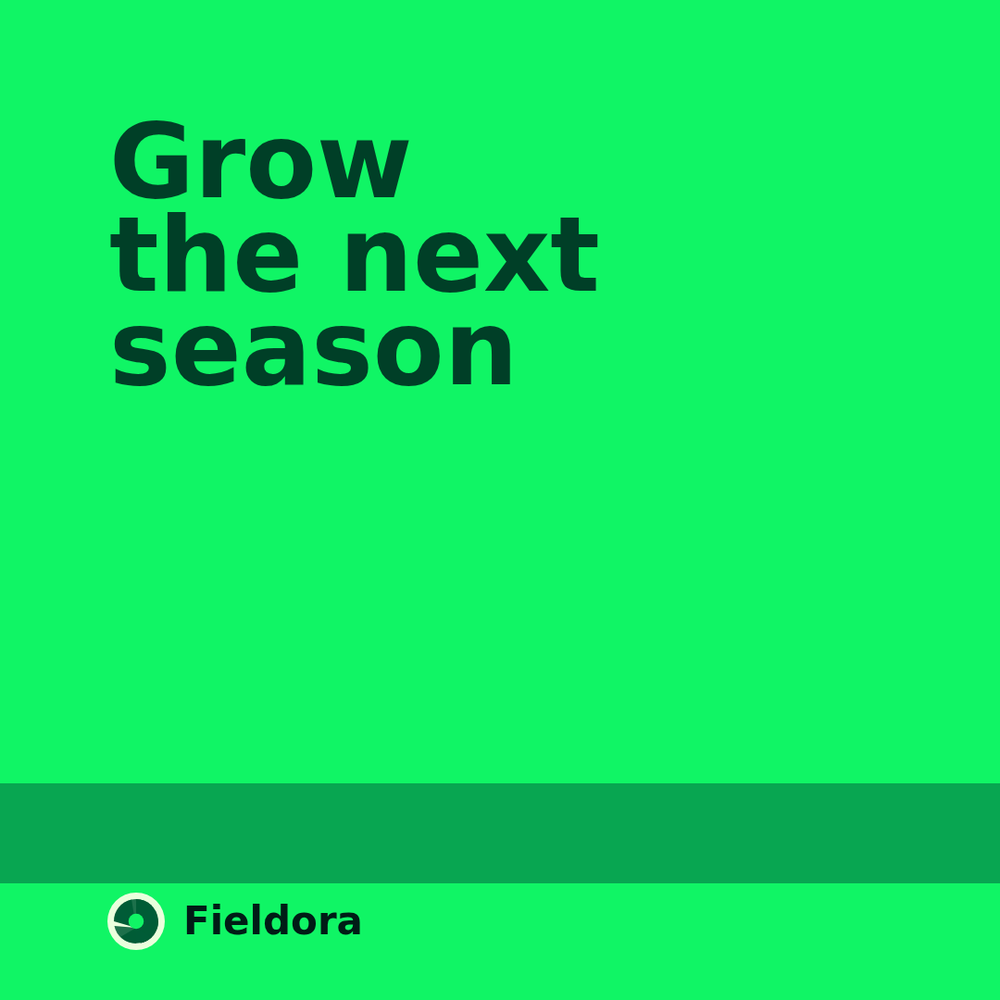

#### Wordmark Post

CLI:

```bash
clickclick template examples/use-cases/agriculture-social-post.html \
  --css examples/use-cases/agriculture-social-post.css \
  --modify-file examples/use-cases/agriculture-social-wordmark.json \
  --out examples/use-cases/agriculture-social-wordmark.png \
  --width 1080 \
  --height 1080
```

Library:

```ts
await renderTemplate({
  htmlPath: "examples/use-cases/agriculture-social-post.html",
  cssPath: "examples/use-cases/agriculture-social-post.css",
  modifications: JSON.parse(await readFile("examples/use-cases/agriculture-social-wordmark.json", "utf8")),
  viewport: { width: 1080, height: 1080 },
  output: { path: "examples/use-cases/agriculture-social-wordmark.png" },
});
```

Result:


#### Sustainable Shape Post

CLI:

```bash
clickclick template examples/use-cases/agriculture-social-post.html \
  --css examples/use-cases/agriculture-social-post.css \
  --modify-file examples/use-cases/agriculture-social-sustainable.json \
  --out examples/use-cases/agriculture-social-sustainable.png \
  --width 1080 \
  --height 1080
```

Library:

```ts
await renderTemplate({
  htmlPath: "examples/use-cases/agriculture-social-post.html",
  cssPath: "examples/use-cases/agriculture-social-post.css",
  modifications: JSON.parse(await readFile("examples/use-cases/agriculture-social-sustainable.json", "utf8")),
  viewport: { width: 1080, height: 1080 },
  output: { path: "examples/use-cases/agriculture-social-sustainable.png" },
});
```

Result:

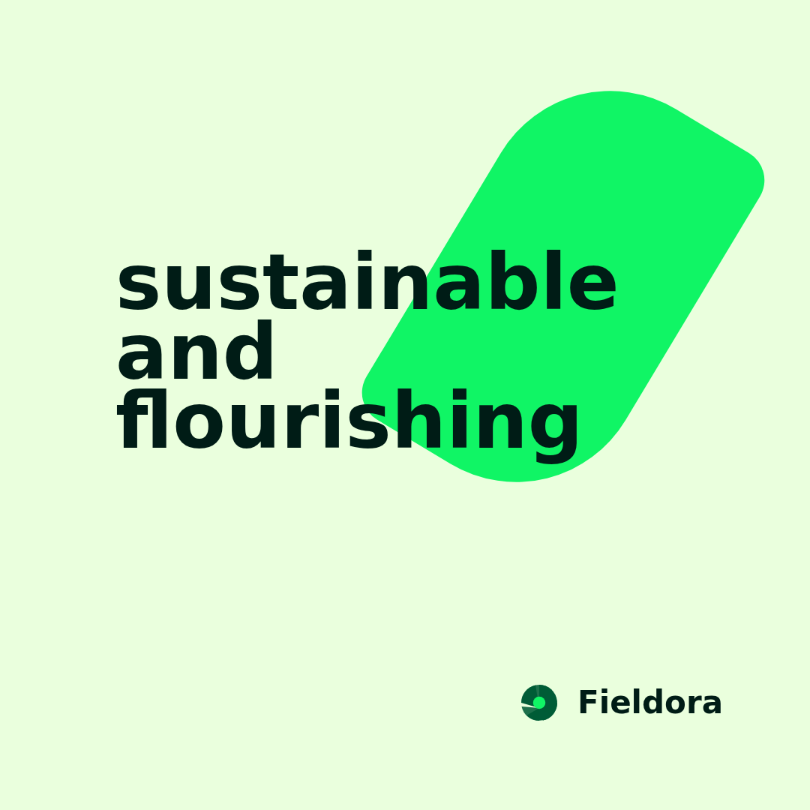

#### Nature Statement Post

CLI:

```bash
clickclick template examples/use-cases/agriculture-social-post.html \
  --css examples/use-cases/agriculture-social-post.css \
  --modify-file examples/use-cases/agriculture-social-decision.json \
  --out examples/use-cases/agriculture-social-decision.png \
  --width 1080 \
  --height 1080
```

Library:

```ts
await renderTemplate({
  htmlPath: "examples/use-cases/agriculture-social-post.html",
  cssPath: "examples/use-cases/agriculture-social-post.css",
  modifications: JSON.parse(await readFile("examples/use-cases/agriculture-social-decision.json", "utf8")),
  viewport: { width: 1080, height: 1080 },
  output: { path: "examples/use-cases/agriculture-social-decision.png" },
});
```

Result:

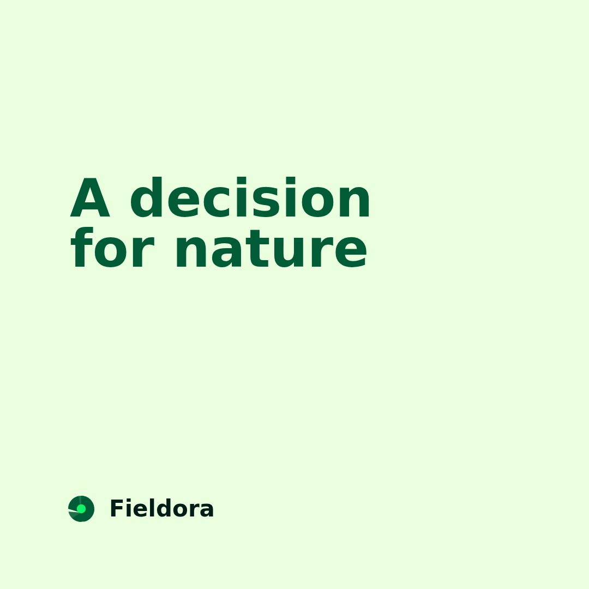

#### Connecting Fields Post

CLI:

```bash
clickclick template examples/use-cases/agriculture-social-post.html \
  --css examples/use-cases/agriculture-social-post.css \
  --modify-file examples/use-cases/agriculture-social-connecting.json \
  --out examples/use-cases/agriculture-social-connecting.png \
  --width 1080 \
  --height 1080
```

Library:

```ts
await renderTemplate({
  htmlPath: "examples/use-cases/agriculture-social-post.html",
  cssPath: "examples/use-cases/agriculture-social-post.css",
  modifications: JSON.parse(await readFile("examples/use-cases/agriculture-social-connecting.json", "utf8")),
  viewport: { width: 1080, height: 1080 },
  output: { path: "examples/use-cases/agriculture-social-connecting.png" },
});
```

Result:


#### Perspective Pattern Post

CLI:

```bash
clickclick template examples/use-cases/agriculture-social-post.html \
  --css examples/use-cases/agriculture-social-post.css \
  --modify-file examples/use-cases/agriculture-social-perspective.json \
  --out examples/use-cases/agriculture-social-perspective.png \
  --width 1080 \
  --height 1080
```

Library:

```ts
await renderTemplate({
  htmlPath: "examples/use-cases/agriculture-social-post.html",
  cssPath: "examples/use-cases/agriculture-social-post.css",
  modifications: JSON.parse(await readFile("examples/use-cases/agriculture-social-perspective.json", "utf8")),
  viewport: { width: 1080, height: 1080 },
  output: { path: "examples/use-cases/agriculture-social-perspective.png" },
});
```

Result:

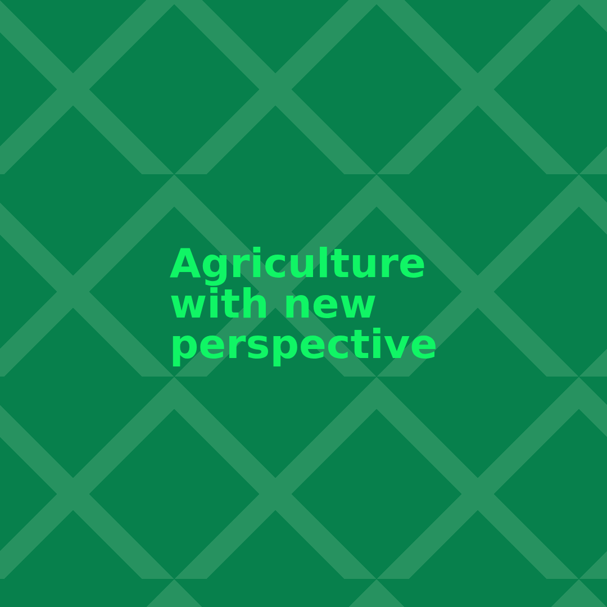

### Render Orbit Marketing Social Posts

Use a reusable template when a campaign has a fixed visual system but each square post swaps color,
copy, and geometric accents. This set adapts a six-post marketing grid into source-neutral examples
with fictional names, original slogans, and a shifted palette.

#### Coral Signal Post

CLI:

```bash
npm run dev -- template examples/use-cases/orbit-social-post.html \
  --css examples/use-cases/orbit-social-post.css \
  --modify-file examples/use-cases/orbit-social-coral.json \
  --out examples/use-cases/orbit-social-coral.png \
  --width 1080 \
  --height 1080
```

Library:

```ts
import { readFile } from "node:fs/promises";
import { renderTemplate } from "@maurogoncalo/clickclick";

await renderTemplate({
  htmlPath: "examples/use-cases/orbit-social-post.html",
  cssPath: "examples/use-cases/orbit-social-post.css",
  modifications: JSON.parse(await readFile("examples/use-cases/orbit-social-coral.json", "utf8")),
  viewport: { width: 1080, height: 1080 },
  output: { path: "examples/use-cases/orbit-social-coral.png" },
});
```

Result:

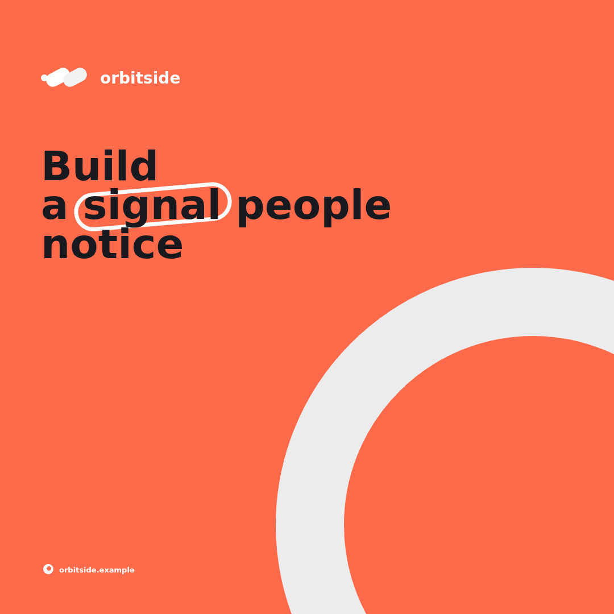

#### Indigo Ideas Post

CLI:

```bash
npm run dev -- template examples/use-cases/orbit-social-post.html \
  --css examples/use-cases/orbit-social-post.css \
  --modify-file examples/use-cases/orbit-social-indigo.json \
  --out examples/use-cases/orbit-social-indigo.png \
  --width 1080 \
  --height 1080
```

Library:

```ts
await renderTemplate({
  htmlPath: "examples/use-cases/orbit-social-post.html",
  cssPath: "examples/use-cases/orbit-social-post.css",
  modifications: JSON.parse(await readFile("examples/use-cases/orbit-social-indigo.json", "utf8")),
  viewport: { width: 1080, height: 1080 },
  output: { path: "examples/use-cases/orbit-social-indigo.png" },
});
```

Result:

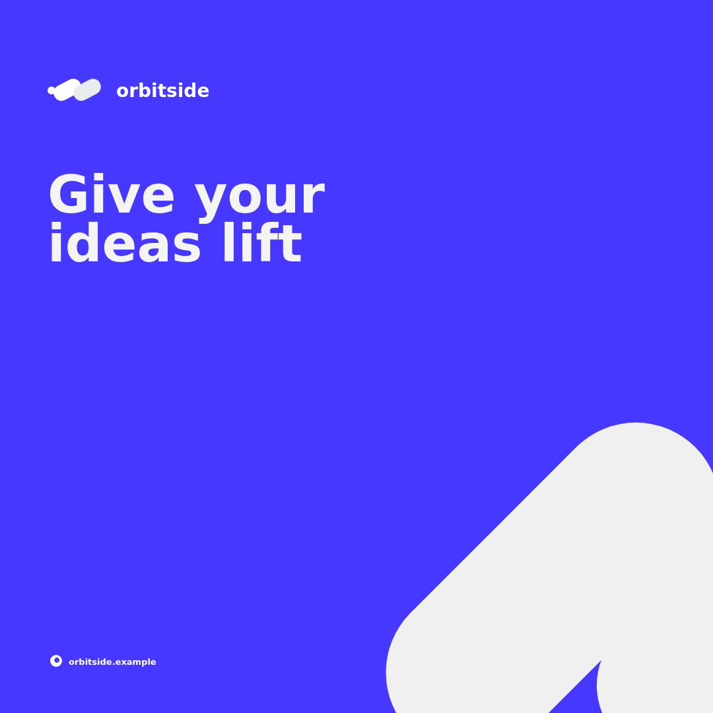

#### Lime Story Post

CLI:

```bash
npm run dev -- template examples/use-cases/orbit-social-post.html \
  --css examples/use-cases/orbit-social-post.css \
  --modify-file examples/use-cases/orbit-social-lime.json \
  --out examples/use-cases/orbit-social-lime.png \
  --width 1080 \
  --height 1080
```

Library:

```ts
await renderTemplate({
  htmlPath: "examples/use-cases/orbit-social-post.html",
  cssPath: "examples/use-cases/orbit-social-post.css",
  modifications: JSON.parse(await readFile("examples/use-cases/orbit-social-lime.json", "utf8")),
  viewport: { width: 1080, height: 1080 },
  output: { path: "examples/use-cases/orbit-social-lime.png" },
});
```

Result:

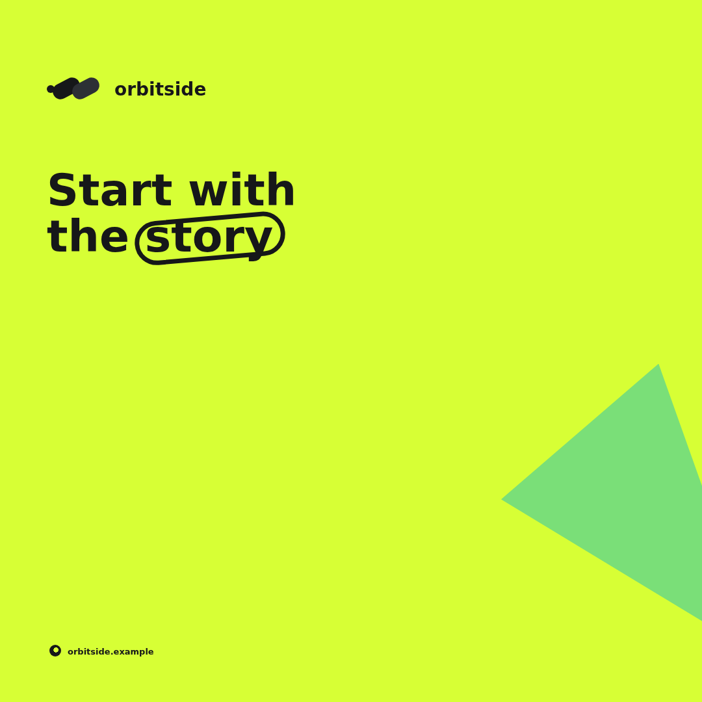

#### Mint Signal Post

CLI:

```bash
npm run dev -- template examples/use-cases/orbit-social-post.html \
  --css examples/use-cases/orbit-social-post.css \
  --modify-file examples/use-cases/orbit-social-mint.json \
  --out examples/use-cases/orbit-social-mint.png \
  --width 1080 \
  --height 1080
```

Library:

```ts
await renderTemplate({
  htmlPath: "examples/use-cases/orbit-social-post.html",
  cssPath: "examples/use-cases/orbit-social-post.css",
  modifications: JSON.parse(await readFile("examples/use-cases/orbit-social-mint.json", "utf8")),
  viewport: { width: 1080, height: 1080 },
  output: { path: "examples/use-cases/orbit-social-mint.png" },
});
```

Result:

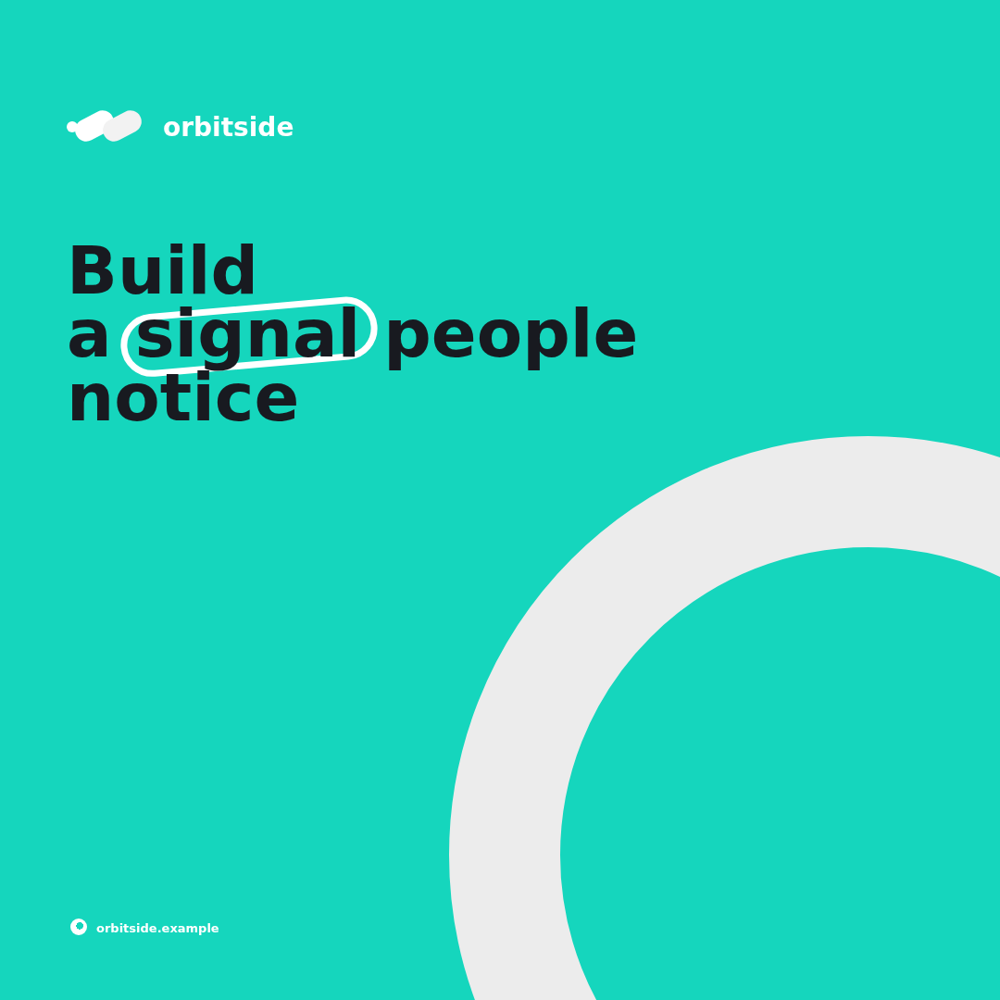

#### Stone Story Post

CLI:

```bash
npm run dev -- template examples/use-cases/orbit-social-post.html \
  --css examples/use-cases/orbit-social-post.css \
  --modify-file examples/use-cases/orbit-social-stone.json \
  --out examples/use-cases/orbit-social-stone.png \
  --width 1080 \
  --height 1080
```

Library:

```ts
await renderTemplate({
  htmlPath: "examples/use-cases/orbit-social-post.html",
  cssPath: "examples/use-cases/orbit-social-post.css",
  modifications: JSON.parse(await readFile("examples/use-cases/orbit-social-stone.json", "utf8")),
  viewport: { width: 1080, height: 1080 },
  output: { path: "examples/use-cases/orbit-social-stone.png" },
});
```

Result:

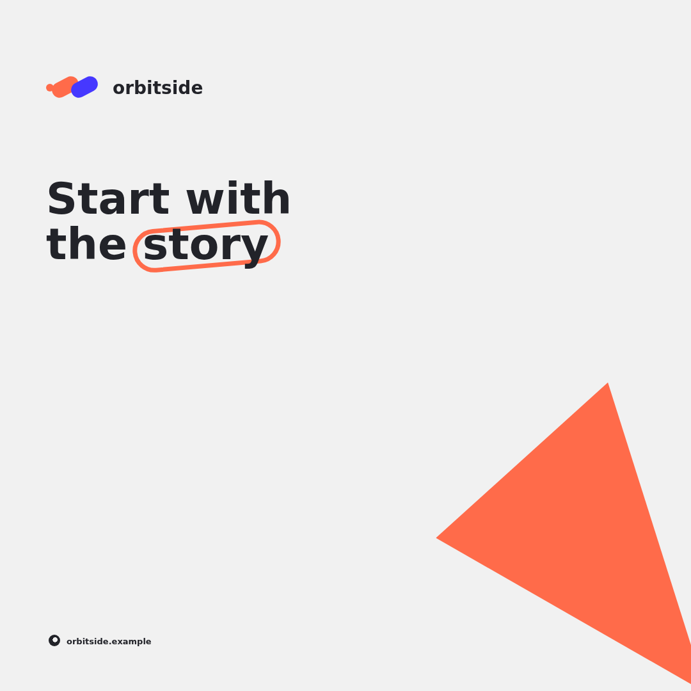

#### Ink Ideas Post

CLI:

```bash
npm run dev -- template examples/use-cases/orbit-social-post.html \
  --css examples/use-cases/orbit-social-post.css \
  --modify-file examples/use-cases/orbit-social-ink.json \
  --out examples/use-cases/orbit-social-ink.png \
  --width 1080 \
  --height 1080
```

Library:

```ts
await renderTemplate({
  htmlPath: "examples/use-cases/orbit-social-post.html",
  cssPath: "examples/use-cases/orbit-social-post.css",
  modifications: JSON.parse(await readFile("examples/use-cases/orbit-social-ink.json", "utf8")),
  viewport: { width: 1080, height: 1080 },
  output: { path: "examples/use-cases/orbit-social-ink.png" },
});
```

Result:

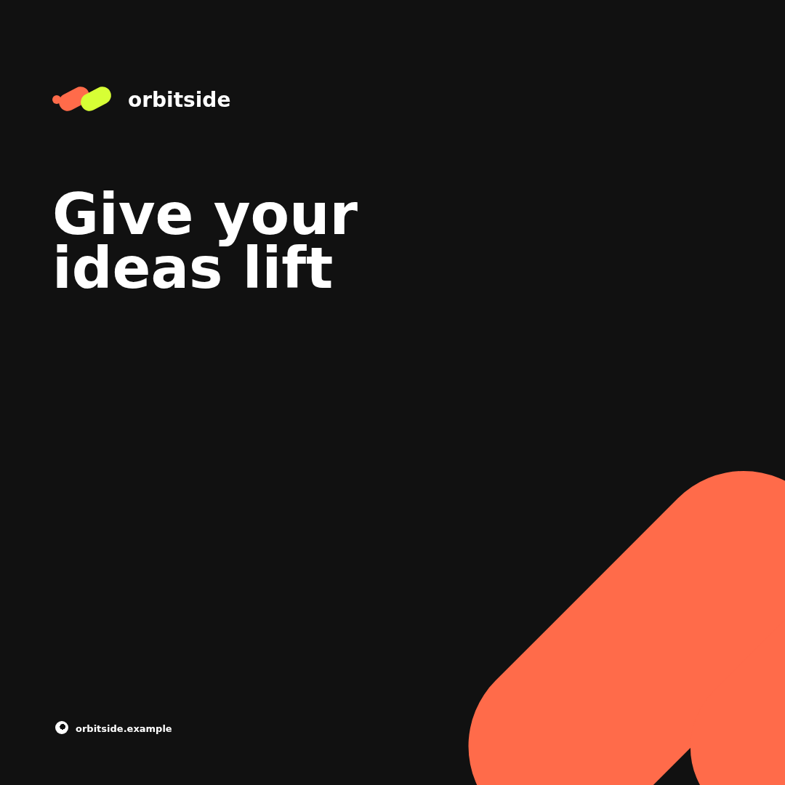

### Render Velora Social Kit

Use a reusable template for an editorial founder social kit with refined serif typography, strict
margins, muted neutrals, and deep red accents. This source-neutral adaptation replaces the
inspiration's name, slogans, logos, handles, and media with fictional Velora copy plus Unsplash
photos passed through JSON image layers.

#### Founder Editorial Post

CLI:

```bash
npm run dev -- template examples/use-cases/velora-social-kit.html \
  --css examples/use-cases/velora-social-kit.css \
  --modify-file examples/use-cases/velora-social-kit-founder.json \
  --out examples/use-cases/velora-social-kit-founder.png \
  --width 1080 \
  --height 1080
```

Library:

```ts
import { readFile } from "node:fs/promises";
import { renderTemplate } from "@maurogoncalo/clickclick";

await renderTemplate({
  htmlPath: "examples/use-cases/velora-social-kit.html",
  cssPath: "examples/use-cases/velora-social-kit.css",
  modifications: JSON.parse(await readFile("examples/use-cases/velora-social-kit-founder.json", "utf8")),
  viewport: { width: 1080, height: 1080 },
  output: { path: "examples/use-cases/velora-social-kit-founder.png" },
});
```

Result:

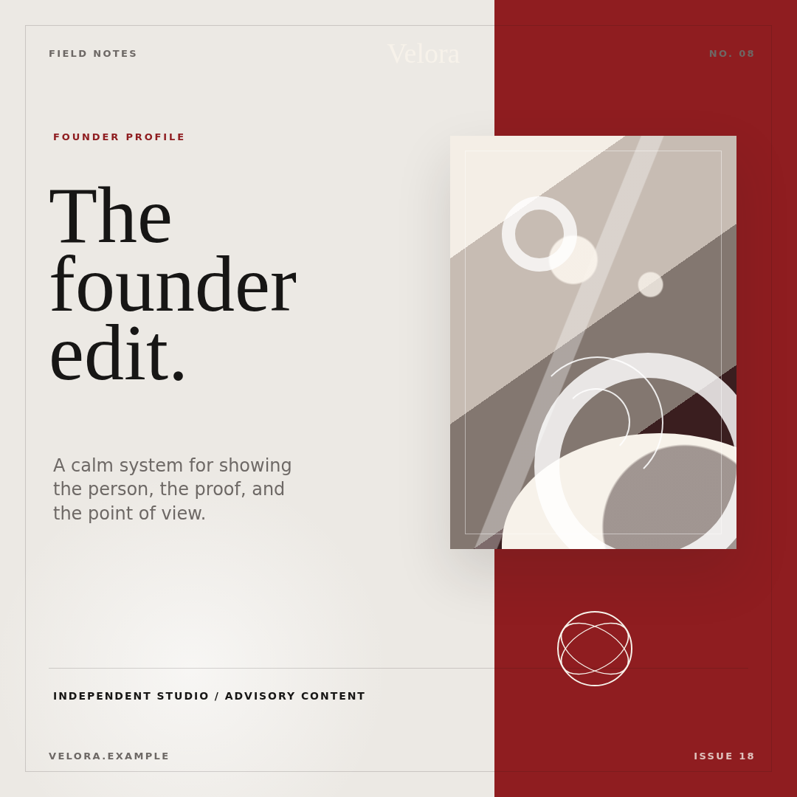

#### Centered Quote Post

CLI:

```bash
npm run dev -- template examples/use-cases/velora-social-kit.html \
  --css examples/use-cases/velora-social-kit.css \
  --modify-file examples/use-cases/velora-social-kit-quote.json \
  --out examples/use-cases/velora-social-kit-quote.png \
  --width 1080 \
  --height 1080
```

Library:

```ts
await renderTemplate({
  htmlPath: "examples/use-cases/velora-social-kit.html",
  cssPath: "examples/use-cases/velora-social-kit.css",
  modifications: JSON.parse(await readFile("examples/use-cases/velora-social-kit-quote.json", "utf8")),
  viewport: { width: 1080, height: 1080 },
  output: { path: "examples/use-cases/velora-social-kit-quote.png" },
});
```

Result:

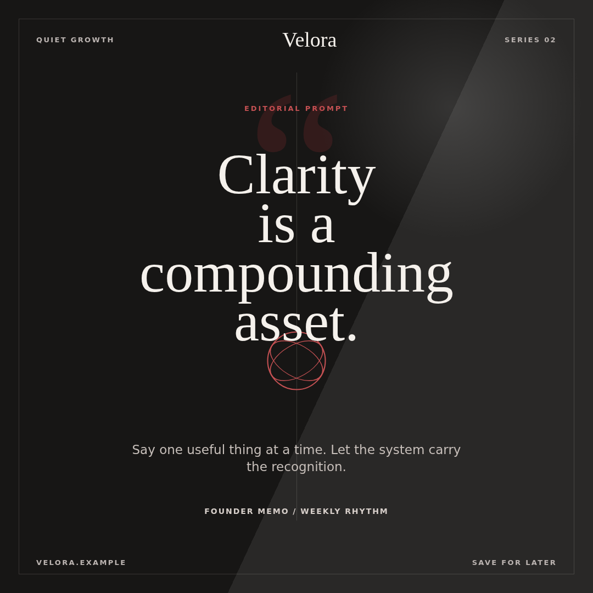

#### Insight Metrics Post

CLI:

```bash
npm run dev -- template examples/use-cases/velora-social-kit.html \
  --css examples/use-cases/velora-social-kit.css \
  --modify-file examples/use-cases/velora-social-kit-insight.json \
  --out examples/use-cases/velora-social-kit-insight.png \
  --width 1080 \
  --height 1080
```

Library:

```ts
await renderTemplate({
  htmlPath: "examples/use-cases/velora-social-kit.html",
  cssPath: "examples/use-cases/velora-social-kit.css",
  modifications: JSON.parse(await readFile("examples/use-cases/velora-social-kit-insight.json", "utf8")),
  viewport: { width: 1080, height: 1080 },
  output: { path: "examples/use-cases/velora-social-kit-insight.png" },
});
```

Result:

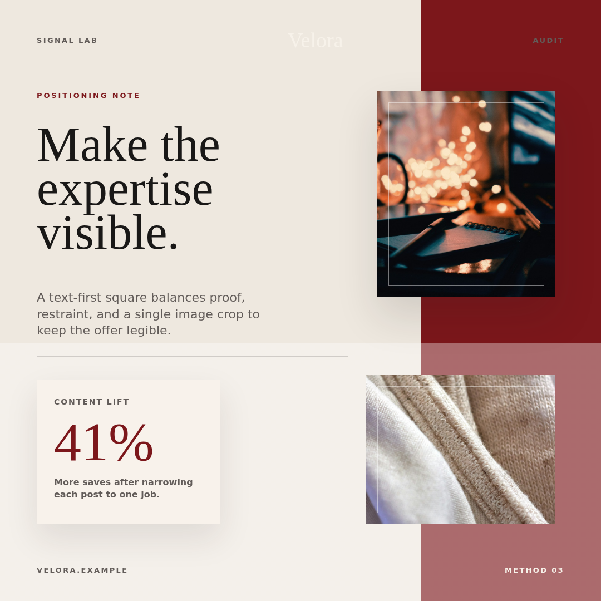

#### Palette Study Post

CLI:

```bash
npm run dev -- template examples/use-cases/velora-social-kit.html \
  --css examples/use-cases/velora-social-kit.css \
  --modify-file examples/use-cases/velora-social-kit-palette.json \
  --out examples/use-cases/velora-social-kit-palette.png \
  --width 1080 \
  --height 1080
```

Library:

```ts
await renderTemplate({
  htmlPath: "examples/use-cases/velora-social-kit.html",
  cssPath: "examples/use-cases/velora-social-kit.css",
  modifications: JSON.parse(await readFile("examples/use-cases/velora-social-kit-palette.json", "utf8")),
  viewport: { width: 1080, height: 1080 },
  output: { path: "examples/use-cases/velora-social-kit-palette.png" },
});
```

Result:

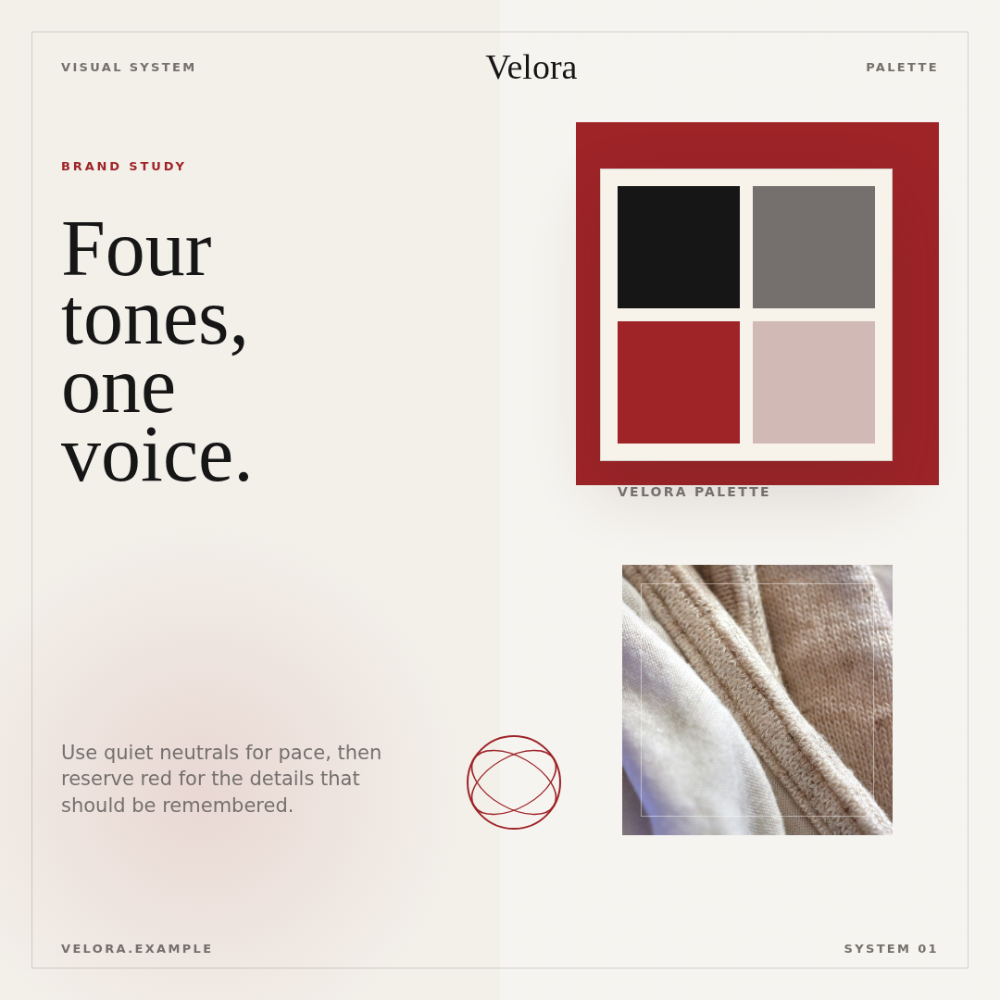

### Render Weave Home Retail Social Posts

Use a reusable template for a retail campaign with product-forward square posts, lifestyle overlays,
and a warm family promo card. This set adapts the supplied three-post composition with a fictional
home brand, original copy, Unsplash photos passed through JSON image layers, and shifted warm
neutrals.

#### Woven Ottoman Product Post

CLI:

```bash
npm run dev -- template examples/use-cases/weave-home-social.html \
  --css examples/use-cases/weave-home-social.css \
  --modify-file examples/use-cases/weave-home-social-product.json \
  --out examples/use-cases/weave-home-social-product.png \
  --width 1080 \
  --height 1080
```

Library:

```ts
await renderTemplate({
  htmlPath: "examples/use-cases/weave-home-social.html",
  cssPath: "examples/use-cases/weave-home-social.css",
  modifications: JSON.parse(await readFile("examples/use-cases/weave-home-social-product.json", "utf8")),
  viewport: { width: 1080, height: 1080 },
  output: { path: "examples/use-cases/weave-home-social-product.png" },
});
```

Result:

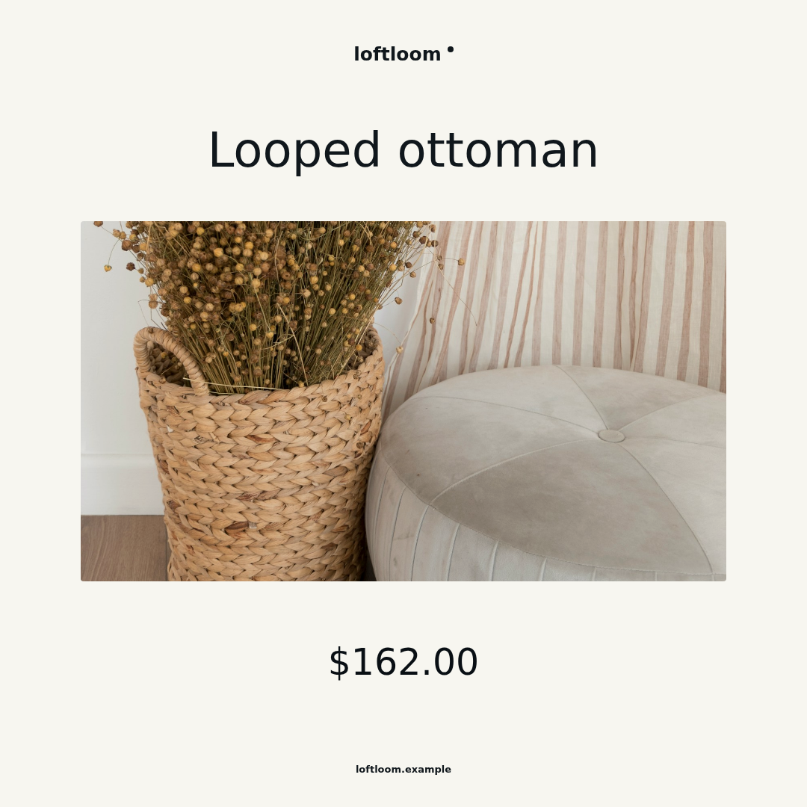

#### Textile Lifestyle Overlay Post

CLI:

```bash
npm run dev -- template examples/use-cases/weave-home-social.html \
  --css examples/use-cases/weave-home-social.css \
  --modify-file examples/use-cases/weave-home-social-lifestyle.json \
  --out examples/use-cases/weave-home-social-lifestyle.png \
  --width 1080 \
  --height 1080
```

Library:

```ts
await renderTemplate({
  htmlPath: "examples/use-cases/weave-home-social.html",
  cssPath: "examples/use-cases/weave-home-social.css",
  modifications: JSON.parse(await readFile("examples/use-cases/weave-home-social-lifestyle.json", "utf8")),
  viewport: { width: 1080, height: 1080 },
  output: { path: "examples/use-cases/weave-home-social-lifestyle.png" },
});
```

Result:

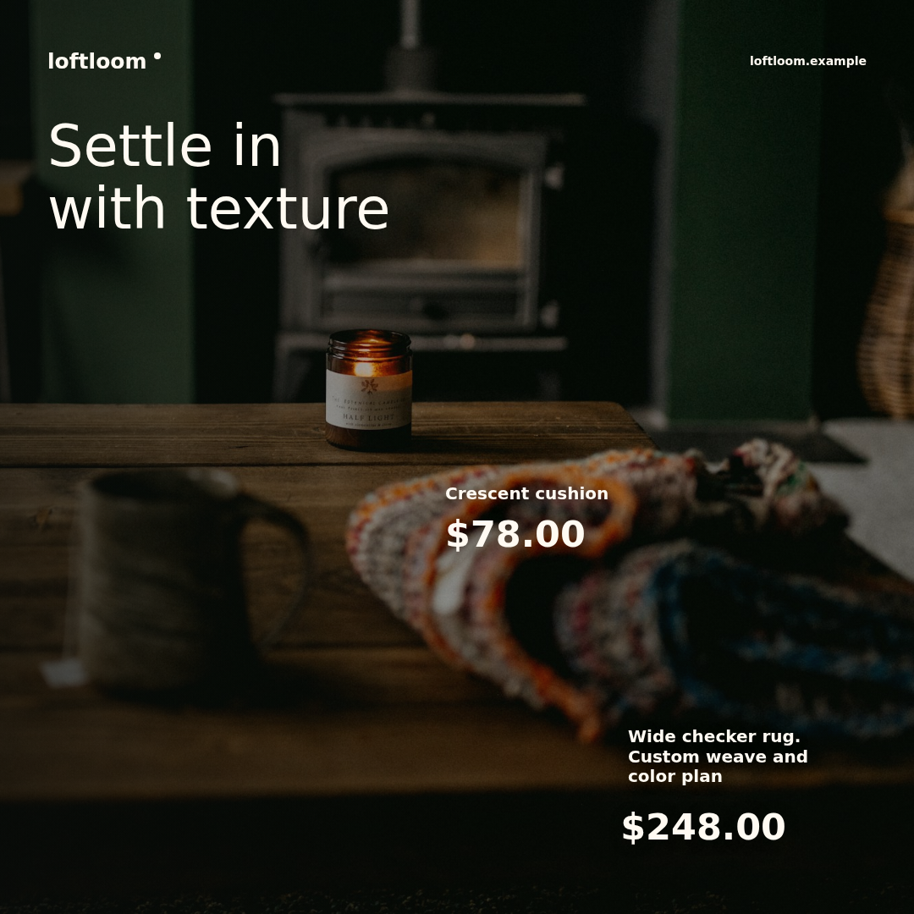

#### Nursery Promo Post

CLI:

```bash
npm run dev -- template examples/use-cases/weave-home-social.html \
  --css examples/use-cases/weave-home-social.css \
  --modify-file examples/use-cases/weave-home-social-family.json \
  --out examples/use-cases/weave-home-social-family.png \
  --width 1080 \
  --height 1080
```

Library:

```ts
await renderTemplate({
  htmlPath: "examples/use-cases/weave-home-social.html",
  cssPath: "examples/use-cases/weave-home-social.css",
  modifications: JSON.parse(await readFile("examples/use-cases/weave-home-social-family.json", "utf8")),
  viewport: { width: 1080, height: 1080 },
  output: { path: "examples/use-cases/weave-home-social-family.png" },
});
```

Result:

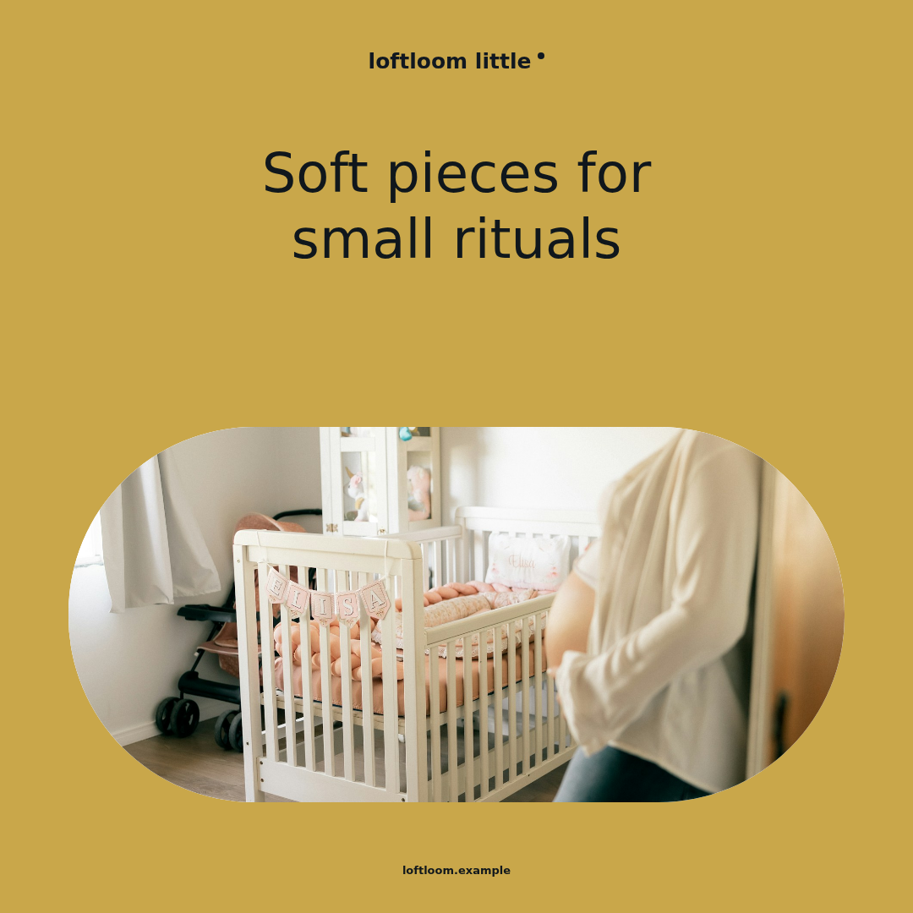

### Render Custom HTML with Fit Text

Use custom HTML/CSS when presets are too constrained, but keep `data-clickclick-fit` on important
copy that needs to survive variable titles.

CLI:

```bash
clickclick render examples/use-cases/fit-text-card.html \
  --css examples/use-cases/fit-text-card.css \
  --out examples/use-cases/fit-text-card.png \
  --width 1200 \
  --height 630
```

Library:

```ts
import { readFile } from "node:fs/promises";
import { renderImage } from "@maurogoncalo/clickclick";

await renderImage({
  document: {
    html: await readFile("examples/use-cases/fit-text-card.html", "utf8"),
    css: await readFile("examples/use-cases/fit-text-card.css", "utf8"),
  },
  viewport: { width: 1200, height: 630 },
  output: { path: "examples/use-cases/fit-text-card.png" },
});
```

Result:


### Fit Text Edge Cases

Attribute-based fitting can set a minimum font size and overflow behavior:

```html
<h1
  data-clickclick-fit
  data-clickclick-min-font-size="28"
  data-clickclick-on-overflow="warn"
>
  A launch title that may be much longer than expected
</h1>
```

Programmatic fitting is useful when you cannot edit the source HTML:

```ts
import { renderImage } from "@maurogoncalo/clickclick";

const result = await renderImage({
  document: {
    html: '<main><h1 class="headline">A launch title that may be much longer than expected</h1></main>',
    css: "main{width:1200px;height:630px}.headline{width:760px;max-height:220px;font-size:96px;overflow:hidden}",
  },
  fitText: [
    {
      selector: ".headline",
      minFontSize: 28,
      maxFontSize: 96,
      onOverflow: "warn",
    },
  ],
});

for (const warning of result.warnings) {
  if (warning.code === "TEXT_FIT_OVERFLOW") {
    console.warn(`${warning.selector} overflowed at ${warning.minFontSize}px`);
  }
}
```

Deliberately long copy can produce a structured warning:

```ts
const result = await renderImage({
  document: {
    html: '<main><h1 class="headline">This headline is intentionally far too long for the available card area and should warn</h1></main>',
    css: "main{width:420px;height:180px}.headline{width:360px;max-height:80px;font-size:72px;overflow:hidden}",
  },
  fitText: [{ selector: ".headline", minFontSize: 32, onOverflow: "warn" }],
});

console.log(result.warnings.map((warning) => warning.code));
```

The CLI `--strict` flag turns renderer warnings into a non-zero exit:

```bash
clickclick render examples/use-cases/fit-text-card.html \
  --css examples/use-cases/fit-text-card.css \
  --out examples/use-cases/fit-text-card.png \
  --strict
```

Text fitting changes only font size. It does not rewrite text, change the box size, adjust
line-height, or remove transforms; size the containing element for the longest copy you intend to
support.

### Modify Template Layers from JSON

Use local templates when you want a reusable art direction with data-driven layer changes. Layers are
selected with `data-layer` attributes in the HTML.

CLI:

```bash
clickclick template examples/use-cases/product-card.html \
  --css examples/use-cases/product-card.css \
  --modify-json '[{"name":"label","text":"Template"},{"name":"title","text":"Modify image layers from JSON"},{"name":"subtitle","text":"Change copy, colors, effects, and visibility while the HTML stays reusable."},{"name":"cta","text":"Ship the asset"},{"name":"panel","background":"#312e81","shadow":"0 28px 80px rgba(15,23,42,.35)"},{"name":"badge","text":"JSON"}]' \
  --out examples/use-cases/template-modifications.png \
  --width 1200 \
  --height 630
```

Library:

```ts
import { renderTemplate } from "@maurogoncalo/clickclick";

await renderTemplate({
  htmlPath: "examples/use-cases/product-card.html",
  cssPath: "examples/use-cases/product-card.css",
  modifications: [
    { name: "label", text: "Template" },
    { name: "title", text: "Modify image layers from JSON" },
    {
      name: "subtitle",
      text: "Change copy, colors, effects, and visibility while the HTML stays reusable.",
    },
    { name: "cta", text: "Ship the asset" },
    { name: "panel", background: "#312e81", shadow: "0 28px 80px rgba(15,23,42,.35)" },
    { name: "badge", text: "JSON" },
  ],
  viewport: { width: 1200, height: 630 },
  output: { path: "examples/use-cases/template-modifications.png" },
});
```

Result:


### Generate Images from Data Rows

Use `generate` when a campaign, launch, docs page, or content feed needs one image per data row.
JSON rows may include full layer modification arrays. CSV and simple YAML rows can map scalar fields
to template layers with `--layer-field`.

CLI:

```bash
clickclick generate examples/use-cases/product-card.html \
  --css examples/use-cases/product-card.css \
  --data examples/use-cases/batch-campaign.json \
  --size og \
  --size square \
  --out-dir examples/use-cases/batch-campaign \
  --out-pattern "{{slug}}-{{size}}.png"
```

CSV:

```csv
slug,title,subtitle,cta
launch,Launch cards from data,Render every row to every target size,Generate assets
docs,Document pages at scale,Use output patterns for deterministic filenames,Publish the set
```

```bash
clickclick generate examples/use-cases/product-card.html \
  --css examples/use-cases/product-card.css \
  --data campaign.csv \
  --layer-field title \
  --layer-field subtitle \
  --layer-field cta \
  --size og \
  --out-dir dist/campaign \
  --out-pattern "{{slug}}-{{size}}.png"
```

YAML:

```yaml
- slug: launch
  title: Launch cards from data
  subtitle: Render every row to every target size
- slug: docs
  title: Document pages at scale
  subtitle: Use output patterns for deterministic filenames
```

Library:

```ts
import { generateTemplateBatch } from "@maurogoncalo/clickclick";
import rows from "../examples/use-cases/batch-campaign.json" with { type: "json" };

await generateTemplateBatch({
  template: {
    htmlPath: "examples/use-cases/product-card.html",
    cssPath: "examples/use-cases/product-card.css",
  },
  rows,
  sizes: [
    { label: "og", width: 1200, height: 630 },
    { label: "square", width: 1080, height: 1080 },
  ],
  outputDir: "examples/use-cases/batch-campaign",
  outputPattern: "{{slug}}-{{size}}.png",
});
```

Result:


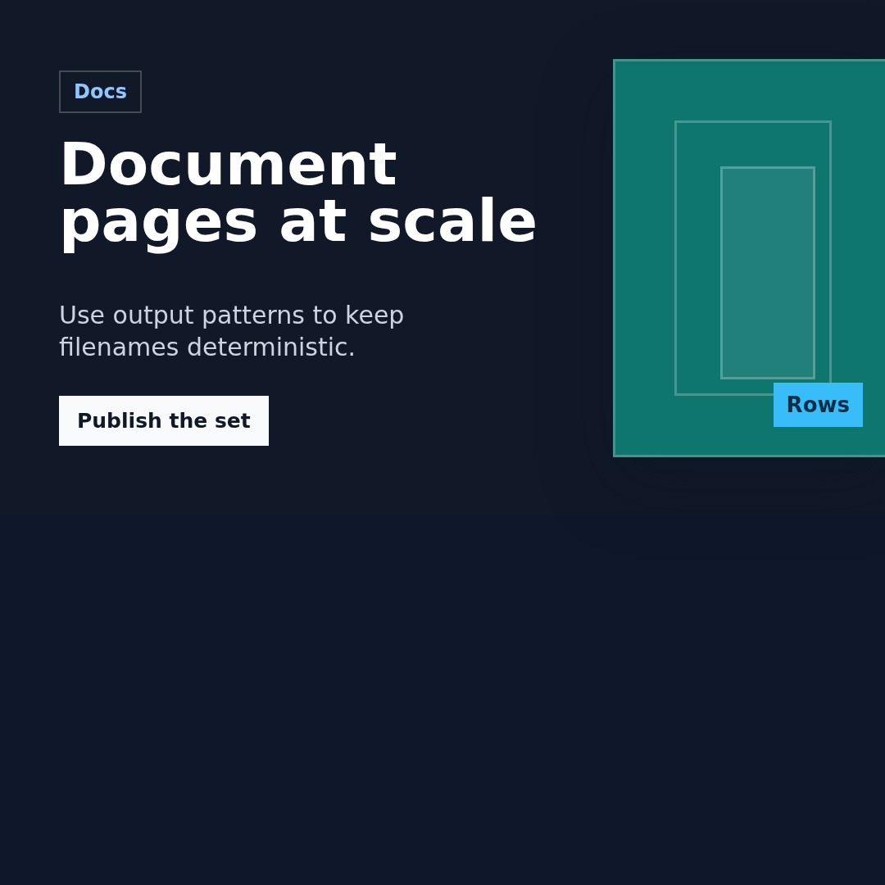

### Batch Preset And Template Commands

Use `batch preset` and `batch template` when CI or release scripts need deterministic outputs from
many rows while reusing a single browser session.

CLI:

```bash
clickclick batch preset solid \
  --data examples/use-cases/batch-campaign.json \
  --out-dir examples/use-cases/batch-command \
  --out-pattern "{{slug}}-preset.png" \
  --width 320 \
  --height 180 \
  --json

clickclick batch template examples/use-cases/product-card.html \
  --css examples/use-cases/product-card.css \
  --data posts.csv \
  --map title=headline \
  --map subtitle=excerpt \
  --sizes og,instagram-square \
  --out-dir dist/social \
  --out-pattern "{{slug}}-{{size}}.png"
```

Result:


### Render a Config Recipe

Use recipes when the template, output size, and standard modifications should live in a project
config instead of a shell script.

CLI:

```bash
clickclick config recipe examples/use-cases/clickclick.config.json release
```

Library:

```ts
import { renderRecipe } from "@maurogoncalo/clickclick";

await renderRecipe("examples/use-cases/clickclick.config.json", "release");
```

Result:


### Render a Multi-Size Social Set

Use template sets when one source template needs to produce several assets for different surfaces.

CLI:

```bash
clickclick config set examples/use-cases/clickclick.config.json social \
  --out-dir examples/use-cases/config-set
```

Library:

```ts
import { renderTemplateSet } from "@maurogoncalo/clickclick";

await renderTemplateSet(
  "examples/use-cases/clickclick.config.json",
  "social",
  "examples/use-cases/config-set",
);
```

Results:


## Local Templates

Templates are normal HTML and CSS. Mark editable elements with `data-layer` names, then render them
directly or apply Bannerbear-style local modifications.

CLI:

```bash
clickclick template examples/card.html \
  --css examples/card.css \
  --modify-json '[{"name":"title","text":"Local launch"},{"name":"card","background":"#f8fafc"}]' \
  --out examples/templates/local-template.png
```

Library:

```ts
import { renderTemplate } from "@maurogoncalo/clickclick";

await renderTemplate({
  html: '<main data-layer="card"><h1 data-layer="title">Old</h1></main>',
  css: "main{width:1200px;height:630px;background:white}",
  modifications: [
    { name: "title", text: "Local launch", color: "#111827", alignment: "center" },
    { name: "card", background: "#f8fafc", shadow: "0 24px 80px rgba(15,23,42,.18)" },
  ],
  output: { path: "template.png" },
});
```

Result:


### Advanced Template Features

Use `--modify-file` when layer updates are easier to review as JSON:

```bash
clickclick template examples/use-cases/image-template.html \
  --css examples/use-cases/image-template.css \
  --modify-file examples/use-cases/template-modifications.json \
  --out examples/use-cases/image-template.png \
  --width 1200 \
  --height 630 \
  --strict
```

Library:

```ts
import { readFile } from "node:fs/promises";
import { renderTemplate } from "@maurogoncalo/clickclick";

await renderTemplate({
  htmlPath: "examples/use-cases/image-template.html",
  cssPath: "examples/use-cases/image-template.css",
  modifications: JSON.parse(await readFile("examples/use-cases/template-modifications.json", "utf8")),
  viewport: { width: 1200, height: 630 },
  output: { path: "examples/use-cases/image-template.png" },
});
```

Result:


The JSON file updates an image layer with `src`, `fit`, `anchor`, and `effect`; it also demonstrates
text updates, `style`, `attributes`, `x`, `y`, `border`, `shadow`, and visibility-compatible layer
fields:

```json
[
  { "name": "hero", "src": "examples/presets/photo-source.svg", "fit": "cover", "anchor": "center", "effect": "grayscale" },
  { "name": "badge", "text": "STRICT", "x": -24, "y": -18, "border": "3px solid #111827" }
]
```

Register a custom font from the CLI or library/config:

```bash
clickclick template examples/use-cases/image-template.html \
  --css examples/use-cases/image-template.css \
  --font "Inter=./fonts/Inter.woff2" \
  --modify-file examples/use-cases/template-modifications.json \
  --out image-template.png
```

```ts
await renderTemplate({
  htmlPath: "examples/use-cases/image-template.html",
  cssPath: "examples/use-cases/image-template.css",
  fonts: [{ family: "Inter", source: "./fonts/Inter.woff2" }],
});
```

Choose warning behavior explicitly while developing templates:

```bash
clickclick template examples/use-cases/image-template.html \
  --css examples/use-cases/image-template.css \
  --modify-json '[{"name":"missing","text":"No layer"}]' \
  --on-missing-layer warn

clickclick template examples/use-cases/image-template.html \
  --css examples/use-cases/image-template.css \
  --modify-json '[{"name":"missing","text":"No layer"}]' \
  --on-missing-layer error \
  --strict
```

Debug bundles write the rendered HTML, CSS, and manifest:

```bash
clickclick template examples/use-cases/image-template.html \
  --css examples/use-cases/image-template.css \
  --modify-file examples/use-cases/template-modifications.json \
  --debug-dir .clickclick-debug \
  --out image-template.png
```

Supported modification fields include `text`, `html`, `src`, `image_url`, `color`, `background`,
`font_family`, `alignment`, `hide`, `show`, `style`, `className`, `attributes`, `x`, `y`, `border`,
`shadow`, `fit`, `anchor`, and `effect`. Effects are CSS-only: `grayscale`, `sepia`, `blur`,
`grayscale-blur`, `flip-horizontal`, `flip-vertical`, `invert`, and `negate`.

Register fonts with `--font "Family=./font.woff2"` in the CLI or with `fonts` in the library/config
API. ClickClick injects `@font-face` rules before capture and waits for browser font readiness.

## Config, Recipes, and Sets

Use a JSON config file to register reusable templates, named recipes, and multi-output sets:

```json
{
  "templates": {
    "card": { "htmlPath": "examples/card.html", "cssPath": "examples/card.css" }
  },
  "recipes": {
    "launch": {
      "template": "card",
      "output": { "path": "launch.png", "width": 1200, "height": 630 },
      "modifications": [{ "name": "title", "text": "Launch" }]
    }
  },
  "templateSets": {
    "social": [
      { "name": "square", "template": "card", "output": { "width": 1080, "height": 1080 } },
      { "name": "wide", "template": "card", "output": { "width": 1200, "height": 630 } }
    ]
  }
}
```

```bash
clickclick config templates ./clickclick.config.json
clickclick config recipe ./clickclick.config.json launch
clickclick config set ./clickclick.config.json social --out-dir ./dist/images
clickclick preview examples/card.html --css examples/card.css --watch
```

Add `--debug-dir ./debug-render` to template or recipe renders to write the source HTML/CSS and a
manifest with modifications and warnings.

Use `--cache` on deterministic render commands to avoid generating identical images twice:

```bash
clickclick preset solid --title "Launch notes" --out solid.png --cache --cache-info
clickclick template examples/card.html --css examples/card.css --out card.png --cache
clickclick config set ./clickclick.config.json social --out-dir ./dist/images --cache
clickclick cache clear
```

Use `--cache-dir <dir>` to override the default `.clickclick-cache/` directory. The `screenshot-url`
and `preview` commands intentionally do not expose cache flags.

### Preview and Config Authoring

Generate a one-shot preview while editing an HTML/CSS template:

```bash
clickclick preview examples/use-cases/product-card.html \
  --css examples/use-cases/product-card.css \
  --out-dir .clickclick-preview \
  --width 1200 \
  --height 630
```

The preview command writes `.clickclick-preview/preview.png`. Use watch mode for the local authoring
loop:

```bash
clickclick preview examples/use-cases/product-card.html \
  --css examples/use-cases/product-card.css \
  --out-dir .clickclick-preview \
  --watch
```

List templates registered in a config file:

```bash
clickclick config templates examples/use-cases/clickclick.config.json
```

Expected output:

```text
product
```

Render a recipe with CLI overrides:

```bash
clickclick config recipe examples/use-cases/clickclick.config.json release \
  --modify-json '[{"name":"title","text":"Recipe override"},{"name":"badge","text":"CLI"}]' \
  --out examples/use-cases/config-recipe.png \
  --width 1200 \
  --height 630
```

Render a template set into an output directory:

```bash
clickclick config set examples/use-cases/clickclick.config.json social \
  --out-dir examples/use-cases/config-set
```

Results:


Library equivalents:

```ts
import { listConfigTemplates, renderRecipe, renderTemplateSet } from "@maurogoncalo/clickclick";

const templates = await listConfigTemplates("examples/use-cases/clickclick.config.json");

await renderRecipe("examples/use-cases/clickclick.config.json", "release", {
  modifications: [
    { name: "title", text: "Recipe override" },
    { name: "badge", text: "API" },
  ],
  viewport: { width: 1200, height: 630 },
  output: { path: "examples/use-cases/config-recipe.png" },
});

await renderTemplateSet(
  "examples/use-cases/clickclick.config.json",
  "social",
  "examples/use-cases/config-set",
);

console.log(templates);
```

### Local Preset Schemas

Use local preset schemas when a project needs reusable preset commands without editing ClickClick
source. The schema declares option names, option types, required/default values, and which template
layers receive each option value.

CLI:

```bash
clickclick preset list --local --preset-config examples/presets/local-presets.json

clickclick preset local campaign-card \
  --preset-config examples/presets/local-presets.json \
  --title "Schema-backed campaign presets" \
  --subtitle "Project presets can be discovered, validated, and rendered from JSON." \
  --label "Local" \
  --out examples/presets/local-campaign-card.png
```

Library:

```ts
import { loadLocalPresetConfig, renderLocalPreset, renderTemplate } from "@maurogoncalo/clickclick";

const config = await loadLocalPresetConfig("examples/presets/local-presets.json");
const schema = config.presets.find((preset) => preset.name === "campaign-card");
if (!schema) throw new Error("Missing preset");

await renderTemplate(renderLocalPreset(schema, {
  title: "Schema-backed campaign presets",
  subtitle: "Project presets can be discovered, validated, and rendered from JSON.",
  label: "Local",
}, {
  path: "examples/presets/local-campaign-card.png",
}));
```

Result:


## Preset Variations

These examples use the same built-in presets with different option combinations. They are useful
starting points when you want a different tone without writing custom HTML/CSS.

### Gradient Launch Alert

CLI:

```bash
clickclick preset gradient \
  --title "API v2 is live" \
  --subtitle "A sharper endpoint design with fewer moving parts." \
  --label "Launch" \
  --from "#be123c" \
  --to "#f97316" \
  --accent "rgba(255,255,255,0.35)" \
  --align left \
  --out examples/presets/gradient-launch.png
```

Library:

```ts
import { presets, renderImage } from "@maurogoncalo/clickclick";

await renderImage({
  ...presets.gradient({
    title: "API v2 is live",
    subtitle: "A sharper endpoint design with fewer moving parts.",
    label: "Launch",
    fromColor: "#be123c",
    toColor: "#f97316",
    accentColor: "rgba(255,255,255,0.35)",
    align: "left",
  }),
  output: { path: "examples/presets/gradient-launch.png" },
});
```

Result:


### Minimal Centered Article

CLI:

```bash
clickclick preset minimal \
  --title "What changed in the renderer" \
  --subtitle "A short technical note for people maintaining image pipelines." \
  --meta "Engineering" \
  --align center \
  --background "#f8fafc" \
  --accent "#0f766e" \
  --out examples/presets/minimal-article.png
```

Library:

```ts
import { presets, renderImage } from "@maurogoncalo/clickclick";

await renderImage({
  ...presets.minimal({
    title: "What changed in the renderer",
    subtitle: "A short technical note for people maintaining image pipelines.",
    meta: "Engineering",
    align: "center",
    backgroundColor: "#f8fafc",
    accentColor: "#0f766e",
  }),
  output: { path: "examples/presets/minimal-article.png" },
});
```

Result:


### Split Product Update

CLI:

```bash
clickclick preset split \
  --title "New dashboard filters" \
  --subtitle "Pin saved views, compare segments, and scan fresher data." \
  --label "Product" \
  --panel-side right \
  --background "#ffffff" \
  --panel-color "#0f172a" \
  --accent "#eab308" \
  --out examples/presets/split-product.png
```

Library:

```ts
import { presets, renderImage } from "@maurogoncalo/clickclick";

await renderImage({
  ...presets.split({
    title: "New dashboard filters",
    subtitle: "Pin saved views, compare segments, and scan fresher data.",
    label: "Product",
    panelSide: "right",
    backgroundColor: "#ffffff",
    panelColor: "#0f172a",
    accentColor: "#eab308",
  }),
  output: { path: "examples/presets/split-product.png" },
});
```

Result:


### Terminal Install Card

CLI:

```bash
clickclick preset terminal \
  --title "Install ClickClick" \
  --subtitle "Generate social images from your release scripts." \
  --prompt "$" \
  --command "npm install @maurogoncalo/clickclick" \
  --output-text "added 1 package" \
  --accent "#38bdf8" \
  --command-color "#ffffff" \
  --out examples/presets/terminal-install.png
```

Library:

```ts
import { presets, renderImage } from "@maurogoncalo/clickclick";

await renderImage({
  ...presets.terminal({
    title: "Install ClickClick",
    subtitle: "Generate social images from your release scripts.",
    prompt: "$",
    command: "npm install @maurogoncalo/clickclick",
    output: "added 1 package",
    accentColor: "#38bdf8",
    commandColor: "#ffffff",
  }),
  output: { path: "examples/presets/terminal-install.png" },
});
```

Result:


### Compare Migration Card

CLI:

```bash
clickclick preset compare \
  --title "Migration impact" \
  --before-title "Old flow" \
  --before-text "Manual screenshots" \
  --after-title "New flow" \
  --after-text "Scripted preset renders" \
  --before-color "#fee2e2" \
  --after-color "#dbeafe" \
  --accent "#2563eb" \
  --out examples/presets/compare-migration.png
```

Library:

```ts
import { presets, renderImage } from "@maurogoncalo/clickclick";

await renderImage({
  ...presets.compare({
    title: "Migration impact",
    beforeTitle: "Old flow",
    beforeText: "Manual screenshots",
    afterTitle: "New flow",
    afterText: "Scripted preset renders",
    beforeColor: "#fee2e2",
    afterColor: "#dbeafe",
    accentColor: "#2563eb",
  }),
  output: { path: "examples/presets/compare-migration.png" },
});
```

Result:


